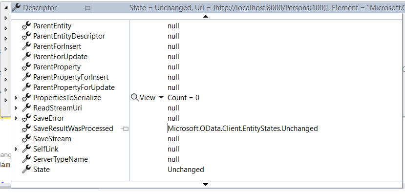

# Bulk Update Operations
**Applies To**: [!INCLUDE[appliesto-odataclient](../includes/appliesto-odataclient-v7.md)]

OData Client [v7.17.0](https://www.nuget.org/packages/Microsoft.OData.Client/) introduced support for bulk update operations.

## What is a bulk update operation 

A bulk update operation is an operation that allows you to perform several operations (POST, PATCH and DELETE) on resources of the same type and all their related resources using a single request. This can be highly efficient in situations where you need to update multiple resources and wish to avoid sending separate requests to process each resource. [Learn more](https://devblogs.microsoft.com/odata/bulk-operations-support-in-odata-web-api/).

## Sample bulk update requests

### Model
To create the various sample requests in this tutorial, the following model classes will be used: 

``` csharp
public class Customer
{
    public int Id { get; set; }
    public string Name { get; set; }
    public int Age { get; set; }
    public List<Order> Orders { get; set; }
}

public class Order
{
    public int Id { get; set; }
    public decimal Amount { get; set; }
}
```
### Sample Request 1
The following code demonstrates how to create 2 customers in a bulk update request:

```csharp
var context = new Container(new Uri("http://localhost:6285/odata/"));

var customer1 = new Customer
{
    Id = 1,
    Name = "Customer1",
    Age = 26
};

context.AddToCustomers(customer1);

var customer2 = new Customer
{
    Id = 2,
    Name = "Customer2",
    Age = 34
};

context.AddToCustomers(customer2)

DataServiceResponse response = await context.BulkUpdateAsync(customer1, customer2);
```
The code above generates the following bulk update request payload: 

```http
PATCH http://localhost:6285/odata/Customers
```
Request body:

```json
{
  "@context": "http://localhost:6285/odata/$metadata#Customers/$delta",
  "value": [
    {
      "Id": 1,
      "Name": "Customer1",
      "Age": 26
    },
    {
      "Id": 2,
      "Name": "Customer2",
      "Age": 34
    }
  ]
}
```

### Sample Request 2
The following code demonstrates how to create 1 customer and 2 orders, and then link the created orders to the created customer in a bulk update request:

```csharp
var context = new Container(new Uri("http://localhost:6285/odata/"));

var customer = new Customer
{
    Id = 1,
    Name = "Customer1",
    Age = 26
};

context.AddToCustomers(customer);

var order = new Order
{
    Id = 2,
    Amount = 10.24
};

var order2 = new Order
{
    Id = 3,
    Amount = 11.54
}

context.AddRelatedOject(customer, "Orders", order);
context.AddRelatedObject(customer, "Orders", order2);

DataServiceResponse response = await context.BulkUpdateAsync(customer);
```
The code above generates the following bulk update request payload: 

```http
PATCH http://localhost:6285/odata/Customers
```
Request body:

```json
{
  "@context": "http://localhost:6285/odata/Customers/$delta",
  "value": [
    {
      "Id": 1,
      "Name": "Customer1",
      "Orders@delta": [
        {
          "Id": 1,
          "Amount": 10.24
        },
        {
          "Id": 2,
          "Amount": 11.54
        }
      ]
    }
  ]
}
```

### Sample Request 3
The following code demonstrates how to create 1 customer, update the amounts of 2 existing orders, and then link the updated orders to the created customer in a bulk update request:.

```csharp
var context = new Container(new Uri("http://localhost:6285/odata/"));

var customer = new Customer
{
    Id = 1,
    Name = "Customer1",
    Age = 26
};

context.AddToCustomers(customer);

DataServiceCollection<Order> ordersCollection = new DataServiceCollection<Order>(context);
ordersCollection.Load(context.Orders);

ordersCollection[0].Amount = 14.12;
ordersCollection[1].Amount = 23.21;

context.AddLink(customer, "Orders", ordersCollection[0]);
context.AddLink(customer, "Orders", ordersCollection[1]);

DataServiceResponse response = await context.BulkUpdateAsync(customer);

// You can traverse the DataServiceResponse object like below: 
var changeOperationResponse = response.First() as ChangeOperationResponse;
EntityDescriptor entityDescriptor = changeOperationResponse.Descriptor as EntityDescriptor;
var returnedCustomer = entityDescriptor.Entity as Customer;
var nestedResponse = changeOperationResponse.NestedResponses[0] as ChangeOperationResponse;
LinkDescriptor orderDescriptor = nestedResponse.Descriptor as LinkDescriptor;
var linkedOrder = orderDescriptor.Target as Order;

Assert.Equal("Customer1", returnedCustomer.Name);
Assert.Equal(1, linkedOrder.Id);
```
The code above generates the following bulk update request payload: 

```http
PATCH http://localhost:6285/odata/Customers
```
Request body:

```json
{
  "@context": "http://localhost:6285/odata/Customers/$delta",
  "value": [
    {
      "Id": 1,
      "Name": "Customer1",
      "Orders@delta": [
        {
          "@id": "Orders(1)",
          "Amount": 14.12
        },
        {
          "@id": "Orders(2)",
          "Amount": 23.21
        }
      ]
    }
  ]
}
```

### Sample Request 4
This sample request demonstrates how to update the age of an existing customer and remove a link to an existing order in a bulk update request:

```csharp
var context = new Container(new Uri("http://localhost:6285/odata/"));

var customer = context.Customers.FirstOrDefault(a=>a.Id == 1);

customer.Age = 35;

context.UpdateObject(customer);

var order = context.Orders.FirstOrDefault(a=>a.Id == 2);

context.DeleteLink(customer, "Orders", order);

DataServiceResponse response = await context.BulkUpdateAsync(customer);
```
The code above generates the following bulk update request payload: 

```http
PATCH http://localhost:6285/odata/Customers
```
Request body:

```json
{
  "@context": "http://localhost:6285/odata/Customers/$delta",
  "value": [
    {
      "Id": 1,
      "Name": "Customer1",
      "Age": 56,
      "Orders@delta": [
        {
          "@removed": {
            "reason": "changed"
          },
          "@id": "http://localhost:6285/odata/Orders(2)"
        }
      ]
    }
  ]
}
```

## Things to Note: 
1. The `BulkUpdateAsync` method should be called with the top-level objects that you want to perform a bulk update on.

2. There is a complementary `BulkUpdate` method applicable in synchronous scenarios.

3. If the request gets processed successfully, the `DataServiceResponse` returned from the call to `BulkUpdateAsync` will have all the `ChangeOperationResponse`'s for all the operations in the bulk update request. If any of the operations failed, then the failed operation's `ChangeOperationResponse`'s descriptor's `SaveResultWasProcessed` value will be `Unchanged`. Also, the descriptor's `SaveError` property will have the error of the failed operation.

	```csharp
	// ...

	DataServiceResponse response = await context.BulkUpdateAsync(customer);

	var customerChangeOperationResponse = response.FirstOrDefault() as ChangeOperationResponse;

	// For a failed operation, the SaveResultWasProcessed value is equal to 
	// EntityStates.Unchanged. For a successful operation, the 
	// SaveResultWasProcessed value is equal to either EntityStates.Modified 
	// or EntityStates.Added or EntityStates.Deleted depending on the performed operation. 
	customerChangeOperationResponse.Descriptor.SaveResultWasProcessed == EntityStates.Unchanged

	```