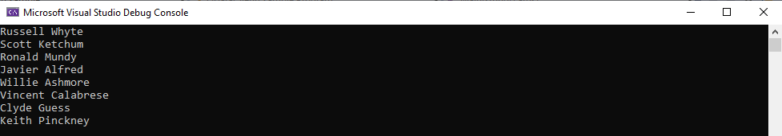

# Getting Started with OData Client

**Applies To**: [!INCLUDE[appliesto-odataclient](../includes/appliesto-odataclient-v7.md)]

The OData Client library allows you to consume data from and interact with OData services from .Net apps. There are multiple layers of abstraction available when working with the library: 

* You can use the library directly to interact with any service.
* You can use a code generation tool to generate strongly-typed client code that's specific to the service you are interested in.

In this article we are going to focus on the latter approach.

## What are Code Generation Tools
* These are tools used to generate client proxy file for an Odata service. They use the schema to generate the proxy classes.
* A proxy class shields the client from the complexities involved in invoking the Odata web service.
* A proxy class contains all the methods and objects exposed by the Odata web service.

## Using the OData Connected Service

The OData Connected Service is a Visual Studio extension that generates strongly-type C# client code for an OData service that you specify. In this article we are going to use the OData Connected Service to create a client for the [OData sample TripPin service](https://www.odata.org/blog/trippin-new-odata-v4-sample-service/).

To get started, open Visual Studio 2019 (2017 will also work for this example) and create a new C# .Net Core project (.Net Framework is also supported) and call the project `ODataClientExample`.

Next, let's install the OData Connected Service extension. To do that go to the **Extensions** menu, then **Manage Extensions**. In the extensions window, search online for "OData Connected Service" and install it.


Once installed, right-click your project in the Solution Explorer, then **Add** then **Connected Service**. In the **Connected Services** window that appears, select **OData Connected Service**.


Next, OData Connected Service provides us a wizard where we can configure settings for the service we want to connect to.  In the Service Name field, enter "TripPinService" as the name of the service. And in the "Address" field, we enter the URL of the metadata endpoint of the service, in this case let's enter: `https://services.odata.org/V4/TripPinServiceRW/$metadata` (Notice the `$metadata` route in the URL). Next let's choose a name for the file to be generated. For this example, let's just stick with the default "Reference". The advanced settings allow you to configure things such as custom namespace, whether to hide generated classes from external assemblies, etc. But for now, let's stick with the default settings. Click "Finish" to complete the configuration and generated the client code.

After successful completion, you should see a **Connected Services** section under your project in the Solution Explorer. Below this section, you will see a folder for the "TripPinService" which contains the generated "Reference.cs" file containing the generated C# client code.


## Using the generated code

Now open your `Program.cs` file and add the following `using` statement at the top:

```c#
using Microsoft.OData.SampleService.Models.TripPin
```

By default, the OData Connected Service generates the relevant classes in the same namespace defined in the OData metadata document. In this case it's `Microsoft.OData.SampleService.Models.TripPin`.

Let's create a new method in `Program` class called `ListPeople()` with the following code:

```c#
async Task ListPeople()
{
    var serviceRoot = "https://services.odata.org/V4/TripPinServiceRW/"
    var context = new DefaultContainer(new Uri(serviceRoot));

    IEnumerable<Person> people = await context.People.ExecuteAsync();
    foreach (var person in people)
    {
        Console.WriteLine("{0} {1}", person.FirstName, person.LastName);
    }
}
```

The above method creates a new instance of `DefaultContainer` pointed to the root
endpoint of the OData service we used to generate the client.
The `DefaultContainer` class is generated by the OData Connected Service,
it inherits from the [DataServiceContext](/dotnet/api/microsoft.odata.client.dataservicecontext)
class that's defined in the OData client library (`Microsoft.OData.Client`)
The `DataServiceContext` keeps track of the objects created
and fetched from the interactions with the service and allows you to
execute queries and other operations against the service.

`DefaultContainer` is generated based on the Trip Pin service and knows about
its data model. In this case `context.People` is generated from the People
entity set defined in the model. `context.People` is an instance of
[DataServiceQuery&lt;Person&gt;](/dotnet/api/microsoft.odata.client.dataservicequery-1).
The `DataServiceQuery<TElement>` class allows you to execute LINQ-enabled queries against
a particular endpoint of the service. `context.People` executes queries that return a
collection of `Person` instances.
The `Person` class is in turn generated based on the `Person` entity in the
OData model and contains the properties defined in the data model.
The generated code also includes enums, and methods corresponding to bound and unbound functions and actions.

Now let's call the `ListPeople()` method from the `Main` method by adding the following
statement in `Main`:
```c#
ListPeople().Wait();
```
Don't forget to add the following using statements as well:
```c#
using System.Collections.Generic;
using System.Threading.Tasks;
```

Now the entire program should look like:
```c#
using System;
using System.Collections.Generic;
using System.Threading.Tasks;
using Microsoft.OData.SampleService.Models.TripPin;

namespace ODataClientExample
{
    class Program
    {
        static void Main(string[] args)
        {
            // from c# 7.1 you can use async Main instead
            ListPeople().Wait();
        }

        static async Task ListPeople()
        {
            var serviceRoot = "https://services.odata.org/V4/TripPinServiceRW/";
            var context = new DefaultContainer(new Uri(serviceRoot));

            IEnumerable<Person> people = await context.People.ExecuteAsync();
            foreach (var person in people)
            {
                Console.WriteLine("{0} {1}", person.FirstName, person.LastName);
            }
        }
    }
}
```
And when you run it, you should see the following output:


As you can see, the OData Connected Service generates C# classes corresponding to your specific OData service and uses the underlying OData client library to serialize and deserialize to and from JSON, saving you a lot of work.

In this tutorial you have learned how to use the OData Connected Service to generate client code to interact with a specific OData service. To learn more about about using the client to read and write to the service, check out the [Basic CRUD Operations](/odata/client/v7/basic-crud-operations) tutorial.
For more information on using the OData Connected Service, checkout [OData Connected Service](/odata/connectedservice/getting-started) tutorial.
