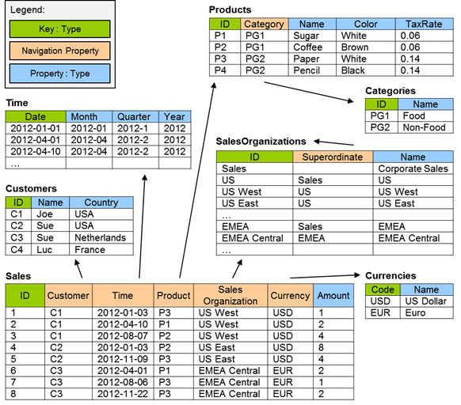

# Grouping and Aggregation in OData Client
**Applies To**: [!INCLUDE[appliesto-odataclient](../includes/appliesto-odataclient-v7.12.1.md)]

OData Client [v7.12.1](https://www.nuget.org/packages/Microsoft.OData.Client/) introduced support for grouping and aggregation. Grouping and aggregation allows us to summarize data for display or analysis. We achieve this by collapsing multiple rows of data into single rows based on some criteria and then computing aggregations like average, sum, min, max, count, etc. In this page, we look at how this feature is implemented in OData client.

## Sample Data
The following sample data from [OASIS OData Extension for Data Aggregation Version 4.0](http://docs.oasis-open.org/odata/odata-data-aggregation-ext/v4.0/cs02/odata-data-aggregation-ext-v4.0-cs02.html#_Toc435016565) site will be used to illustrate the scenarios supported by this feature.



## Simple Aggregation
The standard LINQ aggregation methods include [Average](/dotnet/api/system.linq.queryable.average), [Sum](/dotnet/api/system.linq.queryable.sum), [Min](/dotnet/api/system.linq.queryable.min), and [Max](/dotnet/api/system.linq.queryable.max). We support overloads of these methods that accept two parameters; a sequence of values - `source`: `IQueryable<TSource>`, and a projection function to apply to each element - `selector`.

These methods are translated into the corresponding OData URL.

### Standard LINQ Aggregation Methods Examples
1. Return average of sale amounts

    _Expression:_
    ```csharp
    dataServiceContext.Sales.Average(d1 => d1.Amount)
    ```
    _Translation:_
    ```
    /Sales?$apply=aggregate(Amount with average as AverageAmount)
    ```
    _Result:_ 3.0

2. Return sum of sale amounts

    _Expression:_
    ```csharp
    dataServiceContext.Sales.Sum(d1 => d1.Amount)
    ```
    _Translation:_
    ```
    /Sales?$apply=aggregate(Amount with sum as SumAmount)
    ```
    _Result:_ 24.0

3. Return minimum sale amount

    _Expression:_
    ```csharp
    dataServiceContext.Sales.Min(d1 => d1.Amount)
    ```
    _Translation:_
    ```
    /Sales?$apply=aggregate(Amount with min as MinAmount)
    ```
    _Result:_ 1.0

4. Return maximum sale amount

    _Expression:_
    ```csharp
    dataServiceContext.Sales.Max(d1 => d1.Amount)
    ```
    _Translation:_
    ```
    /Sales?$apply=aggregate(Amount with max as MaxAmount)
    ```
    _Result:_ 8.0

5. Return average sale product tax rate - where Product is a navigation property

    _Expression:_
    ```csharp
    dataServiceContext.Sales.Max(d1 => d1.Product.TaxRate)
    ```
    _Translation:_
    ```
    /Sales?$apply=aggregate(Product/TaxRate with average as AverageProduct_TaxRate)
    ```
    _Result:_ 0.1

6. Return sum sale product tax rate - where Product is a navigation property

    _Expression:_
    ```csharp
    dataServiceContext.Sales.Sum(d1 => d1.Product.TaxRate)
    ```
    _Translation:_
    ```
    /Sales?$apply=aggregate(Product/TaxRate with sum as SumProduct_TaxRate)
    ```
    _Result:_ 0.8

7. Return minimum sale product tax rate - where Product is a navigation property

    _Expression:_
    ```csharp
    dataServiceContext.Sales.Min(d1 => d1.Product.TaxRate)
    ```
    _Translation:_
    ```
    /Sales?$apply=aggregate(Product/TaxRate with min as MinProduct_TaxRate)
    ```
    _Result:_ 0.06

8. Return maximum sale product tax rate - where Product is a navigation property

    _Expression:_
    ```csharp
    dataServiceContext.Sales.Max(d1 => d1.Product.TaxRate)
    ```
    _Translation:_
    ```
    /Sales?$apply=aggregate(Product/TaxRate with max as MaxProduct_TaxRate)
    ```
    _Result:_ 0.14

In addition to the 4 aggregation methods described in the section above, we also support a custom [CountDistinct](/dotnet/api/microsoft.odata.client.dataserviceextensions.countdistinct) method that returns the total number of distinct values in the specified property. This custom method was introduced to eliminate the need for writing an expression of the following form to achieve the same: `dataServiceContext.Sales.Select(d1 => d1.Product).Distinct().Count()`.

### CountDistinct Examples
1. CountDistinct targeting structural property

    _Expression:_
    ```csharp
    dataServiceContext.Sales.CountDistinct(d1 => d1.ProductId)
    ```
    _Translation:_
    ```
    /Sales?$apply=aggregate(ProductId with countdistinct as CountDistinctProductId)
    ```
    _Result:_ 3

2. CountDistinct targeting navigation property

    _Expression:_
    ```csharp
    dataServiceContext.Sales.CountDistinct(d1 => d1.Product.Color)
    ```
    _Translation:_
    ```
    /Sales?$apply=aggregate(Product/Color with countdistinct as CountDistinctProductColor)
    ```
    _Result:_ 2

We can restrict the set of data to be aggregated by using the `Where` method. In this case however, the `Where` method is translated into a `filter` transformation, not a `$filter` query option.

### Filter Transformation Example
Return average USD sale amounts

_Expression:_
```csharp
dataServiceContext.Sales.Where(d1 => d1.CurrencyCode == "USD").Average(d2 => d2.Amount)
```
_Translation:_
```csharp
/Sales?$apply=filter(CurrencyCode eq 'USD')/aggregate(Amount with average as AverageAmount)
```
_Result:_ 3.8

## Grouping and Aggregation
There are [8 overloads](/dotnet/api/system.linq.queryable.groupby) of the `GroupBy` method defined in the `System.Linq` library. Our starting point in implementing support for grouping and aggregation is the following overload:
```csharp
GroupBy<TSource, TKey, TResult>(
    IQueryable<TSource>,
    Expression<Func<TSource, TKey>>,
    Expression<Func<TKey, IEnumerable<TSource>, TResult>>)
```
This overloads accepts 3 parameters:
- `source` - an `IQueryable<T>` whose elements to group
- `keySelector` - a function to extract the key for each element
- `resultSelector` - a function to create a result value for each group

We translate a `GroupBy` expression based on the above overload into the relevant OData URL.

### Grouping and Aggregation Examples:
1. Group by constant

    _Expression:_
    ```csharp
    dataServiceContext.Sales.GroupBy(
        d1 => 1,
	    (d2, d3) => new
	    {
	        AverageAmount = d3.Average(d4 => d4.Amount),
	        SumAmount = d3.Sum(d4 => d4.Amount)
	    });
    ```
    _Translation:_
    ```
    /Sales?$apply=aggregate(Amount with average as AverageAmount,Amount with sum as SumAmount)
    ```

2. Group by single property

    _Expression:_
    ```csharp
    dataServiceContext.Sales.GroupBy(
        d1 => d1.ProductId,
	    (d2, d3) => new
	    {
	        ProductId = d2,
	        AverageAmount = d3.Average(d4 => d4.Amount),
	        SumAmount = d3.Sum(d4 => d4.Amount)
	    });
    ```
    _Translation:_
    ```
    /Sales?$apply=groupby((ProductId),
    aggregate(Amount with average as AverageAmount,Amount with sum as SumAmount))
    ```

3. Group by single navigation property

    _Expression:_
    ```csharp
    dataServiceContext.Sales.GroupBy(
        d1 => d1.Product.Category.Id,
	    (d2, d3) => new
	    {
	        CategoryId = d2,
	        AverageAmount = d3.Average(d4 => d4.Amount),
	        SumAmount = d3.Sum(d4 => d4.Amount)
	    });
    ```
    _Translation:_
    ```
    /Sales?$apply=groupby((Product/Category/Id),
    aggregate(Amount with average as AverageAmount,Amount with sum as SumAmount))
    ```

4. Group by multiple properties

    _Expression:_
    ```csharp
    dataServiceContext.Sales.GroupBy(
        d1 => new { d1.ProductId, d1.CurrencyCode },
	    (d2, d3) => new
	    {
	        d2.ProductId,
	        d2.CategoryCode,
	        AverageAmount = d3.Average(d4 => d4.Amount),
	        SumAmount = d3.Sum(d4 => d4.Amount)
	    });
    ```
    _Translation:_
    ```
    /Sales?$apply=groupby((ProductId,CurrencyCode),
    aggregate(Amount with average as AverageAmount,Amount with sum as SumAmount))
    ```

5. Group by multiple navigation properties

    _Expression:_
    ```csharp
    dataServiceContext.Sales.GroupBy(
        d1 => new { d1.Product.CategoryId, d1.Customer.Country ),
	    (d2, d3) => new
	    {
	        d2.CategoryId,
	        d2.Country,
	        AverageAmount = d3.Average(d4 => d4.Amount),
	        SumAmount = d3.Sum(d4 => d4.Amount)	   
	    });
    ```
    _Translation:_
    ```
    /Sales?$apply=groupby((Product/CategoryId,Customer/Country),
    aggregate(Amount with average as AverageAmount,Amount with sum as SumAmount))
    ```

6. Aggregating navigation property

    _Expression:_
    ```csharp
    dataServiceContext.Sales.GroupBy(
        d1 => d1.Customer.Country,
        (d2, d3) => new
        {
            Country = d2,
            MinTaxRate = d3.Min(d4 => d4.Product.TaxRate),
            MaxTaxRate = d3.Max(d4 => d4.Product.TaxRate)
        });
    ```
    _Translation:_
    ```
    /Sales?$groupby((Customer/Country),
    aggregate(Product/TaxRate with min as MinTaxRate,
    Product/TaxRate with max as MaxTaxRate))
    ```

7. Group and count

    _Expression:_
    ```csharp
    dataServiceContext.Sales.GroupBy(
        d1 => new { d1.ProductId, d1.Customer.Country },
	    (d2, d3) => new
	    {
	        d2.ProductId,
	        d2.Country,
	        NumberOfProductsSoldByCountry = d3.Count()
	    });
    ```
    _Translation:_
    ```
    /Sales?$apply=groupby((ProductId,Customer/Country),
    aggregate($count as NumberOfProductsSoldByCountry))
    ```

8. Group and count distinct

    _Expression:_
    ```csharp
    dataServiceContext.Sales.GroupBy(
        d1 => d1.Customer.Country,
	    (d2, d3) => new
	    {
	        d2.Country,
	        DistinctNumberOfProductsSoldByCountry = d3.CountDistinct(
                d4 => d4.Product.Name)
	    });
    ```
    _Translation:_
    ```
    Sales?$apply=groupby((Customer/Country),
    aggregate(Product/Name with countdistinct as DistinctNumberOfProductsSoldByCountry))
    ```

9. Member initialization in the result selector

    _Expression:_
    ```csharp
    dataServiceContext.Sales.GroupBy(
        d1 => new { d1.ProductId, d1.Customer.Country },
        (d2, d3) => new GroupedResult
        {
            ProductId = d2.ProductId,
            Country = d2.Country,
            AverageAmount = d3.Average(d4 => d4.Amount),
            SumAmount = d3.Sum(d4 => d4.Amount),
            MinAmount = d3.Min(d4 => d4.Amount),
            MaxAmount = d3.Max(d4 => d4.Amount),
            NumberOfProductsSoldByCountry = d3.Count(),
            DistinctNumberOfProductsSoldByCountry = d3.CountDistinct(
                d4 => d4.Product.Name)
        });
    ```
    where `GroupedResult` is a class defined as follows:

    ```csharp
    class GroupedResult
    {
        public string ProductId { get; set; }
        public string Country { get; set; }
        public decimal AverageAmount { get; set; }
        public decimal SumAmount { get; set; }
        public decimal MinAmount { get; set; }
        public decimal MaxAmount { get; set; }
        public int NumberOfProductsSoldByCountry { get; set; }
        public int DistinctNumberOfProductsSoldByCountry { get; set; }
    }
    ```
    _Translation:_
    ```
    /Sales?$apply=groupby((ProductId,Customer/Country),
    aggregate(Amount with average as AverageAmount,Amount with sum as SumAmount,
    Amount with min as MinAmount,Amount with max as MaxAmount,
    $count as NumberOfProductsSoldByCountry,
    Product/Name with countdistinct as DistinctNumberOfProductsSoldByCountry))
    ```

10. Member initialization in the key selector

    _Expression:_
    ```csharp
    dataServiceContext.Sales.GroupBy(
        d1 => new GroupingKey
        {
            CategoryId = d1.Product.CategoryId,
            Country = d1.Customer.Country
        },
	    (d2, d3) => new
	    {
	        d2.CategoryId,
	        d2.Country,
	        AverageAmount = d3.Average(d4 => d4.Amount),
	        SumAmount = d3.Sum(d4 => d4.Amount)	   
	    });
    ```
    where `GroupingKey` is a class defined as follows:

    ```csharp
    class GroupingKey
    {
        public string CategoryId { get; set; }
        public string Country { get; set; }
    }
    ```
    _Translation:_
    ```
    /Sales?$apply=groupby((Product/CategoryId,Customer/Country),
    aggregate(Amount with average as AverageAmount,Amount with sum as SumAmount))
    ```

11. Mixed constructor and member initialization in the result selector

    _Expression:_
    ```csharp
    dataServiceContext.Sales.GroupBy(
        d1 => new { d1.Time.Year, CategoryName = d1.Product.Category.Name },
        (d2, d3) = new GroupedResult(d2.Year, d3.Average(d4 => d4.Amount))
        {
            CategoryName = d2.CategoryName,
            SumAmount = d3.Sum(d4 => d4.Amount)
        });
    ```
    where `GroupedResult` is a class defined as:
    ```csharp
    class GroupedResult
    {
        public int Year { get; }
        public string CategoryName { get; set; }
        public decimal AverageAmount { get; }
        public decimal SumAmount { get; set; }
    }
    ```
    _Translation:_
    ```
    /Sales?$apply=groupby((Time/Year,Product/Category/Name),
    aggregate(Amount with average as AverageAmount,Amount with sum as SumAmount)
    ```

12. Support for known primitive types' member access and method calls

    _Expression:_
    ```csharp
    dataServiceContext.Sales.GroupBy(
        d1 => new
        {
            d1.Time.Year,
            CategoryName = d1.Product.Category.Name,
            d1.CurrencyCode
        },
        (d2, d3) => new
        {
            FoobarLength = "foobar".Length,
            TenStr = 10.ToString(),
            YearStr = d2.Year.ToString(),
            CategoryNameLength = d2.CategoryName.Length,
            d2.CurrencyCode,
            AverageAmount = d3.Average(d4 => d4.Amount).ToString(),
            SumAmount = d3.Sum(d4 => d4.Amount),
            MinAmount = d3.Min(d4 => d4.Amount).ToString()
        });
    ```
    _Translation:_
    ```
    /Sales?$apply=groupby((Time/Year,Product/Category/Name,CurrencyCode),
    aggregate(Amount with average as AverageAmount,
    Amount with sum as SumAmount,Amount with min as MinAmount)
    ```

13. Filter before grouping

    _Expression:_
    ```csharp
    dataServiceContext.Sales.Where(d1 => d1.CurrencyCode == "USD").GroupBy(
        d1 => d1.ProductId,
	    (d2, d3) => new
	    {
	        ProductId = d2,
	        AverageAmount = d3.Average(d4 => d4.Amount),
	        SumAmount = d3.Sum(d4 => d4.Amount)
	    });
    ```
    _Translation:_
    ```
    /Sales?$apply=filter(CurrencyCode eq 'USD')/groupby((ProductId),
    aggregate(Amount with average as AverageAmount,Amount with sum as SumAmount))
    ```
