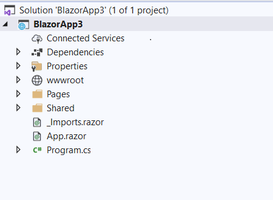

# How to use Blazor WebAssembly with OData Client 
**Applies To**: [!INCLUDE[appliesto-odataclient](../includes/appliesto-odataclient-v7.md)]

## Getting Started
Start by creating a Blazor WebAssembly project. Follow the following steps to create a Blazor WebAssembly project. 

* Open Visual Studio and click on "Create a new project".
* On the window that appears, select the "Blazor App" tempate and click "Next". 
* On the "Configure your project" page, configure your project by providing the project name and the location path then click "Create".
* Finally on the "Create Project" page, specify the target framework that you want to use and select "Blazor WebAssembly App" then click "Create". 

A Blazor Web Assembly project will be created like below. 



On the "Pages" folder add a "Books.cshtml" page. We will display data from the OData endpoint on this page. 

There are two ways in which you can use OData Client with Blazor WebAssembly: 

* You can use the Microsoft OData Connected Service
* You can use Plain Old CLR objects (POCOs)

## Using Microsoft OData Connected Service

Add OData Connected Service to the project you just created above. 

To do so, ensure that you have the Microsoft OData Connected Service extension installed. Refer to this link [Microsoft OData Connected Service](/odata/connectedservice/getting-started/) to find out how to get started with Microsoft OData Connected Service.
Right click on your project and add a Connected Service. Select the Microsoft OData Connected Service that you installed and use the Wizard to generate proxy classes for the OData endpoint that you want to use.

Once all this is done, open the 'Books.cshtml' page and include the code below in the `OnInitializedAsync` method.  

The use of the below syntax is possible with `Microsoft.OData.Client v7.8.1` and above. 

```c#
Uri serviceRoot = new Uri("https://localhost:44353/odata");
var dataServiceContext = new Default.Container(serviceRoot);
dataServiceContext.HttpRequestTransportMode = HttpRequestTransportMode.HttpClient;
var result = await dataServiceContext.Books.ExecuteAsync();
foreach (var book in result)
{
    Console.WriteLine(book.Author);
    Console.WriteLine(book.ISBN);
}
```
You can then display the data however you want on your Razor pages.  

## Using Plain Old CLR objects (POCOs)

If you prefer to not use Microsoft OData Connected Service or any code generation tools, then you can create the `DataServiceContext` as in the example below:
The `DataServiceContext` class is found in the `Microsoft.OData.Client` namespace.

```c#
public partial class ODataServiceContext : DataServiceContext
{
    public ODataServiceContext(Uri serviceRoot) : base(serviceRoot)
    {
        //Add this to override the default HttpWebRequest for making requests in OData Client. 
        HttpRequestTransportMode = HttpRequestTransportMode.HttpClient;

        this.Books = base.CreateQuery<Book>("Books");
        this.Format.LoadServiceModel = () => GetEdmModel();
        this.Format.UseJson();
    }

    private IEdmModel GetEdmModel()
    {
        ODataConventionModelBuilder builder = new ODataConventionModelBuilder();
        builder.EntitySet<Book>("Books").EntityType.HasKey(p => p.Id).Count().Select().Page(null, 100).Expand().Filter();
        return builder.GetEdmModel();
    }

    public DataServiceQuery<Book> Books { get; }
}
```

Then in the `OnInitializedAsync` method in the "Books.cshtml" page and add the code below to get data from an endpoint. For example:
```c# 
var dataServiceContext = new ODataServiceContext(new Uri("https://localhost:44353/odata"));
var result = await dataServiceContext.Books.ExecuteAsync();

foreach (var book in result)
{
    Console.WriteLine(book.Author);
    Console.WriteLine(book.ISBN);
}
```