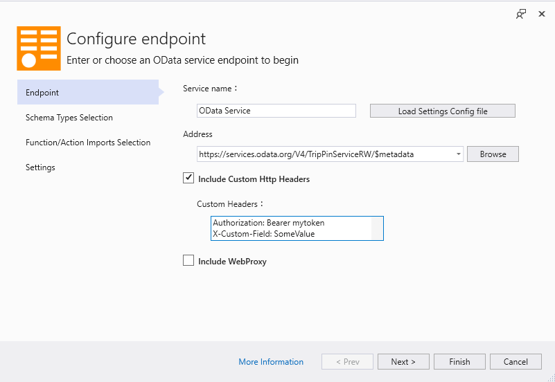
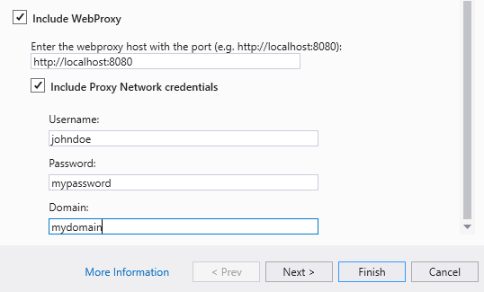

# Accessing endpoints that require authentication

**Applies To**: [!INCLUDE[appliesto-odataclient](../includes/appliesto-odataclient-v7.md)]

OData Connected Services makes a web request to the target OData service in order to fetch the metadata document containing the model schema. If the service restricts access to the metadata endpoints, then the request may fail and the connected service will display an error. One workaround is to manually download the metadata document into a local file and use the file's path as the service endpoint.

However, OData Connected Service provides means to provide authentication details via custom headers or network credentials.

## Custom Headers

The **Custom Headers** field in the **Endpoint** page (the first page of the wizard) allows you to specify arbitrary headers that will get sent along with the request when fetching the metadata document from the service.

To add customer headers, select the **Include Custom Http Headers** checkbox and enter the headers in the **Custom Headers** text field. Each entry consists of a key and value pair separated by a colon (`:`). Each entry should go on a separate line.

## Proxy and network credentials

If you're running OData Connected Service from an environment that's behind a network proxy and/or domain that requires network credentials to access the Internet, you can use the **WebProxy** settings to configure those credentials.

In the **Endpoint** page of the wizard, enable the **Include WebProxy** checkbox. This will reveal a set fields that allow you to specify you proxy credentials

## Privacy concerns

Because custom headers and network credentials might contain sensitive data or data that is not relevant to other developers working on the project, these details are not persisted in your connected service configuration file (`ConnectedService.json`). These credentials are also not stored in the in the generated code. If you want your client app to authenticate requests sent to the server, you'll have to configure that manually in code.