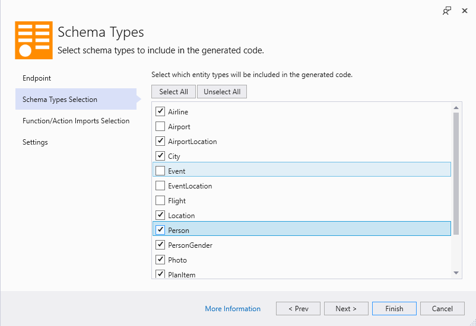
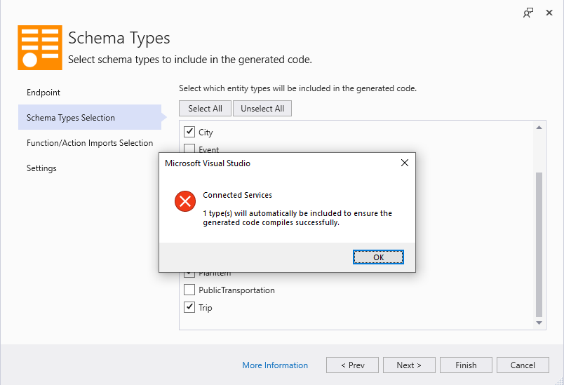
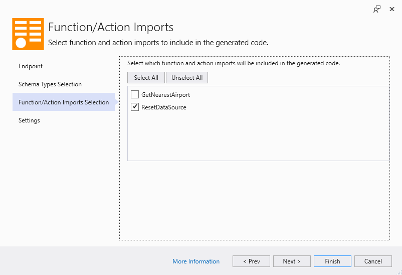

# Choosing what to generate

**Applies To**: [!INCLUDE[appliesto-odataclient](../includes/appliesto-odataclient-v7.md)]

OData Connected Service allows you to select which types and methods to include in the generated code. This allows you to avoid bloating the generated code with things that you do not need for your program. It also comes in handy when you are working with a very large service but want to keep the generated code small and manageable.

## Schema types selection

The **Schema Types** page of the OData Connected Service wizard displays a list of all the types (entity types, complex types, enums) in the service model and lets select which ones to include in the generated code. If you exclude a type from the list, then the corresponding class or enum will not be generated.

When you select a type in the list, all the types that it depends on are also automatically selected. For example, if yo have an entity type `Person` that has an enum property of type `PropertyGender`, then selecting `Person` will cause `PropertyGender` to be auto-selected as well. This ensures that the generated code is able to compile successfully.

You might encounter a pop-up similar to the one below, if you attempt navigating from the screen while having unselected a type that is required by another. For example, if `Person` and `PropertyGender` are initially both selected and you un-select `PropertyGender`, then when you navigate away from the page (e.g. by clicking **Next**), the `PropertyGender` item will be auto-selected and you will get a pop-up like the following:

## Operation Imports Selection

The **Function/Action Imports Selection** page displays a list of function and action imports in the model and lets you select which ones are included in the generated code.

When you un-select an item in this list, the method corresponding to the operation import in the model will not be generated. Keep in mind that this only affect the operation import (which is defined on the entity container), not the underlying unbound action/function defined on an entity set. Operation imports are generated as methods on the top-level `DataServiceContext` of the generated code.

When you select an operation import on the list, then schema types (entity types, complex types, enums) that it depends on (either as parameter or return types) will also be automatically selected. For example, if a function import `GetNearestAirport` returns an entity of type `Airport`, then selecting `GetNearestAiport` will auto-select `Airport` even if you had previously un-selected `Airport`. This ensures that the generated code can compile successfully.
