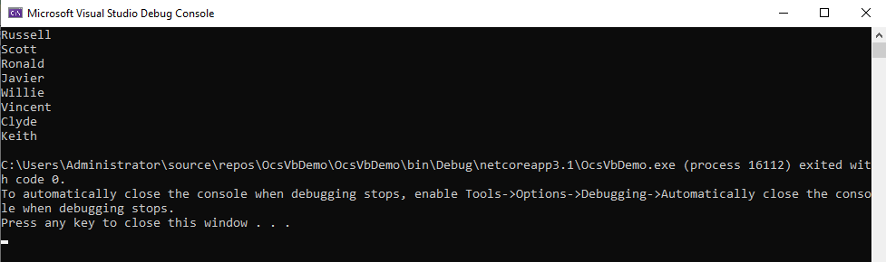

# Generating code for VB clients

**Applies To**: [!INCLUDE[appliesto-odataclient](../includes/appliesto-odataclient-v7.md)]

OData Connected Service allows you to generate client code both for C# and Visual Basic. If you add OData Connected Service to a VB project, then it will generate VB code.

To demonstrate this, let's create a simple Visual Basic .Net Core Console project in Visual Studio and call it `OcsVbDemo`.

Add the OData Connnected Service to you project by right-clicking on the project in Solution Explorer, then Add -> Connected Service -> Connected Services -> OData Connected Service.

For more details about installing and adding OData Connected Service to your project, visit the [Getting Started](./getting-started) section.

In the OData Connected Service wizard, set the **Service Name** to "TripPinService" and the **Address** to `https://services.odata.org/v4/TripPinService/$metadata` (this is a sample OData service for demonstration purposes).

Click "Finish" to start the code generation process. After this process completes, you should see a `TripPinService` folder in the Connected Services section in the Solution. Under that folder, you should also see a `Reference.vb` file which contains the generated code.

Let's use the generated classes in our program to display the fetch and
display data from the OData service.

Open the `Program.vb` file and replace its contents with the following code:

```vb
Imports System
' this is the namespace that contains the generated code, based on the namespace defined in the service metadata
Imports OcsVbDemo.Microsoft.OData.SampleService.Models.TripPin
 
Module Program
    Sub Main(args As String())
        DisplayPeople().Wait()
    End Sub
 
    ''' <summary>
    ''' Fetches and displayes a list of people from the OData service
    ''' </summary>
    ''' <returns></returns>
    Async Function DisplayPeople() As Task
        Dim container = New DefaultContainer(New Uri("https://services.odata.org/v4/TripPinService"))
        Dim people = Await container.People.ExecuteAsync()

        For Each person In people
            Console.WriteLine(person.FirstName)
        Next
    End Function
End Module
```

The `DefaultContainer` is a generated class that inherits from [DataServiceContext](/dotnet/api/microsoft.odata.client.dataservicecontext) and gives us access to the resources exposed by the service. We create a Container instance using the URL of the service root. The container has a generated People property which we’ll use to execute a query against the People entity set on the OData service and then display the results.

Finally, let’s run the app. You should see a list of names displayed on the console:



In this section, we have seen how to use OData Connected Service to generate OData client code for VB projects. Unless otherwise specified, configuration options and features covered in the remainder of this documentation apply for both C# and VB.