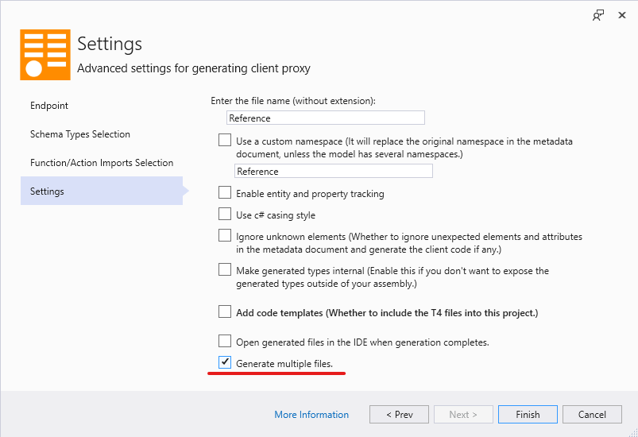
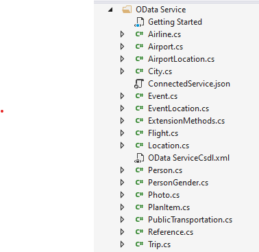

# Generating multiple files

**Applies To**: [!INCLUDE[appliesto-odataclient](../includes/appliesto-odataclient-v7.md)]

By default, the OData Connected Service stores all the generated code into a single file (`Reference.cs` by default, but it can be renamed in the Settings). However, you can opt to have the generated code split into multiple files. This can be useful when the generated code is very large and difficult to maintain in one file or difficult for the IDE to handle properly.

To enable this option, go to the **Settings** page of the OData Connected Service then toggle **Advanced Settings** and select **Generate multiple files**.

Each entity type and enum gets stored in its own file with file name corresponding to the type name. The main file (`Reference.cs`) only contains the top-level container (`DataServiceContext`) and methods containing operation imports. In addition, there's an `ExtensionMethods.cs` file that contains the extension methods on different types, like bound actions/function, `ByKey()` methods, etc.

