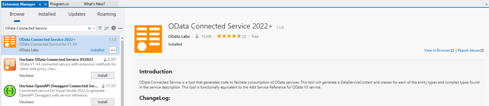

# OData Connected Service

**Applies To**: [!INCLUDE[appliesto-odataclient](../includes/appliesto-odataclient-v7.md)]

OData Connected Service is a Visual Studio extension that generates strongly-typed C# and Visual Basic client code for a specified OData service. It generates a `DataServiceContext` class to interact with the service and CLR types for each entity type and complex type in the service model.

The extension is available at Visual Studio Marketplace:

- [OData Connected Service 2022+](https://marketplace.visualstudio.com/items?itemName=marketplace.ODataConnectedService2022) for Visual Studio 2022
- [OData Connected Service](https://marketplace.visualstudio.com/items?itemName=marketplace.ODataConnectedService) for Visual Studio 2019 and 2017

## Creating a sample client application using OData Connected Service

In this sample we are going to install the extension and use it to create a sample client application for the sample [TripPin](https://www.odata.org/blog/trippin-new-odata-v4-sample-service/) OData service.

Open Visual Studio 2022 and create a new C# .NET project and call the project `ODataClientExample`.

> [!NOTE]
> .NET Framework is also supported, but you would have to manually install Microsoft.OData.Client 7.x, Microsoft.OData.Core 7.x, Microsoft.OData.Edm 7.x, Microsoft.Spatial 7.x since the latest version of OData core libraries do no support .NET Framework.

Install the OData Connected Service extension by going to **Extensions** menu -> **Manage Extensions**. In the Exensions window, search online for "OData Connected Service" and install **OData Connected Service 2022+**.



Once installed, right-click your project in the **Solution Explorer** -> **Add** -> **Connected Service**. In the **Connected Services** window that appears, select **OData Connected Service**.


Next, OData Connected Service provides us a wizard where we can configure settings for the service we want to connect to. In the **Service Name** field, enter "TripPinService" as the name of the service. And in the **Address** field, enter the URL of the metadata endpoint of the service. In this case, we enter: `https://services.odata.org/V4/TripPinServiceRW/$metadata`.

The Connected Service provides many options to control how the code is generated, but for this example we are just going to stick with the defaults. Click **Finish** to complete the configuration and generate the client code.


After successful completion, you should see a **Connected Services** section under your project in the Solution Explorer. Below this section, you should see a folder for the "TripPinService" which contains the generated `Reference.cs` file containing the generated C# client code.


> [!NOTE]
> OData Connected Service installs the latest versions of OData core libraries (i.e. OData.NET) if they are not installed. OData.NET 8 libraries support .NET 8 and later, they do not support older versions of .NET Core or any version of .NET Framework. If your project is targetting any of these .NET versions, then you should manually install Microsoft.Spatial 7.x Microsoft.OData.Edm 7.x, Microsoft.OData.Core 7.x and Microsoft.Client 7.x.

## Using the generated code

Now let's use the generated classes to implement our application logic. Open your `Program.cs` file and add the following `using` statement at the top:

```c#
using Microsoft.OData.SampleService.Models.TripPin
```

By default, the OData Connected Service generates the relevant classes in the same namespace defined in the OData metadata document. In this case, it's `Microsoft.OData.SampleService.Models.TripPin`.

Let's create a new method in `Program.cs` file called `ListPeople()` with the following code:

```c#
async Task ListPeople()
{
    var serviceRoot = "https://services.odata.org/V4/TripPinServiceRW/";
    var context = new DefaultContainer(new Uri(serviceRoot));

    IEnumerable<Person> people = await context.People.ExecuteAsync();
    foreach (var person in people)
    {
        Console.WriteLine("{0} {1}", person.FirstName, person.LastName);
    }
}
```

The above method creates a new instance of `DefaultContainer` pointed to the root endpoint of the OData service we used to generate the client. The `DefaultContainer` class is generated by OData Connected Service based on the entity container in the service model. It inherits from the [DataServiceContext](/dotnet/api/microsoft.odata.client.dataservicecontext)
class that's defined in the OData client library (`Microsoft.OData.Client`). The `DataServiceContext` allows you to execute queries and other operations against the service. It also keeps track of the entities created and fetched when interacting with the service.

`DefaultContainer` is generated based on the Trip Pin service entity container and it knows about its data model. In the code snippet above `context.People` is generated from the People entity set defined in the model. `context.People` is an instance of [DataServiceQuery&lt;Person&gt;](/dotnet/api/microsoft.odata.client.dataservicequery-1).

The `DataServiceQuery<TElement>` class allows you to execute LINQ-enabled queries against a particular endpoint of the service. `context.People` executes queries that return a collection of `Person` instances.

The `Person` class is in turn generated based on the `Person` entity in the OData model and contains the properties defined in the model. The generated code also includes enums, classes corresponding to complex types and methods corresponding to bound and unbound functions and actions.

Now let's call the `ListPeople()` method from the top of the file:

```c#
await ListPeople();
```

The final code should look like:

```c#
using Microsoft.OData.SampleService.Models.TripPin;

await ListPeople();

static async Task ListPeople()
{
    var serviceRoot = "https://services.odata.org/V4/TripPinServiceRW/";
    var context = new DefaultContainer(new Uri(serviceRoot));

    IEnumerable<Person> people = await context.People.ExecuteAsync();
    foreach (var person in people)
    {
        Console.WriteLine("{0} {1}", person.FirstName, person.LastName);
    }
}
```

Finally, let's run the code! You should see the following output:


As you can see, the OData Connected Service generates C# classes corresponding to your specific OData service and uses the underlying OData client library to serialize and deserialize to and from JSON, saving you a lot of work.

In this tutorial you have learned how to use the OData Connected Service to generate client code to interact with a specific OData service. Visit other sections in this documentation to learn about all the features and configuration options provided by the tool.
