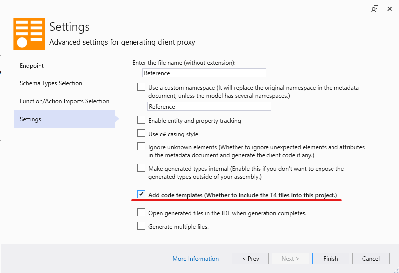
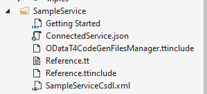
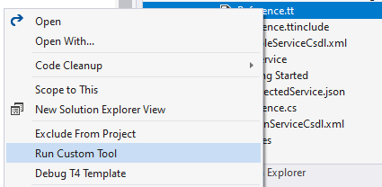
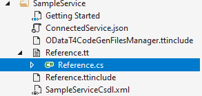

# Working with T4 templates

**Applies To**: [!INCLUDE[appliesto-odataclient](../includes/appliesto-odataclient-v7.md)]

OData Connected Service can generate [T4 templates](https://docs.microsoft.com/en-us/visualstudio/modeling/code-generation-and-t4-text-templates?view=vs-2019) instead of the final code. The T4 templates can be used to generate the final C# or VB code. This comes in handy if you want to run the code generation process in a command-line environment, a continuous integration server or any other environment where the OData Connected Service extension is not installed.

**Note**: [The TextTransform utility](https://docs.microsoft.com/en-us/visualstudio/modeling/generating-files-with-the-texttransform-utility?view=vs-2019) can be used to generate code on a command-line environment.

To generate T4 templates, go to the **Settings** page of the wizard, then toggle **Advance Settings** then select **Add code templates (Whether to include T4 files into this project)**.



When you finish the code generation process, the following files will be added to your project: `Reference.tt` (the main template file), `Reference.ttinclude` and `ODataT4CodeGenFilesManager.ttinclude`.



## Generating the C#/VB code

To generate the C#/VB code, right-click the `Reference.tt` file and click **Run Custom Tool**.



The generated code is saved in the `Reference.cs` (or `Reference.vb`) file by default that you can view by expanding the `Reference.tt` node in **Solution Explorer**.



## Updating generated code

The `Reference.tt` file contains a C# `Configuration` class that provides you access to similar settings available in the connected service wizard. You can update the generated code by updating the properties of the `Configuration` class and then running the custom tool menu option again.

The class properties have comments that explain what effect the configuration option has and the kind of value it expects. The properties are pre-populated with the values that you selected in the connecte service wizard when generating the T4 templates.

```c#
public static class Configuration
{
	// The URI of the metadata document. The value must be set to a valid service document URI or a local file path
    // eg : "http://services.odata.org/V4/OData/OData.svc/", "File:///C:/Odata.edmx", or @"C:\Odata.edmx"
    // ### Notice ### If the OData service requires authentication for accessing the metadata document, the value of
    // MetadataDocumentUri has to be set to a local file path, or the client code generation process will fail.
	public const string MetadataDocumentUri = @"https://services.odata.org/V4/TripPinServiceRW/$metadata";

	// The use of DataServiceCollection enables entity and property tracking. The value must be set to true or false.
	public const bool UseDataServiceCollection = false;

	// The namespace of the client code generated. It replaces the original namespace in the metadata document,
    // unless the model has several namespaces.
	public const string NamespacePrefix = "";

	// The target language of the generated client code. The value must be set to "CSharp" or "VB".
	public const string TargetLanguage = "CSharp";

	// The path for the temporary file where the metadata xml document can be stored. Use this if your metadata is too big to be stored in a string literal. Ensure that you have write permission for this path.
	// For example - "C:\\temp\\Test.xml"
	public const string MetadataFilePath = @"C:\Users\someuser\source\repos\ODataClientExample\ODataClientExample\Connected Services\SampleService\SampleServiceCsdl.xml";

	// The relative path for the MetadataFilePath.
	public const string MetadataFileRelativePath = @"SampleServiceCsdl.xml";

	// This flag indicates whether to enable naming alias. The value must be set to true or false.
	public const bool EnableNamingAlias = true;

	// This flag indicates whether to ignore unexpected elements and attributes in the metadata document and generate
	// the client code if any. The value must be set to true or false.
	public const bool IgnoreUnexpectedElementsAndAttributes = false;

	// If set to true, generated types will have an "internal" class modifier ("Friend" in VB) instead of "public"
	// thereby making them invisible outside the assembly
	public const bool MakeTypesInternal = true;

	//This files indicates whether to generate the files into multiple files or single.
    //If set to true then multiple files will be generated. Otherwise only a single file is generated.
    public const bool GenerateMultipleFiles = false;

	// (Optional) Custom http headers as a multiline string
	public const string CustomHttpHeaders = @"";

	// Comma-separated list of the names of operation imports to exclude from the generated code
	public const string ExcludedOperationImports = "";

     // Comma-separated list of the names of entity types to exclude from the generated code
	public const string ExcludedSchemaTypes = "";
}
```

You can also update the `Configuration` class property values by [updating the connected service through the wizard](./updating-generated-code). This will re-generated the T4 templates with the values from the wizard. Then you re-generated the C#/VB code by re-running the custom tool option again.

Note that when updating through the connected service wizard, you cannot disable generation of T4 templates.
