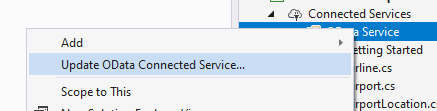

# Updating the generated code

**Applies To**: [!INCLUDE[appliesto-odataclient](../includes/appliesto-odataclient-v7.md)]

When the service metadata document is updated, or when you want to modify the connected service configuration, you can update your connected service by finding the relevant folder under the **Connected Services** node in **Solution Explorer**, right-click your folder and select **Update Connected Service**.

This will launch the OData Connected Service wizard pre-populated with the values you selected when you generated the code. **Note** These are persisted and retrieve from the `ConnectedService.json` file in your connected service folder. You can go through the wizard and update the settings you want to change (e.g. select/un-select schema types, change namespace, etc.). When you click **Finish**, code will be generated afresh and the previously generated files will be replaced with the new code. The new settings will also be persisted in the `ConnectedService.json` file.

## Read-only settings

Note that not all settings can be updated, some of them become read-only after the first code generation and cannot be updated in the wizard when you update the connected service. The read-only settings are:
- Service name
- Address
- The generated file name
- Whether to generate T4 templates
- Whether to generate multiple files
