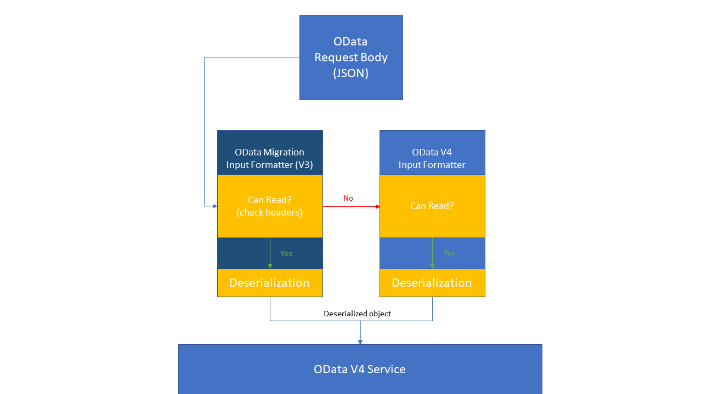
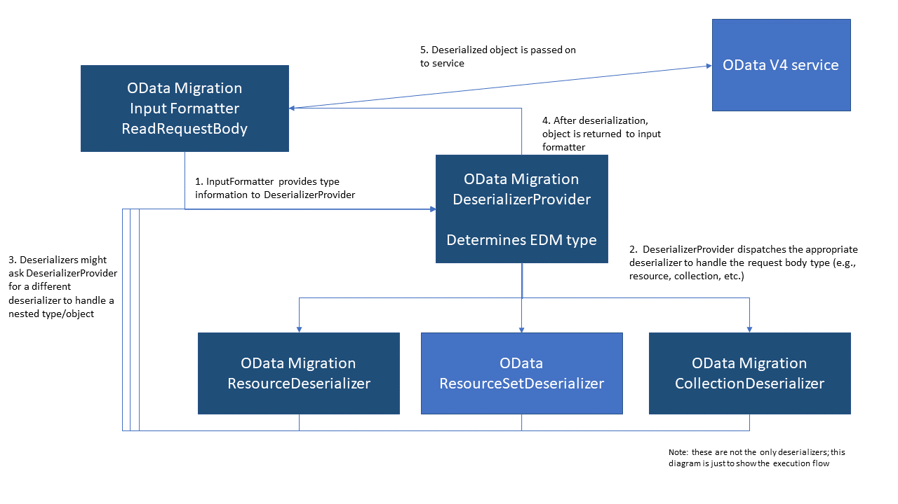
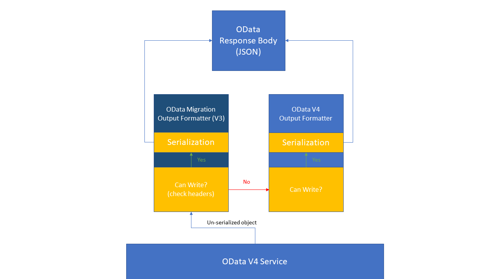

# Introduction

The OData Migration library provides ASP.NET Core 2.2+ OData V4 services with the capability of handling and responding to OData V3 requests.  An OData V4 service that uses the OData Migration Library may appear to an OData V3 client as the equivalent V3 service.  This may be useful to you if you have migrated your service from OData V3 to OData V4, but wish to bridge the gap between your newly migrated V4 service and your OData V3 clients.

# Usage

## Requirements
The OData Migration library applies to:

1. OData V4 services that wish to support V3 clients
2. ASP.NET Core 2.2+ OData V4 services
3. JSON formatted requests and responses

## Not tested or supported
| OData Feature | Tested | Example|
|---|---|---|
| OData XML/Atom format | Not supported | See [Atom and XML formats](https://www.odata.org/documentation/odata-version-3-0/atom-format/)
| Instance annotations beyond basic types in request/response payloads| Not tested or supported | Example of entity reference link via annotation: `"@odata.id" : "serviceRoot/People('vincentcalabrese')"`   |
| Navigation Links | Not tested | `http://localhost/v3/Customer(1)/$links/Orders` |
| Nested/mixed action return payloads | Not tested | `{ mixed_payload: [{ "name": "entity", "id": 3}, 4, 5, [{"name: "other_entity", "price": 9}]] }`|
| Automatic conversion between Edm.Time and Edm.Duration/Edm.TimeOfDay | Not tested | - |
| JSON Verbose Format | Not supported | -  |

In addition, all features that are [new in OData V4](http://docs.oasis-open.org/odata/new-in-odata/v4.0/new-in-odata-v4.0.html) but not present in OData V3 are not supported by this extension.
## Installation and Setup
There are two steps to configure your service to use OData Migration.

### Step 1: Configuring Services

Adding OData Migration to your service configuration simply one properly placed line of code.

```C#
public static void ConfigureServices(IServiceCollection services)
{
	// your code here
	
	// AddOData must be called before AddODataMigration
	services.AddOData();
	services.AddODataMigration();

	// your code here
}
```

AddODataMigration takes no arguments, and adds the following to your service collection:

1. OData Migration filters
2. OData Migration input formatter
3. OData Migration output formatter

The OData Migration filters are ASP.NET Core filters that are used to:

1. Add version and content ID headers to batched requests
2. Catch exceptions in requests within batch requests and send them back as internal server errors with content ID headers attached

The OData Migration input and output formatters observe the incoming request to see if it contains either of the specific OData version headers.
These headers are `dataserviceversion: 3.0` and `maxdataserviceversion: 3.0`  If either of these headers are present in the request, the input formatter
will deserialize the request as a OData v3 request, and the output formatter will return JSON that is OData v3 compliant.  Both of these formatters
make use of the OData Edmx contract to validate requests and responses just as they would be validated in v4.

### Step 2: Configuring IApplicationBuilder

Configuring your application to use OData Migration in its pipeline requires two parameters:

1. A string representation of the OData V3 model you would like to support
2. The IEdmModel representation of your OData V4 model.

The string representation is used for model validation during translation and is also returned when a request asks for the metadata of your service.  The V4 IEdmModel is used for model validation during translation.

Also, the V3 and V4 edmx contracts, while different in format, must match in meaning, or else model validation will fail when checking between models.

Supplying these two parameters to the UseODataMigration extension method is all you need to do to configure your application.  The code below shows how you might obtain the string representation of your V3 model, and where to call UseODataMigration:
```C#
public static void Configure(IApplicationBuilder builder)
{
	// your code here

	// If using batching, you must call UseODataBatching before UseODataMigration
	builder.UseODataBatching();

	IEdmModel v4model = /*your model*/;

	// If you are working with a Data.Edm.IEdmModel:
	Data.Edm.IEdmModel v3model = /*your model*/;
	builder.UseODataMigration(v3model, v4model);

	// If you have your OData V3 model representation as an EDMX string (e.g., by querying your V3 service for metadata)
	// string v3Edmx = /*your EDMX string*/
	// builder.UseODataMigration(v3Edmx, v4model);

	// your code here
}
```
Calling UseODataMigration inserts the middleware responsible for translating incoming request URLs.  For example, an OData version 3 request URL might look like:

```
https://localhost/v3/Product(guid'02951787-4c1a-4dff-a917-a04b21b40ad3')
```

whereas the equivalent OData version 4 request URL looks like:

```
https://localhost/v4/Product(02951787-4c1a-4dff-a917-a04b21b40ad3)
```

OData Migration extension's middleware will take care of this conversion for you automatically, provided that you are using JSON and have either the
`dataserviceversion: 3.0` or `maxdataserviceversion: 3.0` header in your request headers.

Be aware that in its current state, using this extension will cause your v3 metadata to always be returned in response to any metadata requests.

# Project structure
This project uses the master branch for development.  

The main point of entry for usage is `MigrationExtension.cs`.  This exposes public methods for services who want to use this extension.

The architecture of this extension can be thought of as three separate features:

1) URL Translation
2) Request Body Translation
3) Response Body Translation

### URL Translation

URL translation in the code is split into two parts: path translation and query translation. The entry point for URL translation is `ODataMigrationMiddleware.cs` which
formats and checks the request headers to see if the incoming request is an OData V3 request.  If so, it translates the path and query of the HttpContext.

#### Path Translation
The path of the request URL is translated by:

1) Parsing the request path into OData V3 segments (such as a property segment, entity segment, or key segment)
2) Utilizing the UriSegmentTranslator (`Middleware/UriSegmentTranslator.cs`) to convert each segment to an equivalent OData V4 segment
3) Building the V4 path

Translating each segment from V3 to V4 is a process of obtaining the relevant inner pieces of data of the V3 segment, looking up their equivalents
in the V4 model, and constructing a new V4 segment with matching inner data.

#### Query Translation
There are only a few key differences between OData V3 and OData V4 when it comes to queries.  Here is the list of OData query options and their differences:

|Query option|Description|Syntactic difference between V3 and V4|
|---|---|---|
|$expand|Expands related entities inline|None|
|$filter|Filters the results, based on a Boolean condition|The same differences between URLs, for example the presence of keywords like "guid" and "datetime"|
|$inlinecount|Tells the server to include the total count of matching entities in the response.|Changed in V4 to $count, either true or false (whereas $inlinecount is allpages or none)|
|$orderby|Sorts the results|None|
|$select|Selects which properties to include in the response|None|
|$skip|Skips the first n results|None|
|$top|Returns only the first n results|None|

The OData Migration extension translates a V3 query by looking for either filter or inlinecount options and translating them.  The $filter option is translated by:

1) Parsing the filter expression in OData V3
2) Translating the OData v3 representation of the filter expression into an OData v4 representation of the filter expression
3) Inserting the OData v4 representation back into the URL.

The $inlinecount option is translated by changing "allpages" to "true" and "none" to "false".

### Request Body Translation
Request body translation is done by overridding the OData V4 ASP.NET Core InputFormatter.  InputFormatters in ASP.NET Core are responsible for deserializing incoming request bodies.
In OData V4, the ODataInputFormatter uses a set of deserializers that are each responsible for a certain kind of request body payload.  For example, there is an ODataResourceDeserializer,
which is responsible for deserializing incoming entities and complex types.  These deserializers are dispatched by the ODataDeserializerProvider; in OData V4 the implementation for the
default provider is found in the `DefaultODataDeserializerProvider.cs` class.

The main difference between the ODataMigrationInputFormatter and ODataInputFormatter is that the ODataMigrationInputFormatter uses a customized provider found in
`ODataMigrationDeserializerProvider.cs`.  This is because OData Migration handles incoming OData V3 request bodies by dispatching customized deserializers.
Each of these custom deserializers overrides the default OData V4 deserializer in order to insert logic that modifies the incoming request body _before_
it is deserialized in OData V4.



#### Example

One example of an incoming OData V3 request that would pose a problem to a V4 deserializer is:
```
{
	"MyName": "John",
	"MyLong": "1000000000"
}
```
In OData V3, `long` types in request bodies are surrounded by quotes.  However, an OData V4 deserializer reading this request body will throw an exception
at model validation, because the property `MyLong` is supposed to be a `long` type but a `string` is found instead.

In the ODataMigrationInputFormatter, the ODataMigrationResourceDeserializer would be dispatched by the ODataMigrationDeserializerProvider, and would
therefore be able to modify the request body to be V4 compatible _before_ passing it to the ODataResourceDeserializer.

This extension overrides the resource, collection (an array of non-entity/non-complex values), and action payload deserializers.  Some of the OData v4
deserializers did not require modification to be V3 compatible, while others, such as the ODataResourceSetDeserializer, end up depending on the customized
ODataMigrationResourceDeserializer.

#### Deserializers
The following table explains why each deserializer was or was not overridden:

|OData V4 ASP.NET Core Deserializer|Overridden?|Reason|
|---|---|---|
|ODataActionPayloadDeserializer|Yes|Action parameters can consist of V4 types that are represented differently in V3|
|ODataCollectionDeserializer|Yes|Collections are arrays of simple values, and these simple values could be V4 types that are represented differently in V3|
|ODataEntityReferenceLinkDeserializer|No|Entity reference link translation is untested/unsupported (i.e., not yet)|
|ODataEnumDeserializer|No|No need|
|ODataPrimitiveDeserializer|No|In deserialization process, OData libraries will convert by casting primitives to their types.  For example, the quoted long would be casted to a long|
|ODataResourceDeserializer|Yes|Resources can contain V4 types that are represented differently in V3|
|ODataResourceSetDeserializer|No|ODataResourceSetDeserializer relies on ODataResourceDeserializer, which has been overridden|

The following picture shows the flow from the formatter to the service through the deserializers.



Details on each of the custom deserializers can be found in the classes under `Formatters/Deserialization`.

### Response Body Translation
Response body translation is done in a similar way to request body translation by overriding the OData V4 ASP.NET Core OutputFormatter.  OutputFormatters
in ASP.NET Core are responsible for serializing response payloads to the response content type (in this case, JSON).  There is a similar architecture
where the DefaultODataSerializerProvider is responsible for dispatching the appropriate ODataSerializers to serialize the outgoing data.

In OData Migration, the ODataMigrationOutputFormatter overrides the ODataOutputFormatter in order to use a customized ODataMigrationSerializerProvider.
This customized provider dispatches customized ODataSerializers to translate the outgoing response types to match OData V3 conventions. Not all of the
ODataSerializers are overridden; only the ODataResourceSerializer, ODataResourceSetSerializer, ODataCollectionSerializer, ODataPrimitiveSerializer have
been replaced by their OData Migration counterparts.



#### Example

In a similar example to what we examined in the [request body translation](#request-body-translation) section, suppose we have this response body:
```
{
	"MyName": "John",
	"MyLong": 1000000000
}
```
The custom OData Migration serializers would add quotes to the `long` value in this case, because an OData V3 client would be expecting a quoted value
if it knew the entity type was Edm.Int64.

#### Serializers

The following table explains why each serializer was or was not overridden:

|OData V4 ASP.NET Core Serializer|Overridden?|Reason|
|---|---|---|
|ODataCollectionDeserializer|Yes||
|ODataDeltaFeedSerializer|No|Delta feeds are written inline to the response stream so the translation happens in the Resource or ResourceSet serializers|
|ODataEntityReferenceLinkSerializer|No|Entity reference link translation is untested/unsupported (i.e., not yet)|
|ODataEntityReferenceLinksSerializer|No|See above|
|ODataEnumSerializer|No|No need|
|ODataErrorSerializer|No|No need|
|ODataMetadataSerializer|No|No need|
|ODataPrimitiveSerializer|Yes|Unlike in the deserialization process, OData libraries will write V4 types like long as long, however V3 clients expect, in this example, strings, therefore a translation process must occur|
|ODataRawValueSerializer|No|No need|
|ODataResourceSerializer|Yes|Resources can contain V4 types that are represented differently in V3|
|ODataResourceSetSerializer|Yes|Unlike in the deserialization process, because the response stream sends when closed, the method for writing a resource (WriteObject) and writing a resource inline (WriteObjectInline) are separate in serialization.  Therefore, the ResourceSetSerializer doesn't make use of the ResourceSerializer in the same way, and must be treated differently.|
|ODataServiceDocumentSerializer|No|No need|

Details on each of the custom serializers can be found in the classes under `Formatters/Serialization`.

# Building and Testing
The Microsoft.Extensions.OData.Migration.Tests project, found by opening the ODataMigration.sln in VS 2017+, contains unit tests for URL translation and
E2E tests for request/response body translation.  All tests should be pass at the time of this writing.  Note that the E2E tests only test
the request/response body translation and the URL translation is not being tested at the same time.

# Future Features

One feature that would be nice is the automatic conversion of an OData V4 model to an OData V3 model.  Currently no such generalized process exists that we know of,
and having this process would allow the usage of this package to be even more seamless, because you would only need to provide the V4 IEdmModel of the service.