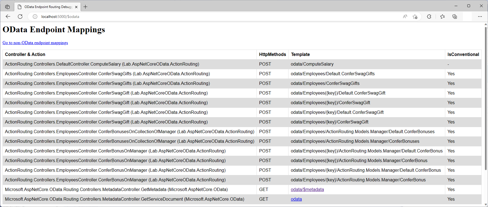

# Action Routing in ASP.NET Core OData 8
**Applies To**:[!INCLUDE[appliesto-webapi](../../includes/appliesto-webapi-v8.md)]

This tutorial shows how ASP.NET Core OData 8 supports action routing. An understanding of routing fundamentals in ASP.NET Core OData 8 is assumed. If you're unfamiliar with routing in ASP.NET Core OData 8, you may want to go through the [routing overview](/odata/webapi-8/fundamentals/routing-overview) tutorial. You may also want to go through the [Actions & Functions](/odata/webapi-8/fundamentals/actions-functions) tutorial to get a better understanding of Edm actions.

## Introduction
Actions are a way to add server-side logic that is not easily defined as CRUD (Create, Read, Update, and Delete) operations on entities. An action can have side effects, which is why they are invoked with the HTTP POST method. An action can target a single entity or a collection of entities. In OData terminology, this is _binding_. You can also have "unbound" actions, which are basically static operations on the OData service.

OData action routing convention supports the following route templates:

| Request Method | Route Template |
|----------------|----------------|
| `POST` | `~/{entityset}\|{singleton}/{action}` |
| `POST` | `~/{entityset}\|{singleton}/{cast}/{action}` |
| `POST` | `~/{entityset}/{key}/{action}` |
| `POST` | `~/{entityset}/{key}/{cast}/{action}` |

**Notes:**
1. OData routing supports canonical parentheses-style key (e.g. `~/Employees(1)`) in addition to key-as-segment (e.g. `~/Employees/1`). Currently, ASP.NET Core OData 8 does not support key-as-segment convention in multi-part keys scenarios
2. `{cast}` is a placeholder for the fully-qualified name for a derived type

To illustrate action routing convention, let's build a sample OData service.

## Prerequisites

[!INCLUDE[](../../includes/appliesto-webapi-v8-net-prereqs-vs.md)]

## Packages

[!INCLUDE[](../../includes/appliesto-webapi-v8-pkg-install.md)]

## Models
The following are the models for the OData service:

**`Employee` class**
```csharp
namespace ActionRouting.Models
{
    public class Employee
    {
        public int Id { get; set; }
        public string Name { get; set; }
        public string SwagGift { get; set; }
    }
}
```

**`Manager` class**
```csharp
namespace ActionRouting.Models
{
    public class Manager : Employee
    {
        public decimal Bonus { get; set; }
    }
}
```

## Edm model and service configuration
The logic for building the Edm model and configuring the OData service is as follows:

# [.NET 6.0](#tab/net60)

```csharp
// Program.cs
using Microsoft.AspNetCore.Builder;
using Microsoft.AspNetCore.OData;
using Microsoft.Extensions.DependencyInjection;
using Microsoft.OData.ModelBuilder;
using ActionRouting.Models;

var builder = WebApplication.CreateBuilder(args);

var modelBuilder = new ODataConventionModelBuilder();
var employeeEntityType = modelBuilder.EntitySet<Employee>("Employees").EntityType;
var managerEntityType = modelBuilder.EntityType<Manager>();

employeeEntityType.Collection.Action("ConferSwagGifts")
    .Parameter<string>("SwagGift");
employeeEntityType.Action("ConferSwagGift")
    .Parameter<string>("SwagGift");
managerEntityType.Collection.Action("ConferBonuses")
    .Parameter<decimal>("Bonus");
managerEntityType.Action("ConferBonus")
    .Parameter<decimal>("Bonus");

builder.Services.AddControllers().AddOData(
    options => options.EnableQueryFeatures(null).AddRouteComponents(
        routePrefix: "odata",
        model: modelBuilder.GetEdmModel()));

var app = builder.Build();

app.UseODataRouteDebug();
app.UseRouting();
app.UseEndpoints(endpoints => endpoints.MapControllers());

app.Run();
```

# [.NET Core 3.1](#tab/netcoreapp31)

```csharp
// Startup.cs
using Microsoft.AspNetCore.Builder;
using Microsoft.AspNetCore.OData;
using Microsoft.Extensions.DependencyInjection;
using Microsoft.OData.ModelBuilder;
using ActionRouting.Models;

public class Startup
{
    public void ConfigureServices(IServiceCollection services)
    {
        var modelBuilder = new ODataConventionModelBuilder();
        var employeeEntityType = modelBuilder.EntitySet<Employee>("Employees").EntityType;
        var managerEntityType = modelBuilder.EntityType<Manager>();

        employeeEntityType.Collection.Action("ConferSwagGifts")
            .Parameter<string>("SwagGift");
        employeeEntityType.Action("ConferSwagGift")
            .Parameter<string>("SwagGift");
        managerEntityType.Collection.Action("ConferBonuses")
            .Parameter<decimal>("Bonus");
        managerEntityType.Action("ConferBonus")
            .Parameter<decimal>("Bonus");

        services.AddControllers().AddOData(
            options => options.EnableQueryFeatures(null).AddRouteComponents(
                routePrefix: "odata",
                model: modelBuilder.GetEdmModel()));
    }

    public void Configure(IApplicationBuilder app)
    {
        app.UseODataRouteDebug();
        app.UseRouting();
        app.UseEndpoints(endpoints => endpoints.MapControllers());
    }
}
```

---

In the above block of code, we define an entity set named `Employees`. Implicitly, `Employee` and `Manager` get included in the Edm model as entity types.

Four Edm actions are also defined:
- `ConferSwagGifts` - bound to the `Employee` entity collection
- `ConferSwagGift` - bound to the `Employee` entity
- `ConferBonuses` - bound to the `Manager` derived entity collection
- `ConferBonus` - bound to the `Manager` derived entity

## Controller
The partial structure of the controller for the OData service is as follows:
```csharp
using System;
using System.Collections.Generic;
using System.Linq;
using Microsoft.AspNetCore.Mvc;
using Microsoft.AspNetCore.OData.Deltas;
using Microsoft.AspNetCore.OData.Query;
using Microsoft.AspNetCore.OData.Routing.Controllers;
using ActionRouting.Models;

public class EmployeesController : ODataController
{
    private static List<Employee> employees = new List<Employee>
    {
        new Employee { Id = 1, Name = "Employee 1" },
        new Employee { Id = 2, Name = "Employee 2" },
        new Employee { Id = 3, Name = "Employee 3" },
        new Employee { Id = 4, Name = "Employee 4" },
        new Manager { Id = 5, Name = "Employee 5" },
        new Manager { Id = 6, Name = "Employee 6" }
    };
}
```

## Routing bound Edm actions
In this section we cover the conventions for routing bound actions and the controller actions (endpoints) required for the requests to be routed successfully.

When invoking an Edm action, the body of the request contains the action parameters as a JSON payload. ASP.NET Core automatically converts the JSON payload to an `ODataActionParameters` object, which is basically a dictionary of parameter values. You use this dictionary to access the parameters in your controller action.

### Invoking an action bound to an entity set or singleton
The route template for this request is: `POST ~/{entityset}|{singleton}/{action}`.

The following request invokes the `ConferSwagGifts` action bound to the `Employees` entity set. The URL for the action is the action name appended to the entity set's URL:
```http
POST http://localhost:5000/odata/Employees/ConferSwagGifts
```

An alternative URL for invoking the same action is:
```http
POST http://localhost:5000/odata/Employees/Default.ConferSwagGifts
```

The Edm organizes elements into a hierarchy. Based on our Edm model, `ConferSwagGifts` action is under a schema element with `Default` as the namespace name.

Here's the request body:
```json
{
    "SwagGift": "Mug"
}
```

For the above request to be conventionally-routed, a controller action named `ConferSwagGifts` that accepts a single parameter of type `ODataActionParameters` is expected. The action should be decorated with `HttpPost` attribute:
```csharp
[HttpPost]
public ActionResult ConferSwagGifts(ODataActionParameters parameters)
{
    if (parameters != null && parameters.TryGetValue("SwagGift", out object swag))
    {
        foreach (var employee in employees)
        {
            employee.SwagGift = Convert.ToString(swag);
        }
    }
    else
    {
        return BadRequest();
    }

    return Ok();
}
```

The response status code should be `200`. Querying any of the employees should confirm that the `SwagGift` property is updated with `Mug` - a relevant controller action to support [retrieving a single entity](/odata/webapi-8/fundamentals/entity-routing#retrieving-a-single-entity) would need to be implemented for this to work.

### Invoking an action bound to an entity
The route templates for this request are:
- `POST ~/{entityset}({key})/{action}`
- `POST ~/{entityset}/{key}/{action}`

The following request invokes the `ConferSwagGift` action bound to employee 1. The URL for the action is the action name appended to the entity's URL:
```http
POST http://localhost:5000/odata/Employees(1)/ConferSwagGift
```

An alternative URL for invoking the same action is:
```http
POST http://localhost:5000/odata/Employees(1)/Default.ConferSwagGift
```

Here's the request body:
```json
{
    "SwagGift": "Gaiter"
}
```

For the above request to be conventionally-routed, a controller action named `ConferSwagGift` is expected. The controller action should accept two parameters - the first is the key parameter and the second a parameter of type `ODataActionParameters`. The action should be decorated with `HttpPost` attribute:
```csharp
[HttpPost]
public ActionResult ConferSwagGift([FromRoute] int key, ODataActionParameters parameters)
{
    if (parameters != null && parameters.TryGetValue("SwagGift", out object swag))
    {
        var employee = employees.SingleOrDefault(d => d.Id.Equals(key));

        if (employee == null)
        {
            return NotFound();
        }

        employee.SwagGift = Convert.ToString(swag);
    }
    else
    {
        return BadRequest();
    }

    return Ok();
}
```

The response status code should be `200`. Querying employee 1 should confirm that the `SwagGift` property is updated with `Gaiter` - a relevant controller action to support [retrieving a single entity](/odata/webapi-8/fundamentals/entity-routing#retrieving-a-single-entity) would need to be implemented for this to work.

### Invoking an action bound to a collection of derived entities or derived singleton
The route template for this request is: `POST ~/{entityset}|{singleton}/{cast}/{action}`.

The following request invokes the `ConferBonuses` action bound to a `Manager` derived entity collection. The URL for the action is the action name appended to the collection of derived entities' URL:
```http
POST http://localhost:5000/odata/Employees/ActionRouting.Models.Manager/ConferBonuses
```

An alternative URL for invoking the same action is:
```http
POST http://localhost:5000/odata/Employees/ActionRouting.Models.Manager/Default.ConferBonuses
```

Here's the request body:
```json
{
    "Bonus": 130
}
```

For the above request to be conventionally-routed, a controller action named `ConferBonusesOnCollectionOfManager` that accepts a single parameter of type `ODataActionParameters` is expected. The action should be decorated with `HttpPost` attribute:
```csharp
[HttpPost]
public ActionResult ConferBonusesOnCollectionOfManager(ODataActionParameters parameters)
{
    if (parameters != null && parameters.TryGetValue("Bonus", out object bonus))
    {
        var managers = employees.OfType<Manager>();

        foreach (var manager in managers)
        {
            manager.Bonus = Convert.ToDecimal(bonus);
        }
    }
    else
    {
        return BadRequest();
    }

    return Ok();
}
```

The response status code should be `200`. Querying any of the managers should confirm that the `Bonus` property is updated with `130` - a relevant controller action to support [retrieving a single derived entity](/odata/webapi-8/fundamentals/entity-routing#retrieving-a-single-derived-entity) would need to be implemented for this to work.

### Invoking an action bound to a derived entity
The route templates for this request are:
- `POST ~/{entityset}({key})/{cast}/{action}`
- `POST ~/{entityset}/{key}/{cast}/{action}`

The following request invokes the `ConferBonus` action bound to employee 5 (a manager). The URL for the action is the action name appended to the derived entity's URL:
```http
POST http://localhost:5000/odata/Employees(5)/ActionRouting.Models.Manager/ConferBonus
```

An alternative URL for invoking the same action is:
```http
POST http://localhost:5000/odata/Employees(5)/ActionRouting.Models.Manager/Default.ConferBonus
```

Here's the request body:
```json
{
    "Bonus": 70
}
```

For the above request to be conventionally-routed, a controller action named `ConferBonusOnManager` is expected. The controller action should accept two parameters - the first is the key parameter and the second a parameter of type `ODataActionParameters`. The action should be decorated with `HttpPost` attribute:
```csharp
[HttpPost]
public ActionResult ConferBonusOnManager([FromRoute] int key, ODataActionParameters parameters)
{
    if (parameters != null && parameters.TryGetValue("Bonus", out object bonus))
    {
        var manager = employees.OfType<Manager>().SingleOrDefault(d => d.Id.Equals(key));

        if (manager == null)
        {
            return NotFound();
        }

        manager.Bonus = Convert.ToDecimal(bonus);
    }
    else
    {
        return BadRequest();
    }

    return Ok();
}
```

The response status code should be `200`. Querying employee 5 (a manager) should confirm that the `Bonus` property is updated with `70` - a relevant controller action to support [retrieving a single derived entity](/odata/webapi-8/fundamentals/entity-routing#retrieving-a-single-derived-entity) would need to be implemented for this to work.

## Routing unbound Edm actions
In this section we cover routing of unbound actions and the controller actions (endpoints) required for the requests to be routed successfully.

The following code configures an unbound action named `ComputeSalary` in the Edm model. The action accepts two action parameters in the request body, namely, `hourlyRate` and `hoursWorked`, and returns a `decimal` result. Notice that we call `Action` directly on the `ODataModelBuilder`, instead of entity type or collection:
```csharp
var computeSalaryFunction = modelBuilder.Action("ComputeSalary");
computeSalaryFunction.Parameter<decimal>("hourlyRate");
computeSalaryFunction.Parameter<int>("hoursWorked");
computeSalaryFunction.Returns<decimal>();
```

An unbound action can be placed in any controller in the application. To avoid confusion, you can create a controller unassociated with any entity set to serve as a home for your unbound operations.

In ASP.NET Core, the default route is one where the route prefix is an empty string or `null`. To associate an unbound action with a configured non-default route, the route template on the controller action should start with the route prefix:
```csharp
using Microsoft.AspNetCore.Mvc;
using Microsoft.AspNetCore.OData.Formatter;
using Microsoft.AspNetCore.OData.Routing.Controllers;

public class DefaultController : ODataController
{
    [HttpPost("odata/ComputeSalary")]
    public ActionResult<decimal> ComputeSalary(ODataActionParameters parameters)
    {
        object hourlyRateAsObject, hoursWorkedAsObject;
        decimal hourlyRate;
        int hoursWorked;

        if (parameters == null
            || !parameters.TryGetValue("hourlyRate", out hourlyRateAsObject)
            || !decimal.TryParse(hourlyRateAsObject.ToString(), out hourlyRate)
            || !parameters.TryGetValue("hoursWorked", out hoursWorkedAsObject)
            || !int.TryParse(hoursWorkedAsObject.ToString(), out hoursWorked))
        {
            return BadRequest();
        }

        return hourlyRate * hoursWorked;
    }
}
```

The following request invokes the `ComputeSalary` unbound action:
```http
POST http://localhost:5000/odata/ComputeSalary
```

Here's the request body:
```json
{
    "hourlyRate": 17.0,
    "hoursWorked": 40
}
```

The following JSON payload shows the expected response:
```json
{
    "@odata.context": "http://localhost:5000/odata/$metadata#Edm.Decimal",
    "value": 680.0
}
```

## Action routing endpoint mappings
If you went through this tutorial and implemented the logic in an OData service, you can run the application and visit the `$odata` endpoint (http://localhost:5000/$odata) to view the endpoint mappings:


