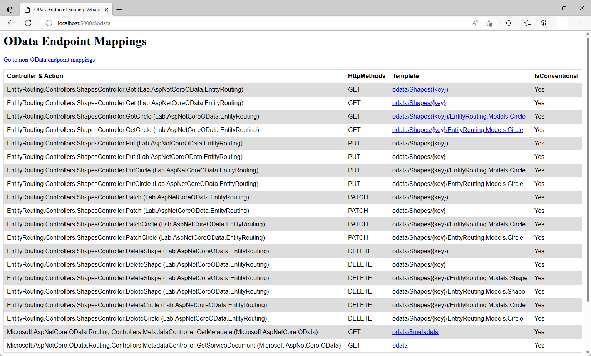

# Entity Routing in ASP.NET Core OData 8
**Applies To**:[!INCLUDE[appliesto-webapi](../../includes/appliesto-webapi-v8.md)]

This tutorial shows how ASP.NET Core OData 8 supports entity routing. An understanding of routing fundamentals in ASP.NET Core OData 8 is assumed. If you're unfamiliar with routing in ASP.NET Core OData 8, you may want to go through the [routing overview](/odata/webapi-8/fundamentals/routing-overview) tutorial.

## Introduction
OData entity routing convention supports the following route templates:

| Request Method | Route Template |
|----------------|----------------|
| `GET` | `~/{entityset}/{key}` |
| `GET` | `~/{entityset}/{key}/{cast}` |
| `PUT` | `~/{entityset}/{key}` |
| `PUT` | `~/{entityset}/{key}/{cast}` |
| `PATCH` | `~/{entityset}/{key}` |
| `PATCH` | `~/{entityset}/{key}/{cast}` |
| `DELETE` | `~/{entityset}/{key}` |
| `DELETE` | `~/{entityset}/{key}/{cast}` |

**Notes:**
1. OData routing supports canonical parentheses-style key (e.g. `~/Shapes(1)`) in addition to key-as-segment (e.g. `~/Shapes/1`). Currently, ASP.NET Core OData 8 does not support key-as-segment convention in multi-part keys scenarios
2. `{cast}` is a placeholder for the fully-qualified name for a derived type

To illustrate entity routing convention, let's build a sample OData service.

## Prerequisites

[!INCLUDE[](../../includes/appliesto-webapi-v8-net-prereqs-vs.md)]

## Packages

[!INCLUDE[](../../includes/appliesto-webapi-v8-pkg-install.md)]

## Models
The following are the models for the OData service:

**`Shape` class**
```csharp
namespace EntityRouting.Models
{
    public class Shape
    {
        public int Id { get; set; }
        public double Area { get;set; }
    }
}
```

**`Rectangle` class**
```csharp
namespace EntityRouting.Models
{
    public class Rectangle : Shape
    {
        public double Length { get; set; }
        public double Width { get; set; }
    }
}
```

**`Circle` class**
```csharp
namespace EntityRouting.Models
{
    public class Circle : Shape
    {
        public double Radius { get; set; }
    }
}
```

## Edm model and service configuration
Install the [Microsoft.AspNetCore.OData](https://www.nuget.org/packages/Microsoft.AspNetCore.OData) 8.x Nuget package. The logic for building the Edm model and configuring the OData service is as follows:

# [.NET 6.0](#tab/net60)

```csharp
// Program.cs
using Microsoft.AspNetCore.Builder;
using Microsoft.AspNetCore.OData;
using Microsoft.Extensions.DependencyInjection;
using Microsoft.OData.ModelBuilder;
using EntityRouting.Models;

var builder = WebApplication.CreateBuilder(args);

var modelBuilder = new ODataConventionModelBuilder();
modelBuilder.EntitySet<Shape>("Shapes");

builder.Services.AddControllers().AddOData(
    options => options.EnableQueryFeatures(null).AddRouteComponents(
        routePrefix: "odata",
        model: modelBuilder.GetEdmModel()));

var app = builder.Build();

app.UseODataRouteDebug();
app.UseRouting();
app.UseEndpoints(endpoints => endpoints.MapControllers());

app.Run();
```

# [.NET Core 3.1](#tab/netcoreapp31)

```csharp
// Startup.cs
using Microsoft.AspNetCore.Builder;
using Microsoft.AspNetCore.OData;
using Microsoft.Extensions.DependencyInjection;
using Microsoft.OData.ModelBuilder;
using EntityRouting.Models;

public class Startup
{
    public void ConfigureServices(IServiceCollection services)
    {
        var modelBuilder = new ODataConventionModelBuilder();
        modelBuilder.EntitySet<Shape>("Shapes");

        services.AddControllers().AddOData(
            options => options.EnableQueryFeatures(null).AddRouteComponents(
                routePrefix: "odata",
                model: modelBuilder.GetEdmModel()));
    }

    public void Configure(IApplicationBuilder app)
    {
        app.UseODataRouteDebug();
        app.UseRouting();
        app.UseEndpoints(endpoints => endpoints.MapControllers());
    }
}
```

---

In the above block of code, we define an entity set named `Shapes`. Implicitly, `Shape`, `Rectangle` and `Circle` get included in the Edm model as entity types.

## Controller
The partial structure of the controller for the OData service is as follows:
```csharp
using System;
using System.Collections.Generic;
using System.Linq;
using Microsoft.AspNetCore.Mvc;
using Microsoft.AspNetCore.OData.Deltas;
using Microsoft.AspNetCore.OData.Query;
using Microsoft.AspNetCore.OData.Routing.Controllers;
using EntityRouting.Models;

public class ShapesController : ODataController
{
    private static List<Shape> shapes = new List<Shape>
    {
        new Rectangle { Id = 1, Length = 7, Width = 4, Area = 28 },
        new Circle { Id = 2, Radius = 3.5, Area = 38.5 },
        new Rectangle { Id = 3, Length = 8, Width = 5, Area = 40 }
    };
}
```

## Routing conventions for entities
In this section we cover the conventions for entity routing and the controller actions (endpoints) required for the request to be routed successfully.

### Retrieving a single entity
The route templates for this request are:
- `GET ~/{entityset}({key})`
- `GET ~/{entityset}/{key}`

The following request returns a single entity with the key value of 1:
```http
GET http://localhost:5000/odata/Shapes(1)
```

For the above request to be conventionally-routed, a controller action named `Get` (or `GetShape`) that accepts the key parameter is expected:
```csharp
public ActionResult<Shape> Get([FromRoute] int key)
{
    var shape = shapes.SingleOrDefault(d => d.Id.Equals(key));

    if (shape == null)
    {
        return NotFound();
    }

    return shape;
}
```

The following JSON payload shows the expected response:
```json
{
    "@odata.context": "http://localhost:5000/odata/$metadata#Shapes/EntityRouting.Models.Rectangle/$entity",
    "@odata.type": "#EntityRouting.Models.Rectangle",
    "Id": 1,
    "Area": 28.0,
    "Length": 7.0,
    "Width": 4.0
}
```

Since `Rectangle` is a derived type, the object in the response contain an `@odata.type` property specifying the type of the entity.

### Retrieving a single derived entity
The route templates for this request are:
- `GET ~/{entityset}({key})/{cast}`.
- `GET ~/{entityset}/{key}/{cast}`

The following request returns a single `Circle` derived entity with the key value of 2:
```http
GET http://localhost:5000/odata/Shapes(2)/EntityRouting.Models.Circle
```

For the above request to be conventionally-routed, a controller action named `GetCircle` that accepts the key parameter is expected:
```csharp
public ActionResult<Circle> GetCircle([FromRoute] int key)
{
    var circle = shapes.OfType<Circle>().SingleOrDefault(d => d.Id.Equals(key));

    if (circle == null)
    {
        return NotFound();
    }

    return circle;
}
```

The following JSON payload shows the expected response:
```json
{
    "@odata.context": "http://localhost:5000/odata/$metadata#Shapes/EntityRouting.Models.Circle/$entity",
    "Id": 2,
    "Area": 38.5,
    "Radius": 3.5
}
```

### Updating a single entity
The route templates for this request are:
- `PUT ~/{entityset}({key})`
- `PUT ~/{entityset}/{key}`

The following `PUT` request updates a `Shape` entity with the key value of 1:
```http
PUT http://localhost:5000/odata/Shapes(1)
```

Here's the request body:
```json
{
    "@odata.type": "#EntityRouting.Models.Rectangle",
    "Id": 1,
    "Length": 8,
    "Width": 5,
    "Area": 40
}
```

For the above request to be conventionally-routed, a controller action named `Put` (or `PutShape`) is expected. The controller action should accept two parameters - the first is the key of the target entity and the second is a parameter of type `Shape` decorated with `FromBody` attribute:
```csharp
public ActionResult Put([FromRoute] int key, [FromBody] Shape shape)
{
    var item = shapes.SingleOrDefault(d => d.Id.Equals(key));

    if (item == null)
    {
        return NotFound();
    }
    else if (!item.GetType().Equals(shape.GetType()))
    {
        return BadRequest();
    }

    // Update properties using reflection
    foreach (var propertyInfo in shape.GetType().GetProperties(
        BindingFlags.Public | BindingFlags.Instance))
    {
        var itemPropertyInfo = item.GetType().GetProperty(
            propertyInfo.Name,
            BindingFlags.Public | BindingFlags.Instance);

        if (itemPropertyInfo.CanWrite)
        {
            itemPropertyInfo.SetValue(item, propertyInfo.GetValue(shape));
        }
    }

    return Ok();
}
```

The response status code should be `200`. Querying the updated entity should return the following:
```json
{
    "@odata.context": "http://localhost:5000/odata/$metadata#Shapes/EntityRouting.Models.Rectangle/$entity",
    "@odata.type": "#EntityRouting.Models.Rectangle",
    "Id": 1,
    "Area": 40.0,
    "Length": 8.0,
    "Width": 5.0
}
```

### Updating a single derived entity
The route templates for this request are:
- `PUT ~/{entityset}({key})/{cast}`
- `PUT ~/{entityset}/{key}/{cast}`

The following `PUT` request updates a `Circle` derived entity with the key value of 2:
```http
PUT http://localhost:5000/odata/Shapes(2)/EntityRouting.Models.Circle
```

Here's the request body:
```json
{
    "Id": 2,
    "Radius": 0.7,
    "Area": 1.54
}
```

For the above request to be conventionally-routed, a controller action named `PutCircle` is expected. The controller action should accept two parameters - the first is the key of the target entity and the second is a parameter of type `Circle` decorated with `FromBody` attribute:
```csharp
public ActionResult PutCircle([FromRoute] int key, [FromBody] Circle circle)
{
    var item = shapes.OfType<Circle>().SingleOrDefault(d => d.Id.Equals(key));

    if (item == null)
    {
        return NotFound();
    }

    item.Id = circle.Id;
    item.Radius = circle.Radius;
    item.Area = circle.Area;

    return Ok();
}
```

The response status code should be `200`. Querying the updated derived entity should return the following:
```json
{
    "@odata.context": "http://localhost:5000/odata/$metadata#Shapes/EntityRouting.Models.Circle/$entity",
    "Id": 2,
    "Area": 1.54,
    "Radius": 0.7
}
```

### Patching a single entity
The route templates for this request are:
- `PATCH ~/{entityset}({key})`
- `PATCH ~/{entityset}/{key}`

The following `PATCH` request patches a `Rectangle` entity with the key value of 3:
```http
PATCH http://localhost:5000/odata/Shapes(3)
```

Here's the request body:
```json
{
    "@odata.type": "#EntityRouting.Models.Rectangle",
    "Width": 6,
    "Area": 48
}
```

For the above request to be conventionally-routed, a controller action named `Patch` (or `PatchShape`) is expected. The controller action should accept two parameters - the first is the key of the target entity and the second is a parameter of type [`Delta<Shape>`](/dotnet/api/microsoft.aspnetcore.odata.deltas.delta) decorated with `FromBody` attribute:
```csharp
public ActionResult Patch([FromRoute] int key, [FromBody] Delta<Shape> delta)
{
    var shape = shapes.SingleOrDefault(d => d.Id.Equals(key));

    if (shape == null)
    {
        return NotFound();
    }
    else if (!shape.GetType().Equals(delta.StructuredType))
    {
        return BadRequest();
    }

    delta.Patch(shape);

    return Ok();
}
```

The response status code should be `200`. Querying the patched entity should return the following:
```json
{
    "@odata.context": "http://localhost:5000/odata/$metadata#Shapes/EntityRouting.Models.Rectangle/$entity",
    "@odata.type": "#EntityRouting.Models.Rectangle",
    "Id": 3,
    "Area": 48.0,
    "Length": 8.0,
    "Width": 6.0
}
```

### Patching a single derived entity
The route templates for this request are:
- `PATCH ~/{entityset}({key})/{cast}`
- `PATCH ~/{entityset}/{key}/{cast}`

The following `PATCH` request patches a `Circle` derived entity with the key value of 2:
```http
PATCH http://localhost:5000/odata/Shapes(2)/EntityRouting.Models.Circle
```

Here's the request body:
```json
{
    "Radius": 1.4,
    "Area": 6.16
}
```

For the above request to be conventionally-routed, a controller action named `PatchCircle` is expected. The controller action should accept two parameters - the first is the key of the target entity and the second is a parameter of type [`Delta<Circle>`](/dotnet/api/microsoft.aspnetcore.odata.deltas.delta) decorated with `FromBody` attribute:
```csharp
public ActionResult PatchCircle([FromRoute] int key, [FromBody] Delta<Circle> delta)
{
    var shape = shapes.OfType<Circle>().SingleOrDefault(d => d.Id.Equals(key));

    if (shape == null)
    {
        return NotFound();
    }

    delta.Patch(shape);

    return Ok();
}
```

The response status code should be `200`. Querying the patched derived entity should return the following:
```json
{
    "@odata.context": "http://localhost:64538/odata/$metadata#Shapes/EntityRouting.Models.Circle/$entity",
    "Id": 2,
    "Area": 6.16,
    "Radius": 1.4
}
```

### Deleting a single entity
The route templates for this request are:
- `DELETE ~/{entityset}({key})`
- `DELETE ~/{entityset}/{key}`

The following request deletes a `Shape` entity with the key value of 3:
```http
DELETE http://localhost:5000/odata/Shapes(3)
```

For the above request to be conventionally-routed, a controller action named `Delete` (or `DeleteShape`) that accepts the key parameter is expected:
```csharp
public ActionResult DeleteShape([FromRoute] int key)
{
    var shape = shapes.SingleOrDefault(d => d.Id.Equals(key));

    if (shape == null)
    {
        return NotFound();
    }

    shapes.Remove(shape);

    return NoContent();
}
```

The response status code should be `200`. Querying the deleted entity should return a `404`.

### Deleting a single derived entity
The route templates for this request are:
- `DELETE ~/{entityset}({key})/{cast}`
- `DELETE ~/{entityset}/{key}/{cast}`

The following request deletes a `Circle` derived entity with the key value of 2:
```http
DELETE http://localhost:5000/odata/Shapes(2)/EntityRouting.Models.Circle
```

For the above request to be conventionally-routed, a controller action named `DeleteCircle` that accepts the key parameter is expected:
```csharp
public ActionResult DeleteCircle([FromRoute] int key)
{
    var shape = shapes.OfType<Circle>().SingleOrDefault(d => d.Id.Equals(key));

    if (shape == null)
    {
        return NotFound();
    }

    shapes.Remove(shape);

    return NoContent();
}
```

The response status code should be `200`. Querying the deleted derived entity should return a `404`.

## Entity routing endpoint mappings
If you went through this tutorial and implemented the logic in an OData service, you can run the application and visit the `$odata` endpoint (http://localhost:5000/$odata) to view the endpoint mappings:


