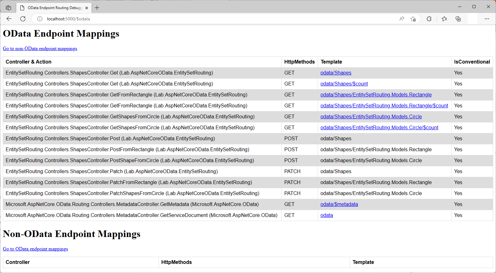

# EntitySet Routing in ASP.NET Core OData 8
**Applies To**:[!INCLUDE[appliesto-webapi](../../includes/appliesto-webapi-v8.md)]

This tutorial shows how ASP.NET Core OData 8 supports entity set routing. An understanding of routing fundamentals in ASP.NET Core OData 8 is assumed. If you're unfamiliar with routing in ASP.NET Core OData 8, you may want to go through the [routing overview](/odata/webapi-8/fundamentals/routing-overview) tutorial.

## Introduction
Entity sets are named collections of entities (e.g. `Customers` is an entity set containing `Customer` entities). Entity sets provide the primary entry points into the data model.

OData entity set routing convention supports the following route templates:

| Request Method | Route Template |
|----------------|----------------|
| `GET` | `~/{entityset}` |
| `GET` | `~/{entityset}/$count` |
| `GET` | `~/{entityset}/{cast}` |
| `GET` | `~/{entityset}/{cast}/$count` |
| `POST` | `~/{entityset}` |
| `POST` | `~/{entityset}/{cast}` |
| `PATCH` | `~/{entityset}` |
| `PATCH` | `~/{entityset}/{cast}` |

**Note**: `{cast}` is a placeholder for the fully-qualified name for a derived type

To illustrate entity set routing convention, let's build a sample OData service.

## Prerequisites

[!INCLUDE[](../../includes/appliesto-webapi-v8-net-prereqs-vs.md)]

## Packages

[!INCLUDE[](../../includes/appliesto-webapi-v8-pkg-install.md)]

## Models
The following are the models for the OData service:

**`Shape` class**
```csharp
namespace EntitySetRouting.Models
{
    public class Shape
    {
        public int Id { get; set; }
        public double Area { get;set; }
    }
}
```

**`Rectangle` class**
```csharp
namespace EntitySetRouting.Models
{
    public class Rectangle : Shape
    {
        public double Length { get; set; }
        public double Width { get; set; }
    }
}
```

**`Circle` class**
```csharp
namespace EntitySetRouting.Models
{
    public class Circle : Shape
    {
        public double Radius { get; set; }
    }
}
```

## Edm model and service configuration
The logic for building the Edm model and configuring the OData service is as follows:

# [.NET 6.0](#tab/net60)

```csharp
// Program.cs
using Microsoft.AspNetCore.Builder;
using Microsoft.AspNetCore.OData;
using Microsoft.Extensions.DependencyInjection;
using Microsoft.OData.ModelBuilder;
using EntitySetRouting.Models;

var builder = WebApplication.CreateBuilder(args);

var modelBuilder = new ODataConventionModelBuilder();
modelBuilder.EntitySet<Shape>("Shapes");

builder.Services.AddControllers().AddOData(
    options => options.EnableQueryFeatures(null).AddRouteComponents(
        routePrefix: "odata",
        model: modelBuilder.GetEdmModel()));

var app = builder.Build();

app.UseODataRouteDebug();
app.UseRouting();
app.UseEndpoints(endpoints => endpoints.MapControllers());

app.Run();
```

# [.NET Core 3.1](#tab/netcoreapp31)

```csharp
// Startup.cs
using Microsoft.AspNetCore.Builder;
using Microsoft.AspNetCore.OData;
using Microsoft.Extensions.DependencyInjection;
using Microsoft.OData.ModelBuilder;
using EntitySetRouting.Models;

public class Startup
{
    public void ConfigureServices(IServiceCollection services)
    {
        var modelBuilder = new ODataConventionModelBuilder();
        modelBuilder.EntitySet<Shape>("Shapes");

        services.AddControllers().AddOData(
            options => options.EnableQueryFeatures(null).AddRouteComponents(
                routePrefix: "odata",
                model: modelBuilder.GetEdmModel()));
    }

    public void Configure(IApplicationBuilder app)
    {
        app.UseODataRouteDebug();
        app.UseRouting();
        app.UseEndpoints(endpoints => endpoints.MapControllers());
    }
}
```

---

In the above block of code, we define an entity set named `Shapes`. Implicitly, `Shape`, `Rectangle` and `Circle` get included in the Edm model as entity types.

## Controller
The partial structure of the controller for the OData service is as follows:
```csharp
using System;
using System.Collections.Generic;
using System.Linq;
using Microsoft.AspNetCore.Mvc;
using Microsoft.AspNetCore.OData.Deltas;
using Microsoft.AspNetCore.OData.Query;
using Microsoft.AspNetCore.OData.Routing.Controllers;
using EntitySetRouting.Models;

public class ShapesController : ODataController
{
    private static List<Shape> shapes = new List<Shape>
    {
        new Rectangle { Id = 1, Length = 7, Width = 4, Area = 28 },
        new Circle { Id = 2, Radius = 3.5, Area = 38.5 },
        new Rectangle { Id = 3, Length = 8, Width = 5, Area = 40 }
    };
}
```

## Routing conventions for entity sets
In this section we cover the conventions for entity set routing and the controller actions (endpoints) required for the requests to be routed successfully.

### Retrieving an entity set
The route template for this request is: `GET ~/{entityset}`.

The following request returns the `Shapes` entity set - basically a collection of `Shape` entities:
```http
GET http://localhost:5000/odata/Shapes
```

For the above request to be conventionally-routed, a controller action named `Get` (or `GetShapes`) is expected:
```csharp
public ActionResult<IEnumerable<Shape>> Get()
{
    return shapes;
}
```

The following JSON payload shows the expected response:
```json
{
    "@odata.context": "http://localhost:5000/odata/$metadata#Shapes",
    "value": [
        {
            "@odata.type": "#EntitySetRouting.Models.Rectangle",
            "Id": 1,
            "Area": 28.0,
            "Length": 7.0,
            "Width": 4.0
        },
        {
            "@odata.type": "#EntitySetRouting.Models.Circle",
            "Id": 2,
            "Area": 38.5,
            "Radius": 3.5
        },
        {
            "@odata.type": "#EntitySetRouting.Models.Rectangle",
            "Id": 3,
            "Area": 40.0,
            "Length": 8.0,
            "Width": 5.0
        }
    ]
}
```

The response contains 3 shape objects - 2 rectangles and 1 circle. Since `Rectangle` and `Circle` are derived types, each of the shape objects contain an `@odata.type` property specifying the type of the entity.

### Retrieving the count of an entity set
The route template for this request is: `GET ~/{entityset}/$count`.

To address the raw value of the number of items in an entity set, append `/$count` to that entity set's URL.

The following request returns a count of items in the `Shapes` entity set:
```http
GET http://localhost:5000/odata/Shapes/$count
```

For the above request to be conventionally-routed, a controller action named `Get` (or `GetShapes`) is expected, same as is expected when [retrieving an entity set](#retrieving-an-entity-set). However, the controller action needs to be decorated with `EnableQuery` attribute. The `EnableQuery` attribute is responsible for generating the relevant query for determining the number of items:
```csharp
[EnableQuery]
public ActionResult<IEnumerable<Shape>> Get()
{
    return shapes;
}
```

 The expected response is shown below:
```console
3
```

### Retrieving a collection of derived entities
The route template for this request is: `GET ~/{entityset}/{cast}`.

The following request returns a collection of derived `Rectangle` entities:
```http
GET http://localhost:5000/odata/Shapes/EntitySetRouting.Models.Rectangle
```

For the above request to be conventionally-routed, a controller action named `GetFromRectangle` (or `GetShapesFromRectangle`) is expected:
```csharp
public ActionResult<IEnumerable<Rectangle>> GetFromRectangle()
{
    return shapes.OfType<Rectangle>().ToList();
}
```

The following JSON payload shows the expected response:
```json
{
    "@odata.context": "http://localhost:5000/odata/$metadata#Shapes/EntitySetRouting.Models.Rectangle",
    "value": [
        {
            "Id": 1,
            "Area": 28.0,
            "Length": 7.0,
            "Width": 4.0
        },
        {
            "Id": 3,
            "Area": 40.0,
            "Length": 8.0,
            "Width": 5.0
        }
    ]
}
```

The response contains 2 rectangle objects.

### Retrieving the count of a collection of derived entities
The route template for this request is: `GET ~/{entityset}/{cast}/$count`.

The following request returns a count of items in the `Shapes` entity set that are rectangles:
```http
GET http://localhost:5000/odata/Shapes/EntitySetRouting.Models.Rectangle/$count
```

For the above request to be conventionally-routed, a controller action named `GetFromRectangle` (or `GetShapesFromRectangle`) is expected, same as is expected when [retrieving a collection of derived entities](#retrieving-a-collection-of-derived-entities). However, the controller action needs to be decorated with `EnableQuery` attribute:
```csharp
[EnableQuery]
public ActionResult<IEnumerable<Rectangle>> GetFromRectangle()
{
    return shapes.OfType<Rectangle>().ToList();
}
```

 The expected response is shown below:
```console
2
```

### Adding an entity to an entity set
To create an entity in an entity set, the client sends a `POST` request to that entity set's URL.

The route template for this request is: `POST ~/{entityset}`

The following `POST` request adds a `Shape` entity to the `Shapes` entity set:
```http
POST http://localhost:5000/odata/Shapes
```

Here's the request body:
```json
{
    "Id": 4,
    "Area": 36
}
```

For the above request to be conventionally-routed, a controller action named `Post` (or `PostShape`) that accepts a parameter of type `Shape` decorated with `FromBody` attribute is expected:
```csharp
public ActionResult Post([FromBody] Shape shape)
{
    shapes.Add(shape);

    return Created(shape);
}
```

The `Created` method used in the above code block is defined in the `ODataController` class - that `ShapesController` derives from. The method generates the location at which the resource has been created and returns it as a response header.

The response status code should be `201`. The following JSON payload shows the expected response:
```json
{
    "@odata.context": "http://localhost:5000/odata/$metadata#Shapes/$entity",
    "Id": 4,
    "Area": 36.0
}
```

If you look through the response headers, you should find the location of the created entity: `http://localhost:5000/odata/Shapes(4)`. Querying the `Shapes` entity set should confirm that the entity was successfully added.

### Adding a derived entity to an entity set
To create a derived entity in an entity set, the client sends a `POST` request to that entity set's URL with the fully-qualified name of the derived type appended at the end.

The route template for this request is: `POST ~/{entityset}/{cast}`

The following `POST` request adds a `Circle` entity to the `Shapes` entity set:
```http
POST http://localhost:5000/odata/Shapes/EntitySetRouting.Models.Circle
```

Here's the request body:
```json
{
    "Id": 5,
    "Radius": 1.4,
    "Area": 6.16
}
```

For the above request to be conventionally-routed, a controller action named `PostFromCircle` (or `PostShapeFromCircle`) that accepts a parameter of type `Circle` decorated with `FromBody` attribute is expected:
```csharp
public ActionResult PostFromCircle([FromBody] Circle circle)
{
    shapes.Add(circle);

    return Created(circle);
}
```

The response status code should be `201`. The following JSON payload shows the expected response:
```json
{
    "@odata.context": "http://localhost:5000/odata/$metadata#Shapes/EntitySetRouting.Models.Circle/$entity",
    "Id": 5,
    "Area": 6.16,
    "Radius": 1.4
}
```

If you look through the response headers, you should find the location of the created derived entity: `http://localhost:5000/odata/Shapes(5)`. Querying the `Shapes` entity set should confirm that the derived entity was successfully added.

### Patching a collection of entities
The semantics of `PATCH` is to merge the content in the request payload with the entity's or entities' current state, applying the update only to those components specified in the request body. To patch a collection of entities in an entity set, the client sends a `PATCH` request to that entity set's URL.

The route template for this request is: `PATCH ~/{entityset}`

The following `PATCH` request patches shape 1 (a circle) and shape 2 (a rectangle):
```http
PATCH http://localhost:5000/odata/Shapes
```

Here's the request body:
```json
{
    "value": [
        {
            "@odata.type": "#EntitySetRouting.Models.Circle",
            "Id": 2,
            "Radius": 0.7,
            "Area": 1.54
        },
        {
            "@odata.type": "#EntitySetRouting.Models.Rectangle",
            "Id": 3,
            "Length": 8,
            "Width": 4,
            "Area": 32
        }
    ]
}
```

For the above request to be conventionally-routed, a controller action named `Patch` (or `PatchShape`) that accepts a parameter of type [`DeltaSet<Shape>`](/dotnet/api/microsoft.aspnetcore.odata.deltas.deltaset) decorated with `FromBody` attribute is expected:
```csharp
public ActionResult Patch([FromBody] DeltaSet<Shape> deltaSet)
{
    foreach (Delta<Shape> delta in deltaSet)
    {
        if (delta.TryGetPropertyValue("Id", out object idAsObject))
        {
            var shape = shapes.SingleOrDefault(d => d.Id.Equals(idAsObject));
            delta.Patch(shape);
        }
    }

    return Ok();
}
```

The response status code should be `200`. Querying `Shapes` entity set should return the following:
```json
{
    "@odata.context": "http://localhost:44184/odata/$metadata#Shapes",
    "value": [
        {
            "@odata.type": "#EntitySetRouting.Models.Rectangle",
            "Id": 1,
            "Area": 28.0,
            "Length": 7.0,
            "Width": 4.0
        },
        {
            "@odata.type": "#EntitySetRouting.Models.Circle",
            "Id": 2,
            "Area": 1.54,
            "Radius": 0.7
        },
        {
            "@odata.type": "#EntitySetRouting.Models.Rectangle",
            "Id": 3,
            "Area": 32.0,
            "Length": 8.0,
            "Width": 4.0
        }
    ]
}
```

### Patching a collection of derived entities
To patch a collection of derived entities in an entity set, the client sends a `PATCH` request to that entity set's URL with the fully-qualified name of the derived type appended at the end.

The route template for this request is: `PATCH ~/{entityset}/{cast}`

The following `PATCH` request patches the rectangles with `Id` value of 1 and 3 respectively:
```http
PATCH http://localhost:5000/odata/Shapes/EntitySetRouting.Models.Rectangle
```

Here's the request body:
```json
{
    "value": [
        {
            "Id": 1,
            "Length": 6,
            "Width": 5,
            "Area": 30
        },
        {
            "Id": 3,
            "Length": 8,
            "Width": 4,
            "Area": 32
        }
    ]
}
```

For the above request to be conventionally-routed, a controller action named `PatchFromRectangle` (or `PatchShapeFromRectangle`) that accepts a parameter of type [`DeltaSet<Rectangle>`](/dotnet/api/microsoft.aspnetcore.odata.deltas.deltaset) decorated with `FromBody` attribute  is expected:
```csharp
public ActionResult PatchFromRectangle([FromBody] DeltaSet<Rectangle> deltaSet)
{
    foreach (Delta<Rectangle> delta in deltaSet)
    {
        if (delta.TryGetPropertyValue("Id", out object idAsObject))
        {
            var rectangle = shapes.SingleOrDefault(d => d.Id.Equals(idAsObject)) as Rectangle;
            delta.Patch(rectangle);
        }
    }

    return Ok();
}
```

The response status code should be `200`. Querying `Shapes` entity set should return the following:
```json
{
    "@odata.context": "http://localhost:44184/odata/$metadata#Shapes",
    "value": [
        {
            "@odata.type": "#EntitySetRouting.Models.Rectangle",
            "Id": 1,
            "Area": 30.0,
            "Length": 6.0,
            "Width": 5.0
        },
        {
            "@odata.type": "#EntitySetRouting.Models.Circle",
            "Id": 2,
            "Area": 38.5,
            "Radius": 3.5
        },
        {
            "@odata.type": "#EntitySetRouting.Models.Rectangle",
            "Id": 3,
            "Area": 32.0,
            "Length": 8.0,
            "Width": 4.0
        }
    ]
}
```

## Entity set routing endpoint mappings
If you went through this tutorial and implemented the logic in an OData service, you can run the application and visit the `$odata` endpoint (http://localhost:5000/$odata) to view the endpoint mappings:


