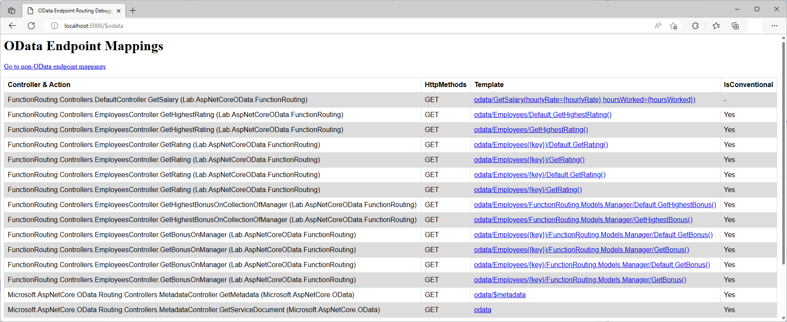

# Function Routing in ASP.NET Core OData 8
**Applies To**:[!INCLUDE[appliesto-webapi](../../includes/appliesto-webapi-v8.md)]

This tutorial shows how ASP.NET Core OData 8 supports function routing. An understanding of routing fundamentals in ASP.NET Core OData 8 is assumed. If you're unfamiliar with routing in ASP.NET Core OData 8, you may want to go through the [routing overview](/odata/webapi-8/fundamentals/routing-overview) tutorial. You may also want to go through the [Actions & Functions](/odata/webapi-8/fundamentals/actions-functions) tutorial to get a better understanding of Edm functions.

## Introduction
Functions are a way to add server-side logic that is not easily defined as CRUD (Create, Read, Update, and Delete) operations on entities. A function can target a single entity or a collection of entities. In OData terminology, this is _binding_. You can also have "unbound" functions, which are basically static operations on the OData service.

OData function routing convention supports the following route templates:

| Request Method | Route Template |
|----------------|----------------|
| `GET` | `~/{entityset}\|{singleton}/{function}` |
| `GET` | `~/{entityset}\|{singleton}/{cast}/{function}` |
| `GET` | `~/{entityset}/{key}/{function}` |
| `GET` | `~/{entityset}/{key}/{cast}/{function}` |

**Notes:**
1. OData routing supports canonical parentheses-style key (e.g. `~/Employees(1)`) in addition to key-as-segment (e.g. `~/Employees/1`). Currently, ASP.NET Core OData 8 does not support key-as-segment convention in multi-part keys scenarios
2. `{cast}` is a placeholder for the fully-qualified name for a derived type

To illustrate function routing convention, let's build a sample OData service.

## Prerequisites

[!INCLUDE[](../../includes/appliesto-webapi-v8-net-prereqs-vs.md)]

## Packages

[!INCLUDE[](../../includes/appliesto-webapi-v8-pkg-install.md)]

## Models
The following are the models for the OData service:

**`Employee` class**
```csharp
namespace FunctionRouting.Models
{
    public class Employee
    {
        public int Id { get; set; }
        public string Name { get; set; }
        public int PerfRating { get; set; }
    }
}
```

**`Manager` class**
```csharp
namespace FunctionRouting.Models
{
    public class Manager : Employee
    {
        public decimal Bonus { get; set; }
    }
}
```

## Edm model and service configuration
The logic for building the Edm model and configuring the OData service is as follows:

# [.NET 6.0](#tab/net60)

```csharp
// Program.cs
using Microsoft.AspNetCore.Builder;
using Microsoft.AspNetCore.OData;
using Microsoft.Extensions.DependencyInjection;
using Microsoft.OData.ModelBuilder;
using FunctionRouting.Models;

var builder = WebApplication.CreateBuilder(args);

var modelBuilder = new ODataConventionModelBuilder();
var employeeEntityType = modelBuilder.EntitySet<Employee>("Employees").EntityType;
var managerEntityType = modelBuilder.EntityType<Manager>();

employeeEntityType.Collection.Function("GetHighestRating")
    .Returns<int>();
employeeEntityType.Function("GetRating")
    .Returns<int>();
managerEntityType.Collection.Function("GetHighestBonus")
    .Returns<decimal>();
managerEntityType.Function("GetBonus")
    .Returns<decimal>();

builder.Services.AddControllers().AddOData(
    options => options.EnableQueryFeatures(null).AddRouteComponents(
        routePrefix: "odata",
        model: modelBuilder.GetEdmModel()));

var app = builder.Build();

app.UseODataRouteDebug();
app.UseRouting();
app.UseEndpoints(endpoints => endpoints.MapControllers());

app.Run();
```

# [.NET Core 3.1](#tab/netcoreapp31)

```csharp
// Startup.cs
using Microsoft.AspNetCore.Builder;
using Microsoft.AspNetCore.OData;
using Microsoft.Extensions.DependencyInjection;
using Microsoft.OData.ModelBuilder;
using FunctionRouting.Models;

public class Startup
{
    public void ConfigureServices(IServiceCollection services)
    {
        var modelBuilder = new ODataConventionModelBuilder();
        var employeeEntityType = modelBuilder.EntitySet<Employee>("Employees").EntityType;
        var managerEntityType = modelBuilder.EntityType<Manager>();

        employeeEntityType.Collection.Function("GetHighestRating")
            .Returns<int>();
        employeeEntityType.Function("GetRating")
            .Returns<int>();
        managerEntityType.Collection.Function("GetHighestBonus")
            .Returns<decimal>();
        managerEntityType.Function("GetBonus")
            .Returns<decimal>();

        services.AddControllers().AddOData(
            options => options.EnableQueryFeatures(null).AddRouteComponents(
                routePrefix: "odata",
                model: modelBuilder.GetEdmModel()));
    }

    public void Configure(IApplicationBuilder app)
    {
        app.UseODataRouteDebug();
        app.UseRouting();
        app.UseEndpoints(endpoints => endpoints.MapControllers());
    }
}
```

---

In the above block of code, we define an entity set named `Employees`. Implicitly, `Employee` and `Manager` get included in the Edm model as entity types.

Four Edm functions are also defined:
- `GetHighestRating` - bound to the `Employee` entity collection
- `GetRating` - bound to the `Employee` entity
- `GetHighestBonus` - bound to the `Manager` derived entity collection
- `GetBonus` - bound to the `Manager` derived entity

## Controller
The partial structure of the controller for the OData service is as follows:
```csharp
using System;
using System.Collections.Generic;
using System.Linq;
using Microsoft.AspNetCore.Mvc;
using Microsoft.AspNetCore.OData.Deltas;
using Microsoft.AspNetCore.OData.Query;
using Microsoft.AspNetCore.OData.Routing.Controllers;
using FunctionRouting.Models;

public class EmployeesController : ODataController
{
    private static List<Employee> employees = new List<Employee>
    {
        new Employee { Id = 1, Name = "Employee 1", PerfRating = 8 },
        new Employee { Id = 2, Name = "Employee 2", PerfRating = 7 },
        new Employee { Id = 3, Name = "Employee 3", PerfRating = 5 },
        new Employee { Id = 4, Name = "Employee 4", PerfRating = 3 },
        new Manager { Id = 5, Name = "Employee 5", PerfRating = 7, Bonus = 2900 },
        new Manager { Id = 6, Name = "Employee 6", PerfRating = 9, Bonus = 3700 }
    };
}
```

## Routing bound Edm functions
In this section we cover the conventions for routing bound functions and the controller actions (endpoints) required for the requests to be routed successfully.

### Invoking a function bound to an entity set or singleton
The route template for this request is: `GET ~/{entityset}|{singleton}/{function}`

The following request invokes the `GetHighestRating` function bound to the `Employees` entity set. The URL for the function is the function name appended to the entity set's URL:
```http
GET http://localhost:5000/odata/Employees/GetHighestRating()
```

An alternative URL for invoking the same function is:
```http
GET http://localhost:5000/odata/Employees/Default.GetHighestRating()
```

The Edm organizes elements into a hierarchy. Based on our Edm model, `GetHighestRating` action is under a schema element with `Default` as the namespace name.

For the above request to be conventionally-routed, a controller action named `GetHighestRating` that accepts no parameters is expected. The controller action should be decorated with `HttpGet` attribute:
```csharp
[HttpGet]
public ActionResult<decimal> GetHighestRating()
{
    if (employees.Count < 1)
    {
        return NoContent();
    }

    return employees.Select(d => d.PerfRating).OrderByDescending(d => d).First();
}
```

The following JSON payload shows the expected response:
```json
{
    "@odata.context": "http://localhost:5000/odata/$metadata#Edm.Int32",
    "value": 9
}
```

### Invoking a function bound to an entity
The route templates for this request are:
- `GET ~/{entityset}({key})/{function}`
- `GET ~/{entityset}/{key}/{function}`

The following request invokes the `GetRating` function bound to employee 1. The URL for the function is the function name appended to the entity's URL:
```http
GET http://localhost:5000/odata/Employees(1)/GetRating()
```

An alternative URL for invoking the same function is:
```http
GET http://localhost:5000/odata/Employees(1)/Default.GetRating()
```

For the above request to be conventionally-routed, a controller action named `GetRating` that accepts the key parameter is expected. The controller action should be decorated with `HttpGet` attribute:
```csharp
[HttpGet]
public ActionResult<decimal> GetRating([FromRoute] int key)
{
    var employee = employees.SingleOrDefault(d => d.Id.Equals(key));

    if (employee == null)
    {
        return NotFound();
    }

    return employee.PerfRating;
}
```

The following JSON payload shows the expected response:
```json
{
    "@odata.context": "http://localhost:5000/odata/$metadata#Edm.Int32",
    "value": 8
}
```

### Invoking a function bound to a collection of derived entities or derived singleton
The route template for this request is: `GET ~/{entityset}|{singleton}/{cast}/{function}`

The following request invokes the `GetHighestBonus` function bound to the collection of `Manager` derived entities. The URL for the function is the function name appended to the collection of derived entities' URL:
```http
GET http://localhost:5000/odata/Employees/FunctionRouting.Models.Manager/GetHighestBonus()
```

An alternative URL for invoking the same function is:
```http
GET http://localhost:5000/odata/Employees/FunctionRouting.Models.Manager/Default.GetHighestBonus()
```

For the above request to be conventionally-routed, a controller action named `GetHighestBonusOnCollectionOfManager` that accepts no parameters is expected. The controller action should be decorated with `HttpGet` attribute:
```csharp
[HttpGet]
public ActionResult<decimal> GetHighestBonusOnCollectionOfManager()
{
    var managers = employees.OfType<Manager>().ToArray();

    if (managers.Length < 1)
    {
        return NoContent();
    }

    return managers.Select(d => d.Bonus).OrderByDescending(d => d).First();
}
```

The following JSON payload shows the expected response:
```json
{
    "@odata.context": "http://localhost:5000/odata/$metadata#Edm.Decimal",
    "value": 3700
}
```

### Invoking a function bound to a derived entity
The route templates for this request are:
- `GET ~/{entityset}({key})/{cast}/{function}`
- `GET ~/{entityset}/{key}/{cast}/{function}`

The following request invokes the `GetBonus` function bound to employee 5 (a manager). The URL for the function is the function name appended to the derived entity's URL:
```http
GET http://localhost:5000/odata/Employees(5)/FunctionRouting.Models.Manager/GetBonus()
```

An alternative URL for invoking the same function is:
```http
GET http://localhost:5000/odata/Employees(5)/FunctionRouting.Models.Manager/Default.GetBonus()
```

For the above request to be conventionally-routed, a controller action named `GetBonusOnManager` that accepts the key parameter is expected. The controller action should be decorated with `HttpGet` attribute:
```csharp
[HttpGet]
public ActionResult<decimal> GetBonusOnManager([FromRoute] int key)
{
    var manager = employees.OfType<Manager>().SingleOrDefault(d => d.Id.Equals(key));

    if (manager == null)
    {
        return NotFound();
    }

    return manager.Bonus;
}
```

The following JSON payload shows the expected response:
```json
{
    "@odata.context": "http://localhost:5000/odata/$metadata#Edm.Decimal",
    "value": 2900
}
```

## Routing unbound Edm functions
In this section we cover routing of unbound functions and the controller actions (endpoints) required for the requests to be routed successfully.

The following code configures an unbound function named `GetSalary` in the Edm model. The function accepts two parameters, namely, `hourlyRate` and `hoursWorked`, and returns a `decimal` result. Notice that we call `Function` directly on the `ODataModelBuilder`, instead of entity type or collection:
```csharp
var getSalaryFunction = modelBuilder.Function("GetSalary");
getSalaryFunction.Parameter<decimal>("hourlyRate");
getSalaryFunction.Parameter<int>("hoursWorked");
getSalaryFunction.Returns<decimal>();
```

An unbound function can be placed in any controller in the application. To avoid confusion, you can create a controller unassociated with any entity set to serve as a home for your unbound operations.

In ASP.NET Core, the default route is one where the route prefix is an empty string or `null`. To associate an unbound action with a configured non-default route, the route template on the controller action should start with the route prefix:
```csharp
public class DefaultController : ODataController
{
    [HttpGet("odata/GetSalary(hourlyRate={hourlyRate},hoursWorked={hoursWorked})")]
    public ActionResult<decimal> GetSalary(decimal hourlyRate, int hoursWorked)
    {
        return hourlyRate * hoursWorked;
    }
}
```

The following request invokes the `GetSalary` unbound function:
```http
GET http://localhost:5000/odata/GetSalary(hourlyRate=17,hoursWorked=40)
```

The following JSON payload shows the expected response:
```json
{
    "@odata.context": "http://localhost:5000/odata/$metadata#Edm.Decimal",
    "value": 680
}
```

## Function routing endpoint mappings
If you went through this tutorial and implemented the logic in an OData service, you can run the application and visit the `$odata` endpoint (http://localhost:5000/$odata) to view the endpoint mappings:


