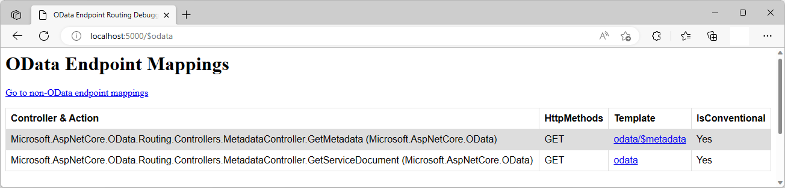

# Metadata Routing in ASP.NET Core OData 8
**Applies To**:[!INCLUDE[appliesto-webapi](../../includes/appliesto-webapi-v8.md)]

This tutorial shows how ASP.NET Core OData 8 supports metadata routing conventionally. An understanding of routing fundamentals in ASP.NET Core OData 8 is assumed. If you're unfamiliar with routing in ASP.NET Core OData 8, you may want to go through the [routing overview](/odata/webapi-8/fundamentals/routing-overview) tutorial.

## Introduction
OData services provide two types of metadata documents to describe themselves:
- A **service document** that lists all the top-level feeds so clients can discover them and find out the addresses of each of them.
- A **service metadata document** that describes the data model (i.e. structure and organization of all the resources) exposed as HTTP endpoints by the service.

To illustrate metadata routing convention, let's build a sample OData service.

## Prerequisites

[!INCLUDE[](../../includes/appliesto-webapi-v8-net-prereqs-vs.md)]

## Packages

[!INCLUDE[](../../includes/appliesto-webapi-v8-pkg-install.md)]

## Models
The following are the models for the OData service:

**`Order` class**
```csharp
namespace MetadataRouting.Models
{
    public class Order
    {
        public int Id { get; set; }
        public decimal Amount { get; set; }
        public Customer Customer { get; set; }
    }
}
```

**`Customer` class**
```csharp
namespace MetadataRouting.Models
{
    public class Customer
    {
        public int Id { get; set; }
        public string Name { get; set; }
        public List<Order> Orders { get; set; } = new List<Order>();
    }
}
```

## Edm model and service configuration
The logic for building the Edm model and configuring the OData service is as follows:

# [.NET 6.0](#tab/net60)

```csharp
// Program.cs
using Microsoft.AspNetCore.Builder;
using Microsoft.AspNetCore.OData;
using Microsoft.Extensions.DependencyInjection;
using Microsoft.OData.ModelBuilder;
using MetadataRouting.Models;

var builder = WebApplication.CreateBuilder(args);

var modelBuilder = new ODataConventionModelBuilder();
modelBuilder.EntitySet<Customer>("Customers");
modelBuilder.EntitySet<Order>("Orders");

builder.Services.AddControllers().AddOData(
    options => options.EnableQueryFeatures(null).AddRouteComponents(
        routePrefix: "odata",
        model: modelBuilder.GetEdmModel()));

var app = builder.Build();

app.UseODataRouteDebug();
app.UseRouting();
app.UseEndpoints(endpoints => endpoints.MapControllers());

app.Run();
```

# [.NET Core 3.1](#tab/netcoreapp31)

```csharp
// Startup.cs
using Microsoft.AspNetCore.Builder;
using Microsoft.AspNetCore.OData;
using Microsoft.Extensions.DependencyInjection;
using Microsoft.OData.ModelBuilder;
using MetadataRouting.Models;

public class Startup
{
    public void ConfigureServices(IServiceCollection services)
    {
        var modelBuilder = new ODataConventionModelBuilder();
        modelBuilder.EntitySet<Customer>("Customers");
        modelBuilder.EntitySet<Order>("Orders");

        services.AddControllers().AddOData(
            options => options.EnableQueryFeatures(null).AddRouteComponents(
                routePrefix: "odata",
                model: modelBuilder.GetEdmModel()));
    }

    public void Configure(IApplicationBuilder app)
    {
        app.UseODataRouteDebug();
        app.UseRouting();
        app.UseEndpoints(endpoints => endpoints.MapControllers());
    }
}
```

---

In the preceding block of code, we define two entity sets, namely, `Customers` and `Orders`. Implicitly, `Customer` and `Order` get included in the Edm model as entity types.

## Controller
We do not need to add any controller(s) to handle service metadata requests. Requests for service metadata are handled by a built-in controller named `MetadataController`. The controller exposes two actions, namely:
- `GetServiceDocument` - generates the OData service document
- `GetMetadata` - generates the OData service metadata document.

## OData service document
The service document is available from the root of the OData service. It gives you the titles and URLs for each of the OData service feeds.

To fetch the service document, issue a GET request to the service root:
```http
GET http://localhost:5000/odata
```

The following JSON payload shows the expected response:
```json
{
    "@odata.context": "http://localhost:5000/odata/$metadata",
    "value": [
        {
            "name": "Customers",
            "kind": "EntitySet",
            "url": "Customers"
        },
        {
            "name": "Orders",
            "kind": "EntitySet",
            "url": "Orders"
        }
    ]
}
```

Based on the preceding payload, the entity sets in our OData service are `Customers` and `Orders`. The URLs for the two entity sets are `Customers` and `Orders` respectively.

To retrieve all the customers, append `Customers` to the service root to form the following URL:
```http
http://localhost:5000/odata/Customers
```

Similarly, to retrieve all the orders, append `Orders` to the service root to form the following URL:
```http
http://localhost:5000/odata/Orders
```

## OData service metadata document
The service metadata document contains a complete description of the feeds, types, properties, and relationships exposed by the OData service in the Entity Data Model (EDM).

A service metadata document describes it's data in EDM terms using an XML language for describing models called the [Common Schema Definition Language](http://docs.oasis-open.org/odata/odata-csdl-xml/v4.01/odata-csdl-xml-v4.01.html) (CSDL). When exposed by an OData service as a service metadata document, the CSDL document is packed using the [EDMX](/openspecs/windows_protocols/mc-edmx/5dff5e25-56a1-408b-9d44-bff6634c7d16) format.

Most OData clients libraries use the service metadata to drive the generation of client-side proxy classes to represent the server types. Tools like [OData Connected Service](https://marketplace.visualstudio.com/items?itemName=marketplace.ODataConnectedService) rely on the service metadata to generate proxy classes used in OData client applications.

In our sample OData service, the service metadata document describes two entity types (`Customer` and `Order`) and the relationships between them.

To fetch service metadata, issue a GET request to the service root appended with `/$metadata`:
```http
GET http://localhost:5000/odata/$metadata
```

The following XML payload shows the expected response:
```xml
<?xml version="1.0" encoding="utf-8"?>
<edmx:Edmx Version="4.0" xmlns:edmx="http://docs.oasis-open.org/odata/ns/edmx">
    <edmx:DataServices>
        <Schema Namespace="MetadataRouting.Models" xmlns="http://docs.oasis-open.org/odata/ns/edm">
            <EntityType Name="Customer">
                <Key>
                    <PropertyRef Name="Id" />
                </Key>
                <Property Name="Id" Type="Edm.Int32" Nullable="false" />
                <Property Name="Name" Type="Edm.String" />
                <NavigationProperty Name="Orders" Type="Collection(MetadataRouting.Models.Order)" />
            </EntityType>
            <EntityType Name="Order">
                <Key>
                    <PropertyRef Name="Id" />
                </Key>
                <Property Name="Id" Type="Edm.Int32" Nullable="false" />
                <Property Name="Amount" Type="Edm.Decimal" Nullable="false" Scale="Variable" />
                <NavigationProperty Name="Customer" Type="MetadataRouting.Models.Customer" />
            </EntityType>
        </Schema>
        <Schema Namespace="Default" xmlns="http://docs.oasis-open.org/odata/ns/edm">
            <EntityContainer Name="Container">
                <EntitySet Name="Customers" EntityType="MetadataRouting.Models.Customer">
                    <NavigationPropertyBinding Path="Orders" Target="Orders" />
                </EntitySet>
                <EntitySet Name="Orders" EntityType="MetadataRouting.Models.Order">
                    <NavigationPropertyBinding Path="Customer" Target="Customers" />
                </EntitySet>
            </EntityContainer>
        </Schema>
    </edmx:DataServices>
</edmx:Edmx>
```

Based on the preceding payload, two entity types are described within a shema element in the `MetadataRouting.Models` namespace: 
- The `Customer` entity type contains two structural properties, namely, `Id` and `Name`, and a collection-valued navigation property named `Orders`. The `Id` property is designated as the key property.
- The `Order` entity type contains two structural properties, namely, `Id` and `Amount`, and a single-valued navigation property named `Customer`. The `Id` property is designated as the key property.

The payload further contains an `EntityContainer` element described within a schema element in the `Default` namespace. An OData service must define an entity container. Entity containers define the entity sets, singletons, function and action imports exposed by the OData service.

The `Customers` entity set has a navigation property binding to the `Orders` entity set for `Orders` navigation property and the `Orders` entity set in turn has a navigation property binding to the `Customers` entity set for the `Customer` navigation property.

## Metadata routing endpoint mappings
If you went through this tutorial and implemented the logic in an OData service, you can run the application and visit the `$odata` endpoint (http://localhost:5000/$odata) to view the endpoint mappings:


