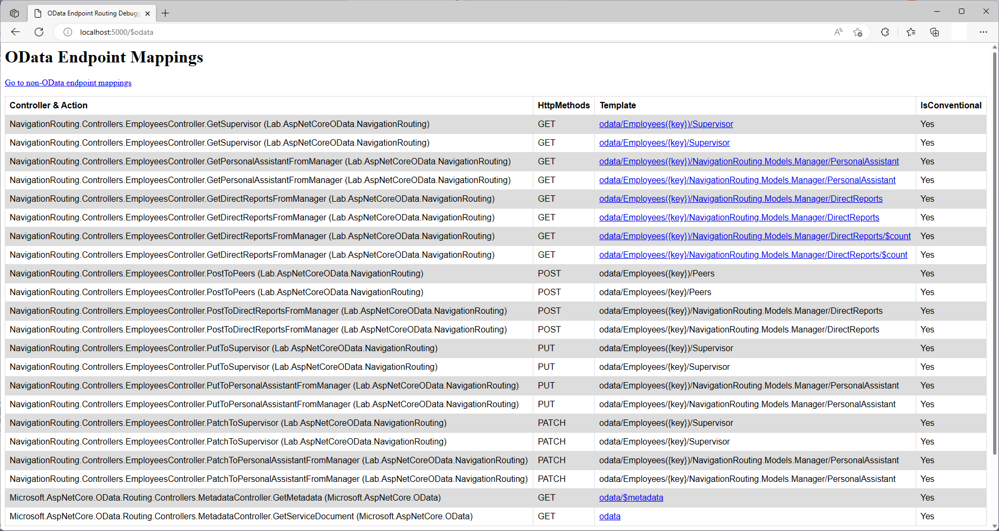

# Navigation Routing in ASP.NET Core OData 8
**Applies To**:[!INCLUDE[appliesto-webapi](../../includes/appliesto-webapi-v8.md)]

This tutorial shows how ASP.NET Core OData 8 supports navigation routing. An understanding of routing fundamentals in ASP.NET Core OData 8 is assumed. If you're unfamiliar with routing in ASP.NET Core OData 8, you may want to go through the [routing overview](/odata/webapi-8/fundamentals/routing-overview) tutorial.

## Introduction
OData navigation routing convention supports the following route templates:

| Request Method | Route Template |
|----------------|----------------|
| `GET` | `~/{entityset}/{key}/{navigationproperty}` |
| `GET` | `~/{entityset}/{key}/{cast}/{navigationproperty}` |
| `GET` | `~/{entityset}/{key}/{cast}/{collectionvaluednavigationproperty}/$count` |
| `GET` | `~/{singleton}/{navigationproperty}` |
| `GET` | `~/{singleton}/{cast}/{navigationproperty}` |
| `GET` | `~/{singleton}/{cast}/{collectionvaluednavigationproperty}/$count` |
| `POST` | `~/{entityset}/{key}/{collectionvaluednavigationproperty}` |
| `POST` | `~/{entityset}/{key}/{cast}/{collectionvaluednavigationproperty}` |
| `POST` | `~/{singleton}/{collectionvaluednavigationproperty}` |
| `POST` | `~/{singleton}/{cast}/{collectionvaluednavigationproperty}` |
| `PUT` | `~/{entityset}/{key}/{singlevaluednavigationproperty}` |
| `PUT` | `~/{entityset}/{key}/{cast}/{singlevaluednavigationproperty}` |
| `PUT` | `~/{singleton}/{singlevaluednavigationproperty}` |
| `PUT` | `~/{singleton}/{cast}/{singlevaluednavigationproperty}` |
| `PATCH` | `~/{entityset}/{key}/{navigationproperty}` |
| `PATCH` | `~/{entityset}/{key}/{cast}/{navigationproperty}` |
| `PATCH` | `~/{singleton}/{navigationproperty}` |
| `PATCH` | `~/{singleton}/{cast}/{navigationproperty}` |

**Notes:**
1. OData routing supports canonical parentheses-style key (e.g. `~/Employees(1)`) in addition to key-as-segment (e.g. `~/Employees/1`). Currently, ASP.NET Core OData 8 does not support key-as-segment convention in multi-part keys scenarios
2. `{cast}` is a placeholder for the fully-qualified name for a derived type
3. On the above route templates table, where `{navigationproperty}` is used, that implies support for both single-valued and collection-valued navigation property

To illustrate navigation routing convention, let's build a sample OData service.

## Prerequisites

[!INCLUDE[](../../includes/appliesto-webapi-v8-net-prereqs-vs.md)]

## Packages

[!INCLUDE[](../../includes/appliesto-webapi-v8-pkg-install.md)]

## Models
The following are the models for the OData service:

**`Employee` class**
```csharp
namespace NavigationRouting.Models
{
    public class Employee
    {
        public int Id { get; set; }
        public string Name { get; set; }
        public Employee Supervisor { get; set; }
        public List<Employee> Peers { get; set; } = new List<Employee>();
    }
}
```

**`Manager` class**
```csharp
namespace NavigationRouting.Models
{
    public class Manager : Employee
    {
        public Employee PersonalAssistant { get; set; }
        public List<Employee> DirectReports { get; set; } = new List<Employee>();
    }
}
```

## Edm model and service configuration
The logic for building the Edm model and configuring the OData service is as follows:

# [.NET 6.0](#tab/net60)

```csharp
// Program.cs
using Microsoft.AspNetCore.Builder;
using Microsoft.AspNetCore.OData;
using Microsoft.Extensions.DependencyInjection;
using Microsoft.OData.ModelBuilder;
using NavigationRouting.Models;

var builder = WebApplication.CreateBuilder(args);

var modelBuilder = new ODataConventionModelBuilder();
modelBuilder.EntitySet<Employee>("Employees");

builder.Services.AddControllers().AddOData(
    options => options.EnableQueryFeatures(null).AddRouteComponents(
        routePrefix: "odata",
        model: modelBuilder.GetEdmModel()));

var app = builder.Build();

app.UseODataRouteDebug();
app.UseRouting();
app.UseEndpoints(endpoints => endpoints.MapControllers());

app.Run();
```

# [.NET Core 3.1](#tab/netcoreapp31)

```csharp
// Startup.cs
using Microsoft.AspNetCore.Builder;
using Microsoft.AspNetCore.OData;
using Microsoft.Extensions.DependencyInjection;
using Microsoft.OData.ModelBuilder;
using NavigationRouting.Models;

public class Startup
{
    public void ConfigureServices(IServiceCollection services)
    {
        var modelBuilder = new ODataConventionModelBuilder();
        modelBuilder.EntitySet<Employee>("Employees");

        services.AddControllers().AddOData(
            options => options.EnableQueryFeatures(null).AddRouteComponents(
                routePrefix: "odata",
                model: modelBuilder.GetEdmModel()));
    }

    public void Configure(IApplicationBuilder app)
    {
        app.UseODataRouteDebug();
        app.UseRouting();
        app.UseEndpoints(endpoints => endpoints.MapControllers());
    }
}
```

---

In the above block of code, we define an entity set named `Employees`. Implicitly, `Employee` and `Manager` get included in the Edm model as entity types.

## Controller
The partial structure of the controller for the OData service is as follows:
```csharp
using System;
using System.Collections.Generic;
using System.Linq;
using Microsoft.AspNetCore.Mvc;
using Microsoft.AspNetCore.OData.Deltas;
using Microsoft.AspNetCore.OData.Query;
using Microsoft.AspNetCore.OData.Routing.Controllers;
using NavigationRouting.Models;

public class EmployeesController : ODataController
{
    private static IList<Employee> employees = GetEmployees();

    private static List<Employee> GetEmployees()
    {
        var employee5 = new Manager { Id = 5, Name = "Employee 5" };
        var employee1 = new Employee { Id = 1, Name = "Employee 1", Supervisor = employee5 };
        var employee2 = new Employee { Id = 2, Name = "Employee 2", Supervisor = employee5 };
        var employee3 = new Employee { Id = 3, Name = "Employee 3", Supervisor = employee5 };
        var employee4 = new Employee { Id = 4, Name = "Employee 4" }; // No Supervisor
        var employee6 = new Manager { Id = 6, Name = "Employee 6" };

        employee5.DirectReports = new List<Employee> { employee1, employee2, employee3 };
        employee5.PersonalAssistant = employee3;

        return new List<Employee> { employee1, employee2, employee3, employee4, employee5, employee6 };
    }
}
```

## Routing conventions for navigation properties
In this section we cover the conventions for navigation routing and the controller actions (endpoints) required for the request to be routed successfully.

### Retrieving a single-valued or collection-valued navigation property on an entity
The route templates for this request are:
- `GET ~/{entityset}({key})/{navigationproperty}`
- `GET ~/{entityset}/{key}/{navigationproperty}`

The following request returns the `Supevisor` single-valued navigation property on employee 1:
```http
GET http://localhost:5000/odata/Employees(1)/Supervisor
```

For the above request to be conventionally-routed, a controller action named `GetSupervisor` that accepts the key parameter is expected:
```csharp
public ActionResult<Employee> GetSupervisor([FromRoute] int key)
{
    var employee = employees.SingleOrDefault(d => d.Id.Equals(key));

    if (employee == null)
    {
        return NotFound();
    }

    return employee.Supervisor;
}
```

The following JSON payload shows the expected response:
```json
{
    "@odata.context": "http://localhost:5000/odata/$metadata#Employees/NavigationRouting.Models.Manager/$entity",
    "@odata.type": "#NavigationRouting.Models.Manager",
    "Id": 5,
    "Name": "Employee 5"
}
```

### Retrieving a single-valued or collection-valued navigation property on a derived entity
The route templates for this request are:
- `GET ~/{entityset}({key})/{cast}/{navigationproperty}`
- `GET ~/{entityset}/{key}/{cast}/{navigationproperty}`

The following request returns the `DirectReports` collection-valued navigation property on employee 5 (a manager):
```http
GET http://localhost:5000/odata/Employees(5)/NavigationRouting.Models.Manager/DirectReports
```

For the above request to be conventionally-routed, a controller action named `GetDirectReportsFromManager` that accepts the key parameter is expected:
```csharp
public ActionResult<IEnumerable<Employee>> GetDirectReportsFromManager([FromRoute] int key)
{
    var manager = employees.OfType<Manager>().SingleOrDefault(d => d.Id.Equals(key));

    if (manager == null)
    {
        return NotFound();
    }

    return manager.DirectReports;
}
```

The following JSON payload shows the expected response:
```json
{
    "@odata.context": "http://localhost:5000/odata/$metadata#Employees",
    "value": [
        {
            "Id": 1,
            "Name": "Employee 1"
        },
        {
            "Id": 2,
            "Name": "Employee 2"
        },
        {
            "Id": 3,
            "Name": "Employee 3"
        }
    ]
}
```

### Retrieving the count of a collection-valued navigation property on a derived entity
The route templates for this request are:
- `GET ~/{entityset}({key})/{cast}/{collectionvaluednavigationproperty}/$count`
- `GET ~/{entityset}/{key}/{cast}/{collectionvaluednavigationproperty}/$count`

To address the raw value of the number of items in a collection, append `/$count` to the collection-valued navigation property's URL.

The following request returns the number of items in the `DirectReports` collection-valued navigation property on employee 5 (a manager):
```http
GET http://localhost:5000/odata/Employees(5)/NavigationRouting.Models.Manager/DirectReports/$count
```

For the above request to be conventionally-routed, a controller action named `GetDirectReportsFromManager` that accepts the key parameter is expected, same as is expected when retrieving a collection-valued navigation property. However, the controller action needs to be decorated with `EnableQuery` attribute:
```csharp
[EnableQuery]
public ActionResult<IEnumerable<Employee>> GetDirectReportsFromManager([FromRoute] int key)
{
    var manager = employees.OfType<Manager>().SingleOrDefault(d => d.Id.Equals(key));

    if (manager == null)
    {
        return NotFound();
    }

    return manager.DirectReports;
}
```

 The expected response is shown below:
```console
3
```

### Post to a collection-valued navigation property on an entity
The route templates for this request are:
- `POST ~/{entityset}({key})/{collectionvaluednavigationproperty}`
- `POST ~/{entityset}/{key}/{collectionvaluednavigationproperty}`

The following `POST` request adds an employee to the `Peers` collection-valued navigation property on employee 4:
```http
POST http://localhost:5000/odata/Employees(4)/Peers
```

Here's the request body:
```json
{
    "Id": 7,
    "Name": "Employee 7"
}
```

For the above request to be conventionally-routed, a controller action named `PostToPeers` is expected. The controller action should accept two parameters - the first is the key parameter and the second a parameter of type `Employee` decorated with `FromBody` attribute:
```csharp
public ActionResult PostToPeers([FromRoute] int key, [FromBody] Employee peer)
{
    var employee = employees.SingleOrDefault(d => d.Id.Equals(key));

    if (employee == null)
    {
        return NotFound();
    }

    employees.Add(peer);
    employee.Peers.Add(peer);

    return Created(peer);
}
```

The response status code should be `201`. The following JSON payload shows the expected response:
```json
{
    "@odata.context": "http://localhost:5000/odata/$metadata#Employees/$entity",
    "Id": 7,
    "Name": "Employee 7"
}
```

### Post to a collection-valued navigation property on a derived entity
The route templates for this request are:
- `POST ~/{entityset}({key})/{cast}/{collectionvaluednavigationproperty}`
- `POST ~/{entityset}/{key}/{cast}/{collectionvaluednavigationproperty}`

The following `POST` request adds an employee to the `DirectReports` collection-valued navigation property on employee 6 (a manager):
```http
POST http://localhost:5000/odata/Employees(6)/NavigationRouting.Models.Manager/DirectReports
```

Here's the request body:
```json
{
    "Id": 8,
    "Name": "Employee 8"
}
```

For the above request to be conventionally-routed, a controller action named `PostToDirectReportsFromManager` is expected. The controller action should accept two parameters - the first is the key parameter and the second a parameter of type `Employee` decorated with `FromBody` attribute:
```csharp
public ActionResult PostToDirectReportsFromManager([FromRoute] int key, [FromBody] Employee employee)
{
    var manager = employees.OfType<Manager>().SingleOrDefault(d => d.Id.Equals(key));

    if (manager == null)
    {
        return NotFound();
    }

    employees.Add(employee);
    manager.DirectReports.Add(employee);

    return Created(employee);
}
```

The response status code should be `201`. The following JSON payload shows the expected response:
```json
{
    "@odata.context": "http://localhost:5000/odata/$metadata#Employees/$entity",
    "Id": 8,
    "Name": "Employee 8"
}
```

### Updating a single-valued navigation property on an entity
The route templates for this request are:
- `PUT ~/{entityset}({key})/{singlevaluednavigationproperty}`
- `PUT ~/{entityset}/{key}/{singlevaluednavigationproperty}`

The following `PUT` request updates a `Supervisor` single-valued navigation property on employee 1:
```http
PUT http://localhost:5000/odata/Employees(1)/Supervisor
```

Here's the request body:
```json
{
    "@odata.type": "#NavigationRouting.Models.Manager",
    "Id": 6,
    "Name": "Employee 6"
}
```

For the above request to be conventionally-routed, a controller action named `PutToSupervisor` is expected. The controller action should accept two parameters - the first is the key parameter and the second a parameter of type `Employee` decorated with `FromBody` attribute:
```csharp
public ActionResult PutToSupervisor([FromRoute] int key, [FromBody] Employee supervisor)
{
    var employee = employees.SingleOrDefault(d => d.Id.Equals(key));

    if (employee == null)
    {
        return NotFound();
    }

    employee.Supervisor = supervisor;

    return Ok();
}
```

The response status code should be `200`. Querying the `Supervisor` single-valued navigation property on employee 1 should confirm that the navigation property was updated:
```http
GET http://localhost:5000/odata/Employees(1)/Supervisor
```

### Updating a single-valued navigation property on a derived entity
The route templates for this request are:
- `PUT ~/{entityset}({key})/{cast}/{singlevaluednavigationproperty}`
- `PUT ~/{entityset}/{key}/{cast}/{singlevaluednavigationproperty}`

The following `PUT` request updates a `PersonalAssistant` single-valued navigation property on employee 6 (a manager):
```http
PUT http://localhost:5000/odata/Employees(6)/NavigationRouting.Models.Manager/PersonalAssistant
```

Here's the request body:
```json
{
    "Id": 4,
    "Name": "Employee 4"
}
```

For the above request to be conventionally-routed, a controller action named `PutToPersonalAssistantFromManager` is expected. The controller action should accept two parameters - the first is the key parameter and the second a parameter of type `Employee` decorated with `FromBody` attribute:
```csharp
public ActionResult PutToPersonalAssistantFromManager([FromRoute] int key, [FromBody] Employee personalAssistant)
{
    var manager = employees.OfType<Manager>().SingleOrDefault(d => d.Id.Equals(key));

    if (manager == null)
    {
        return NotFound();
    }

    manager.PersonalAssistant = personalAssistant;

    return Ok();
}
```

The response status code should be `200`. Querying the `PersonalAssistant` single-valued navigation property on the `Manager` derived entity with a key value of 1 should confirm that the navigation property was updated:
```http
GET http://localhost:5000/odata/Employees(6)/NavigationRouting.Models.Manager/PersonalAssistant
```

### Patching a navigation property on an entity
The route templates for this request are:
- `PATCH ~/{entityset}({key})/{navigationproperty}`
- `PATCH ~/{entityset}/{key}/{navigationproperty}`

The following `PATCH` request patches a `Supervisor` navigation property on employee 1:
```http
PATCH http://localhost:5000/odata/Employees(1)/Supervisor
```

Here's the request body:
```json
{
    "Name": "Sue"
}
```

For the above request to be conventionally-routed, a controller action named `PatchToSupervisor` is expected. The controller action should accept two parameters - the first is the key parameter and the second a parameter of type [`Delta<Employee>`](/dotnet/api/microsoft.aspnetcore.odata.deltas.delta) decorated with `FromBody` attribute:
```csharp
public ActionResult PatchToSupervisor([FromRoute] int key, [FromBody] Delta<Employee> delta)
{
    var employee = employees.SingleOrDefault(d => d.Id.Equals(key));

    if (employee == null)
    {
        return NotFound();
    }

    if (employee.Supervisor != null)
    {
        delta.Patch(employee.Supervisor);
    }

    return Ok();
}
```

The response status code should be `200`. Querying the `Supervisor` navigation property on employee 1 should confirm that the navigation property was patched:
```http
GET http://localhost:5000/odata/Employees(1)/Supervisor
```

### Patching a navigation property on a derived entity
The route templates for this request are:
- `PATCH ~/{entityset}({key})/{cast}/{navigationproperty}`
- `PATCH ~/{entityset}/{key}/{cast}/{navigationproperty}`

The following `PATCH` request patches a `PersonalAssistant` navigation property on employee 6 (a manager):
```http
PATCH http://localhost:5000/odata/Employees(6)/NavigationRouting.Models.Manager/PersonalAssistant
```

Here's the request body:
```json
{
    "Name": "Joe"
}
```

For the above request to be conventionally-routed, a controller action named `PatchToPersonalAssistantFromManager` is expected. The controller action should accept two parameters - the first is the key parameter and the second a parameter of type [`Delta<Employee>`](/dotnet/api/microsoft.aspnetcore.odata.deltas.delta) decorated with `FromBody` attribute:
```csharp
public ActionResult PatchToPersonalAssistantFromManager([FromRoute] int key, [FromBody] Delta<Employee> delta)
{
    var manager = employees.OfType<Manager>().SingleOrDefault(d => d.Id.Equals(key));

    if (manager == null)
    {
        return NotFound();
    }

    if (manager.PersonalAssistant != null)
    {
        delta.Patch(manager.PersonalAssistant);
    }

    return Ok();
}
```

The response status code should be `200`. Querying the `PersonalAssistant` navigation property on employee 6 (a manager) should confirm that the navigation property was patched:
```http
GET http://localhost:5000/odata/Employees(6)/NavigationRouting.Models.Manager/PersonalAssistant
```

## Navigation routing endpoint mappings
If you went through this tutorial and implemented the logic in an OData service, you can run the application and visit the `$odata` endpoint (http://localhost:5000/$odata) to view the endpoint mappings:


