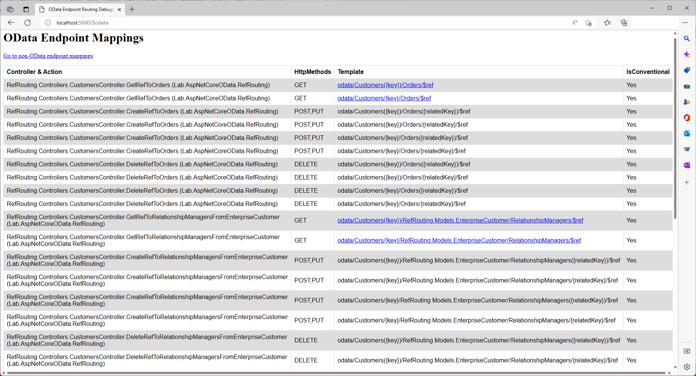

# Reference Routing in ASP.NET Core OData 8
**Applies To**:[!INCLUDE[appliesto-webapi](../../includes/appliesto-webapi-v8.md)]

This tutorial shows how ASP.NET Core OData 8 supports reference routing conventionally. An understanding of routing fundamentals in ASP.NET Core OData 8 is assumed. If you're unfamiliar with routing in ASP.NET Core OData 8, you may want to go through the [routing overview](/odata/webapi-8/fundamentals/routing-overview) tutorial.

## Introduction
OData services are based on a data model that supports relationships between entities. For example, an OData service could expose a collection of `Order` entities each of which are related to the `Customer` entity. In OData terminology, the relationship is a "reference". (In OData v3, the relationship was called a _link_.) References between entities are addressable just like entities themselves by appending a navigation property name followed by `/$ref` to the entity URL. For example, here is the URI to address the reference between an order and the customer it belongs to:
```http
http://localhost:5000/odata/Orders(1)/Customer/$ref
```

OData reference routing convention supports the following route templates:

| Request Method | Route Template |
|----------------|----------------|
| `GET` \| `DELETE` | `~/{entityset}/{key}/{navigationproperty}/$ref` |
| `GET` \| `DELETE` | `~/{singleton}/{navigationproperty}/$ref` |
| `GET` \| `POST` \| `PUT` \| `DELETE` | `~/{entityset}/{key}/{navigationproperty}/{relatedkey}/$ref` |
| `GET` \| `POST` \| `PUT` \| `DELETE` | `~/{entityset}/{key}/{cast}/{navigationproperty}/{relatedkey}/$ref` |
| `GET` \| `POST` \| `PUT` \| `DELETE` | `~/{singleton}/{navigationproperty}/{relatedkey}/$ref` |
| `GET` \| `POST` \| `PUT` \| `DELETE` | `~/{singleton}/{cast}/{navigationproperty}/{relatedkey}/$ref` |

**Notes:**
1. OData routing supports canonical parentheses-style key (e.g. `~/Employees(1)`) in addition to key-as-segment (e.g. `~/Employees/1`). Currently, ASP.NET Core OData 8 does not support key-as-segment convention in multi-part keys scenarios
2. `{cast}` is a placeholder for the fully-qualified name for a derived type

To illustrate reference routing convention, let's build a sample OData service.

## Prerequisites

[!INCLUDE[](../../includes/appliesto-webapi-v8-net-prereqs-vs.md)]

## Packages

[!INCLUDE[](../../includes/appliesto-webapi-v8-pkg-install.md)]

## Models
The following are the models for the OData service:

**`Order` class**
```csharp
namespace RefRouting.Models
{
    public class Order
    {
        public int Id { get; set; }
        public decimal Amount { get; set; }
        public Customer Customer { get; set; }
    }
}
```

**`Customer` class**
```csharp
namespace RefRouting.Models
{
    public class Customer
    {
        public int Id { get; set; }
        public string Name { get; set; }
        public List<Order> Orders { get; set; } = new List<Order>();
    }
}
```

**`EnterpriseCustomer`** class
```csharp
namespace RefRouting.Models
{
    public class EnterpriseCustomer : Customer
    {
        public List<Employee> RelationshipManagers { get; set; } = new List<Employee>();
    }
}
```

**`Employee`** class
```csharp
namespace RefRouting.Models
{
    public class Employee
    {
        public int Id { get; set; }
        public string Name { get; set; }
    }
}
```

## Edm model and service configuration
The logic for building the Edm model and configuring the OData service is as follows:

# [.NET 6.0](#tab/net60)

```csharp
// Program.cs
using Microsoft.AspNetCore.Builder;
using Microsoft.AspNetCore.OData;
using Microsoft.Extensions.DependencyInjection;
using Microsoft.OData.ModelBuilder;
using RefRouting.Models;

var builder = WebApplication.CreateBuilder(args);

var modelBuilder = new ODataConventionModelBuilder();
modelBuilder.EntitySet<Customer>("Customers");
modelBuilder.EntitySet<Order>("Orders");

builder.Services.AddControllers().AddOData(
    options => options.EnableQueryFeatures(null).AddRouteComponents(
        routePrefix: "odata",
        model: modelBuilder.GetEdmModel()));

var app = builder.Build();

app.UseODataRouteDebug();
app.UseRouting();
app.UseEndpoints(endpoints => endpoints.MapControllers());

app.Run();
```

# [.NET Core 3.1](#tab/netcoreapp31)

```csharp
// Startup.cs
using Microsoft.AspNetCore.Builder;
using Microsoft.AspNetCore.OData;
using Microsoft.Extensions.DependencyInjection;
using Microsoft.OData.ModelBuilder;
using RefRouting.Models;

public class Startup
{
    public void ConfigureServices(IServiceCollection services)
    {
        var modelBuilder = new ODataConventionModelBuilder();
        modelBuilder.EntitySet<Customer>("Customers");
        modelBuilder.EntitySet<Order>("Orders");

        services.AddControllers().AddOData(
            options => options.EnableQueryFeatures(null).AddRouteComponents(
                routePrefix: "odata",
                model: modelBuilder.GetEdmModel()));
    }

    public void Configure(IApplicationBuilder app)
    {
        app.UseODataRouteDebug();
        app.UseRouting();
        app.UseEndpoints(endpoints => endpoints.MapControllers());
    }
}
```

---

In the above block of code, we define two entity sets, namely, `Customers` and `Orders`. Implicitly, `Customer` and `Order` get included in the Edm model as entity types. `EnterpriseCustomer` is derived from `Customer` and `EnterpriseCustomer` references `Employee`. Because of those relationships, `EnterpriseCustomer` and `Employee` also get included in the Edm model.

## Controllers
To demonstrate the subtle differences between entity references and collection of entity references, we create two controllers; `OrdersController` and `CustomersController`. This should help us model a 1-many relationship - a customer may have many orders and an order belongs to one customer.

The partial structures of the controllers for the OData service is as follows:
```csharp
using System;
using System.Collections.Generic;
using System.Linq;
using Microsoft.AspNetCore.Mvc;
using Microsoft.AspNetCore.OData.Query;
using Microsoft.AspNetCore.OData.Routing.Controllers;
using RefRouting.Models;

public class CustomersController : ODataController
{
    private static Random random = new Random();
    private static List<Customer> customers = new List<Customer>
    {
        new Customer
        {
            Id = 1,
            Name = "Customer 1",
            Orders = new List<Order> { new Order { Id = 1, Amount = 80 }, new Order { Id = 2, Amount = 40 } }
        },
        new EnterpriseCustomer
        {
            Id = 2,
            Name = "Customer 2",
            Orders = new List<Order> { new Order { Id = 3, Amount = 50 }, new Order { Id = 4, Amount = 65 } },
            RelationshipManagers = new List<Employee> { new Employee { Id = 1, Name = "Employee 1" } }
        }
    };
}

public class OrdersController : ODataController
{
    private static List<Order> orders = GetOrders();

    private static List<Order> GetOrders()
    {
        var customer1 = new Customer { Id = 1, Name = "Customer 1" };
        var customer2 = new EnterpriseCustomer
        {
            Id = 2,
            Name = "Customer 2",
            RelationshipManagers = new List<Employee> { new Employee { Id = 1, Name = "Employee 1" } }
        };

        return new List<Order>
        {
            new Order { Id = 1, Amount = 80, Customer = customer1 },
            new Order { Id = 2, Amount = 40, Customer = customer1 },
            new Order { Id = 3, Amount = 50, Customer = customer2 },
            new Order { Id = 4, Amount = 65, Customer = customer2 },
            new Order { Id = 5, Amount = 35 }
        };
    }
}
```

## Routing conventions for references between entities
In this section we cover the conventions for routing entity references and the controller actions (endpoints) required for the request to be routed successfully.

### Create a relationship between two existing entities where the navigation property is single-valued
The route templates for this request are:
- `~/{entityset}({key})/{navigationproperty}/{relatedkey}/$ref`
- `~/{entityset}/{key}/{navigationproperty}/{relatedkey}/$ref`
- `~/{entityset}({key})/{navigationproperty}({relatedkey})/$ref`
- `~/{entityset}/{key}/{navigationproperty}({relatedkey})/$ref`

The code samples provided in this section belong to the `OrdersController` class since `order.Customer` is the "1" end of the 1-to-many relationship.

The following `PUT` request creates a relationship between order 5 and customer 1:
```http
PUT http://localhost:5000/odata/Orders(5)/Customer(1)/$ref
```

The request body is empty.

For the above request to be conventionally-routed, the controller action can be implemented in either of the following two ways:
1. A controller action named `CreateRefToCustomer` that accepts two parameters - the first is the key for the target entity and second is the key for the related entity:
    ```csharp
    public ActionResult CreateRefToCustomer([FromRoute] int key, [FromRoute] int relatedKey)
    {
        var order = orders.SingleOrDefault(d => d.Id.Equals(key));

        if (order == null)
        {
            return NotFound();
        }

        // Quick, lazy and dirty
        order.Customer = new Customer { Id = relatedKey, Name = $"Customer {relatedKey}" };

        return NoContent();
    }
    ```

    We are creating the relationship by assigning the customer object to `Customer` property of the order.
2. A controller action named `CreateRef` that accepts three parameters - the first is the key for the target entity, the second is the key for the related entity, and the third is the name of the target navigation property.
    ```csharp
    public ActionResult CreateRef([FromRoute] int key, [FromRoute] int relatedKey, [FromRoute] string navigationProperty)
    {
        var order = orders.SingleOrDefault(d => d.Id.Equals(key));

        if (order == null)
        {
            return NotFound();
        }

        switch (navigationProperty)
        {
            case "Customer":
                // Quick, lazy and dirty
                order.Customer = new Customer { Id = relatedKey, Name = $"Customer {relatedKey}" };
                break;
            default:
                return BadRequest();
        }

        return NoContent();
    }
    ```

This alternative allows you to have a single `CreateRef` controller action that can handle requests relevant to different navigation properties.

To be backward-compatible with OData 4.0, ASP.NET Core OData 8.0 supports yet another two route templates:
- `~/{entityset}({key})/{navigationproperty}/$ref`
- `~/{entityset}/{key}/{navigationproperty}/$ref`

On these templates, the key for the related entity does not appear on the URL; instead, the address for the related entity is in the request body:
```http
PUT http://localhost:5000/Orders(5)/Customer/$ref
```

Here's the request body:
```csharp
{
    "@odata.id": "http://localhost:5000/Customers(1)"
}
```

For the above request to be conventionally-routed, the controller action can be implemented in either of the following two ways:
1. A controller action named `CreateRefToCustomer` that accepts two parameters - the first is the key for the target entity and second is a `Uri` parameter decorated with `FromBody` attribute. The `Uri` parameter will contain the value of `@odata.id` property from the request body:
    ```csharp
    public ActionResult CreateRefToCustomer([FromRoute] int key, [FromBody] Uri link)
    {
        var order = orders.SingleOrDefault(d => d.Id.Equals(key));

        if (order == null)
        {
            return NotFound();
        }

        int relatedKey;
        // The code for TryParseRelatedKey is shown a little further below
        if (!TryParseRelatedKey(link, out relatedKey))
        {
            return BadRequest();
        }

        // Quick, lazy and dirty
        order.Customer = new Customer { Id = relatedKey, Name = $"Customer {relatedKey}" };

        return NoContent();
    }
    ```

2. A controller action named `CreateRef` that accepts three parameters - the first is the key for the target entity, the second is the name of the target navigation property, and the third is a `Uri` parameter decorated with `FromBody` attribute. The `Uri` parameter will contain the value of `@odata.id` property from the request body:
    ```csharp
    public ActionResult CreateRef([FromRoute] int key, [FromRoute] string navigationProperty, [FromBody] Uri link)
    {
        var order = orders.SingleOrDefault(d => d.Id.Equals(key));

        if (order == null)
        {
            return NotFound();
        }

        int relatedKey;
        // The code for TryParseRelatedKey is shown a little further below
        if (!TryParseRelatedKey(link, out relatedKey))
        {
            return BadRequest();
        }

        switch (navigationProperty)
        {
            case "Customer":
                // Quick, lazy and dirty
                order.Customer = new Customer { Id = relatedKey, Name = $"Customer {relatedKey}" };
                break;

            default:
                return BadRequest();
        }

        return NoContent();
    }
    ```

Here's the code for the `TryParseRelatedKey` method:
```csharp
using Microsoft.AspNetCore.OData.Extensions;
using Microsoft.OData.Edm;
using Microsoft.OData.UriParser;

private bool TryParseRelatedKey(Uri link, out int relatedKey)
{
    relatedKey = 0;

    var model = Request.GetRouteServices().GetService(typeof(IEdmModel)) as IEdmModel;
    var serviceRoot = Request.CreateODataLink();

    var uriParser = new ODataUriParser(model, new Uri(serviceRoot), link);
    // NOTE: ParsePath may throw exceptions for various reasons
    ODataPath odataPath = uriParser.ParsePath();
    KeySegment keySegment = odataPath.OfType<KeySegment>().LastOrDefault();

    if (keySegment == null || !int.TryParse(keySegment.Keys.First().Value.ToString(), out relatedKey))
    {
        return false;
    }

    return true;
}
```

### Create a relationship between two existing entities where the navigation property is collection-valued
The route templates for this request are:
- `~/{entityset}({key})/{navigationproperty}/{relatedkey}/$ref`
- `~/{entityset}/{key}/{navigationproperty}/{relatedkey}/$ref`
- `~/{entityset}({key})/{navigationproperty}({relatedkey})/$ref`
- `~/{entityset}/{key}/{navigationproperty}({relatedkey})/$ref`

The code samples provided in this section belong to the `CustomersController` class since `customer.Orders` is the "many" end of the 1-to-many relationship.

The following `POST` request creates a relationship between customer 1 and order 5:
```http
POST http://localhost:5000/odata/Customers(1)/Orders(5)/$ref
```

The request body is empty.

For the above request to be conventionally-routed, the controller action can be implemented in either of the following two ways:
1. A controller action named `CreateRefToOrders` that accepts two parameters - the first is the key for the target entity and second is the key for the related entity:
    ```csharp
    public ActionResult CreateRefToOrders([FromRoute] int key, [FromRoute] int relatedKey)
    {
        var customer = customers.SingleOrDefault(d => d.Id.Equals(key));

        if (customer == null)
        {
            return NotFound();
        }

        if (customer.Orders.SingleOrDefault(d => d.Id.Equals(relatedKey)) == null)
        {
            // Quick, lazy and dirty
            customer.Orders.Add(new Order { Id = relatedKey, Amount = random.Next(1, 9) * 10 });
        }

        return NoContent();
    }
    ```

    We are creating the relationship by adding the order to the `Orders` collection.
2. A controller action named `CreateRef` that accepts three parameters - the first is the key for the target entity, the second is the key for the related entity, and the third is the name of the target navigation property; mirroring a similarly-named method from previous section.

### Create a relationship between two existing entities where the navigation property is on a derived entity
The route templates for this request are:
- `~/{entityset}({key})/{cast}/{navigationproperty}({relatedKey})/$ref`
- `~/{entityset}/{key}/{cast}/{navigationproperty}/{relatedKey}/$ref`
- `~/{entityset}({key})/{cast}/{navigationproperty}({relatedKey})/$ref`
- `~/{entityset}/{key}/{cast}/{navigationproperty}({relatedKey})/$ref`

The `EnterpriseCustomer` derives from `Customer` and it contains a collection-valued navigation property named `RelationshipManagers`.

The code samples provided in this section belong to the `CustomersController` class since `enterpriseCustomer.RelationshipManagers` is the "many" end of the 1-to-many relationship.

The following `POST` request creates a relationship between enterprise customer 2 and employee 2:
```http
POST http://localhost:5000/odata/Customers(2)/RefRouting.Models.EnterpriseCustomer/RelationshipManagers(2)/$ref
```

The request body is empty.

For the above request to be conventionally-routed, a controller action named `CreateRefToRelationshipManagersFromEnterpriseCustomer` is expected. The controller action should accept two parameters - the first is the key for the target entity and the second is the key for the related entity:
```csharp
public ActionResult CreateRefToRelationshipManagersFromEnterpriseCustomer([FromRoute] int key, [FromRoute] int relatedKey)
{
    var customer = customers.OfType<EnterpriseCustomer>().SingleOrDefault(d => d.Id.Equals(key));

    if (customer == null)
    {
        return NotFound();
    }

    if (customer.RelationshipManagers.SingleOrDefault(d => d.Id == relatedKey) == null)
    {
        customer.RelationshipManagers.Add(new Employee { Id = relatedKey, Name = $"Employee {relatedKey}" });
    }

    return NoContent();
}
```

### Remove a relationship between two entities where the navigation property is single-valued
The route templates for this request are:
- `~/{entityset}({key})/{navigationproperty}$ref`
- `~/{entityset}/{key}/{navigationproperty}/$ref`

The code samples provided in this section belong to the `OrdersController` class since `order.Customer` is the "1" end of the 1-to-many relationship.

The following `DELETE` request removes the relationship between order 2 and the single-valued `Customer` related entity:
```http
DELETE http://localhost:5000/odata/Orders(2)/Customer/$ref
```

For the above request to be conventionally-routed, the controller action can be implemented in either of the following two ways:
1. A controller action named `DeleteRefToCustomer` that accepts the key for the target entity as a parameter:
    ```csharp
    public ActionResult DeleteRefToCustomer([FromRoute] int key)
    {
        var order = orders.SingleOrDefault(d => d.Id.Equals(key));

        if (order == null)
        {
            return NotFound();
        }

        order.Customer = null;

        return NoContent();
    }
    ```

    We are removing the relationship by setting the `Customer` property of the order object to `null`.

2. A controller action named `DeleteRef` that accepts two parameters - the first is the key for the target entity and the second is the name of the target navigation property. The code for that is not included in this tutorial but it closely mirrors the `CreateRef` method from a previous section.

### Remove a relationship between two entities where the navigation property is collection-valued
The route templates for this request are:
- `~/{entityset}({key})/{navigationproperty}/{relatedkey}/$ref`
- `~/{entityset}/{key}/{navigationproperty}/{relatedkey}/$ref`
- `~/{entityset}({key})/{navigationproperty}({relatedkey})/$ref`
- `~/{entityset}/{key}/{navigationproperty}({relatedkey})/$ref`

The code samples provided in this section belong to the `CustomersController` class since `customer.Orders` is the "many" end of the 1-to-many relationship.

The following `DELETE` request removes the relationship between customer 1 and order 2 in the `Orders` collection-valued navigation property:
```http
DELETE http://localhost:5000/odata/Customers(1)/Orders(2)/$ref
```

For the above request to be conventionally-routed, the controller action can be implemented in either of the following two ways:
1. A controller action named `DeleteRefToCustomer` that accepts two parameters - the first is the key for the target entity and the second is the key for related entity:
    ```csharp
    public ActionResult DeleteRefToOrders([FromRoute] int key, [FromRoute] int relatedKey)
    {
        var customer = customers.SingleOrDefault(d => d.Id.Equals(key));

        if (customer == null)
        {
            return NotFound();
        }

        var relatedOrder = customer.Orders.SingleOrDefault(d => d.Id.Equals(relatedKey));
        if (relatedOrder != null)
        {
            customer.Orders.Remove(relatedOrder);
        }

        return NoContent();
    }
    ```

    We are removing the relationship by removing the related order from the `Orders` collection.

2. A controller action named `DeleteRef` that accepts three parameters - the first is the key for the target entity, the second is the key for related entity, and the third is the name of the target navigation property. The code for that is not included in this tutorial but it closely mirrors the `CreateRef` method (with similar parameters) from a previous section.

### Remove a relationship between two entities where the navigation property is on a derived entity
The route templates for this request are:
- `~/{entityset}({key})/{cast}/{navigationproperty}/{relatedkey}/$ref`
- `~/{entityset}/{key}/{cast}/{navigationproperty}/{relatedkey}/$ref`
- `~/{entityset}({key})/{cast}/{navigationproperty}({relatedkey})/$ref`
- `~/{entityset}/{key}/{cast}/{navigationproperty}({relatedkey})/$ref`

The code samples provided in this section belong to the `CustomersController` class since `enterpriseCustomer.RelationshipManagers` is the "many" end of the 1-to-many relationship.

The following `DELETE` request removes the relationship between enterprise customer 2 and employee 1 in the `RelationshipManagers` collection-valued navigation property:
```http
DELETE http://localhost:5000/odata/Customers(2)/RefRouting.Models.EnterpriseCustomer/RelationshipManagers(1)/$ref
```

For the above request to be conventionally-routed, a controller action named `DeleteRefToRelationshipManagersFromEnterpriseCustomer` is expected. The controller action should accept two parameters - the first is the key for the target entity and the second is the key for the related entity:
```csharp
public ActionResult DeleteRefToRelationshipManagersFromEnterpriseCustomer([FromRoute] int key, [FromRoute] int relatedKey)
{
    var customer = customers.OfType<EnterpriseCustomer>().SingleOrDefault(d => d.Id.Equals(key));

    if (customer == null)
    {
        return NotFound();
    }

    var relatedEmployee = customer.RelationshipManagers.SingleOrDefault(d => d.Id == relatedKey);
    if (relatedEmployee != null)
    {
        customer.RelationshipManagers.Remove(relatedEmployee);
    }

    return NoContent();
}
```

### Requesting entity references
A client may request entity references in place of the actual entities. To do this, the client issues a `GET` request with `/$ref` appended to the resource path.

For a single-valued navigation property, the response is an entity reference pointing to the related single entity. If the navigation property is not set, the response is either `204 No Content` or `404 Not Found`. To request for an entity reference for the `Customer` navigation property on order 1:
```http
GET http://localhost:5000/odata/Orders(1)/Customer/$ref
```

For a collection-valued navigation property, the response is a collection of entity references pointing to the related entities. If no entities are related, the response is an empty collection. To request for the collection of entity references for `Orders` navigation property on customer 1:
```http
GET http://localhost:5000/odata/Customers(1)/Orders/$ref
```

## Reference routing endpoint mappings
If you went through this tutorial and implemented the logic in an OData service, you can run the application and visit the `$odata` endpoint (http://localhost:5000/$odata) to view the endpoint mappings:


