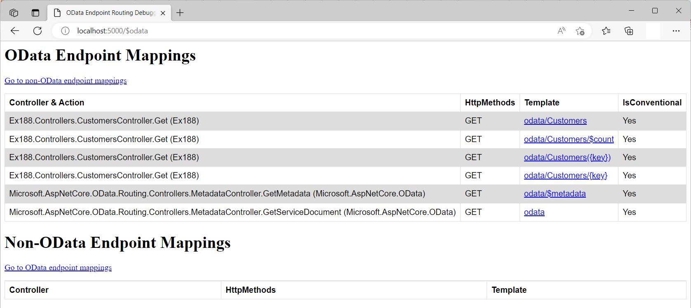
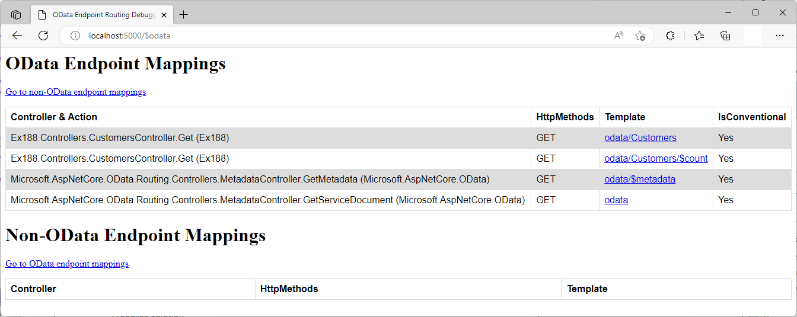

# Routing in ASP.NET Core OData 8
**Applies To**:[!INCLUDE[appliesto-webapi](../../includes/appliesto-webapi-v8.md)]

This tutorial covers routing in ASP.NET Core OData 8. This tutorial assumes a basic understanding of how to create and run an ASP.NET Core OData 8 application. If you're unfamiliar with ASP.NET Core OData 8, you may want to go through the [Getting started](/odata/webapi-8/getting-started) tutorial.

## Prerequisites

[!INCLUDE[](../../includes/appliesto-webapi-v8-net-prereqs-vs.md)]

## Introduction
Routing is responsible for matching incoming HTTP requests and dispatching those requests to the app's executable endpoints. In ASP.NET Core OData 8, an endpoint represents the controller action that the incoming request resolves to, along with other metadata attached to the route that matches the request.

Routing uses a pair of [middleware](/aspnet/core/fundamentals/middleware), registered by [`UseRouting`](/dotnet/api/microsoft.aspnetcore.builder.endpointroutingapplicationbuilderextensions.userouting) and [`UseEndpoints`](/dotnet/api/microsoft.aspnetcore.builder.endpointroutingapplicationbuilderextensions.useendpoints):
- [`UseRouting`](/dotnet/api/microsoft.aspnetcore.builder.endpointroutingapplicationbuilderextensions.userouting) adds route matching to the middleware pipeline. This middleware is responsible for matching the URLs of incoming requests and mapping them to controller actions. The matching process can extract values from the request's URL and provide those values for request processing.
- [`UseEndpoints`](/dotnet/api/microsoft.aspnetcore.builder.endpointroutingapplicationbuilderextensions.useendpoints) adds endpoint execution to the middleware pipeline. It runs the delegate associated with the matched endpoint.

```csharp
app.UseRouting();
app.UseEndpoints(endpoints => endpoints.MapControllers());
```

## Registering OData services
OData extends the `IMvcBuilder` interface with the `AddOData()` method used to register required services on the [dependency injection](/aspnet/core/fundamentals/dependency-injection) container to anchor OData features. These services include the built-in OData routing conventions designed specifically for OData endpoints. The `AddOData()` method accepts a delegate to configure `ODataOptions`. The `ODataOptions` class support a variety of methods used to register the Edm model and to enable OData query features.

The Entity Data Model, or EDM/Edm in short, is the abstract model that is used to describe the data exposed by an OData service. The Edm model is registered against a route by specifying a route prefix. This is done by calling any of the `AddRouteComponents` overloads. Where the `AddRouteComponents(IEdmModel)` overload is called, or route prefix is passed as an empty string, the Edm model is added to the default route. The various OData query features are enabled by calling the relevant methods like `Select()`, `Filter()`, `OrderBy()`, etc. Note that you can call `EnableQueryFeatures(Nullable<Int32>)` method to enable all OData query features in one command.

# [.NET 6.0](#tab/net60)

```csharp
// Program.cs
var builder = WebApplication.CreateBuilder(args);

var modelBuilder = new ODataConventionModelBuilder();
modelBuilder.EntitySet<Customer>("Customers");

builder.Services.AddControllers().AddOData(
    options => options.EnableQueryFeatures(maxTopValue: null).AddRouteComponents(
        routePrefix: "odata",
        model: modelBuilder.GetEdmModel()));

var app = builder.Build();
```

# [.NET Core 3.1](#tab/netcoreapp31)

```csharp
// Startup.cs
public void ConfigureServices(IServiceCollection services)
{
    var modelBuilder = new ODataConventionModelBuilder();
    modelBuilder.EntitySet<Customer>("Customers");

    services.AddControllers().AddOData(
        options => options.EnableQueryFeatures(maxTopValue: null).AddRouteComponents(
            routePrefix: "odata",
            model: modelBuilder.GetEdmModel()));
}
```

---

## OData routing
In the above block of code, we build an Edm model using the `ODataConventionModelBuilder`. We then call the `AddOData()` method resulting into the following OData routing conventions being registered in the [dependency injection](/aspnet/core/fundamentals/dependency-injection) container:
- [`MetadataRoutingConvention`](/odata/webapi-8/fundamentals/metadata-routing) - routes requests for service metadata
- [`EntitySetRoutingConvention`](/odata/webapi-8/fundamentals/entityset-routing) - routes requests for entity sets
- [`EntityRoutingConvention`](/odata/webapi-8/fundamentals/entity-routing) - routes requests for single entities by key
- [`SingletonRoutingConvention`](/odata/webapi-8/fundamentals/singleton-routing) - routes requests for singletons
- [`FunctionRoutingConvention`](/odata/webapi-8/fundamentals/function-routing) - routes requests for Edm functions
- [`ActionRoutingConvention`](/odata/webapi-8/fundamentals/action-routing) - routes requests for Edm actions
- `OperationImportRoutingConvention` - routes requests for operation imports
- [`PropertyRoutingConvention`](/odata/webapi-8/fundamentals/property-routing) - routes requests for structural properties
- [`NavigationRoutingConvention`](/odata/webapi-8/fundamentals/navigation-routing) - routes requests for navigation properties
- [`RefRoutingConvention`](/odata/webapi-8/fundamentals/ref-routing) - routes requests for entity reference links
- `AttributeRoutingConvention` - represents a routing convention for attribute-routed requests

A in-depth walkthrough for the core routing conventions can be found in the relevant tutorial.

At application startup, OData path templates for all potential endpoints are built. The OData routing conventions above are "executed" to generate a route table that maps each controller action (endpoint) to an OData route template.

The built-in OData routing conventions above implement the following interface:
```csharp
public interface IODataControllerActionConvention
{
    int Order { get; }
    bool AppliesToController(ODataControllerActionContext context);
    bool AppliesToAction(ODataControllerActionContext context);
}
```

- `Order` is used to specify the execution order of the convention. Conventions are executed in ascending numeric value of the `Order` property.
- `AppliesToController` is used to determine whether the particular convention applies to the controller referenced in the `ODataControllerActionContext` parameter passed into the method. It returns `true` if the convention can be applied to all actions in the controller; otherwise `false`.
- `AppliesToAction` is run on all controller actions where `AppliesToController` has returned `true`. It returns `true` to signal that the controller action has been processed by the particular convention and the remaining routing conventions (with higher order) should skip it; otherwise `false` to signal that the remaining routing conventions can be ran on the particular action.

The `AppliesToController` and `AppliesToAction` are executed for each controller and controller actions to generate a mapping for all OData endpoints.

Consider the following `CustomersController` class representing an OData controller where the controller name `Customers` corresponds to an entity set with a similar name in the Edm model built in a previous section.

```csharp
using System.Collections.Generic;
using Microsoft.AspNetCore.Mvc;
using Microsoft.AspNetCore.OData.Query;
using Microsoft.AspNetCore.OData.Routing.Controllers;

public class CustomersController : ODataController
{
    [EnableQuery]
    public ActionResult<IEnumerable<Customer>> Get()
    {
        return new List<Customer>
        {
            new Customer { Id = 1, Name = "Customer 1" },
            new Customer { Id = 2, Name = "Customer 2" }
        };
    }

    public ActionResult<Customer> Get([FromRoute] int key)
    {
        return new Customer { Id = key, Name = $"Customer {key}" };
    }
}

public class Customer
{
    public int Id { get; set; }
    public string Name { get; set; }
}
```

The `Get()` and `Get(int)` controller actions in `CustomersController` are both endpoints that can be matched to URLs of incoming requests and executed.

| Controller action | OData path template | Description |
|-------------------|---------------------|-------------|
| `Get()` | `~/Customers` | Return customer entity collection |
| `Get()` | `~/Customers/$count` | Return number of customer entities |
| `Get(int)` | `~/Customers({key})` | Matches URL like `/Customers(1)` and returns a single customer entity uniquely identified by key 1 |
| `Get(int)` | `~/Customers/{key}` | Matches URL like `/Customers/1` and returns a single customer entity uniquely identified by key 1 |

### Attribute routing
Controller actions are either conventionally-routed or attribute-routed. Placing a route on the controller or action makes it attribute-routed. The built-in OData routing conventions only cover a considerably limited set of OData routing conventions defined in the [OData URL conventions specification](http://docs.oasis-open.org/odata/odata/v4.01/odata-v4.01-part2-url-conventions.html). Attribute routing makes it possible to support routing mappings not covered by conventional routing. Attribute routing uses a set of attributes to map actions directly to OData route templates. Attribute-routed controllers are mapped by calling [`MapControllers`](/dotnet/api/microsoft.aspnetcore.builder.controllerendpointroutebuilderextensions.mapcontrollers) at application startup.

The typical attribute routing scenario involves applying the route template to the HTTP verb attributes:
```csharp
public class CustomersController : ODataController
{
    [EnableQuery]
    [HttpGet("odata/Customers")]
    public ActionResult<IEnumerable<Customer>> List()
    {
        return new List<Customer>
        {
            new Customer { Id = 1, Name = "Customer 1" },
            new Customer { Id = 2, Name = "Customer 2" }
        };
    }

    [HttpGet("odata/Customers({key})")]
    public ActionResult<Customer> Details([FromRoute] int key)
    {
        return new Customer { Id = key, Name = $"Customer {key}" };
    }
}
```

In this case, the controller action is explicitly matched to the hard-coded route template. The route prefix is included to associate the route template with the configured route.

| Controller action | OData path template | Description |
|-------------------|---------------------|-------------|
| `List()` | `~/Customers` | Return customer entity collection |
| `Details(int)` | `~/Customers({key})` | Matches URL like `/Customers(1)` and returns a single customer entity uniquely identified by key 1 |

The route prefix can also be applied to the `Route` attribute on the controller:
```csharp
[Route("odata")]
public class CustomersController : ODataController
{
    [EnableQuery]
    [HttpGet("Customers")]
    public ActionResult List()
    {
        // ...
    }

    [HttpGet("Customers({key})")]
    public ActionResult Details([FromRoute] int key)
    {
        // ...
    }
}
```
The route template on `Route` attribute is prepended to the route template on the controller action to form the final route template for that action.

Attribute routing can be disabled during service configuration as follows:
```csharp
services.AddControllers().AddOData(options => options.EnableAttributeRouting = false);
```

### Debugging OData routing
ASP.NET Core OData 8 supports a middleware that renders all OData and non-OData endpoint mappings. To enable this middleware add `app.UseODataRouteDebug()` above `app.UseRouting()`:

```csharp
app.UseODataRouteDebug();
app.UseRouting();
```

If you then run the application and send a `GET` request to `<ROOT URL>/$odata`, for instance http://localhost:5000/$odata,  you should get a HTML page similar to the one below:



## OData URL components
An OData URL has at most 3 significant parts: the _service root_, the _resource path_, and the _query options_.
```
http://localhost:5000/odata/Customers/?$select=Name
\_________________________/\________/\____________/
            |                   |           |
      service root       resource path  query options
```

The **service root** is a combination of the root URL and the route prefix where one is configured. The service root identifies the root of an OData service. A GET request to this URL returns the format-specific (JSON or XML) service document.
#### Request
```http
GET http://localhost:5000/odata
```
#### Response
```json
{
    "@odata.context": "http://localhost:5000/odata/$metadata",
    "value": [
        {
            "name": "Customers",
            "kind": "EntitySet",
            "url": "Customers"
        }
    ]
}
```

Resources exposed by an OData service are addressable by the corresponding **resource path**. Examples of resources might be customers, a single customer, and so forth. Examples of addressable aspects of these resources as exposed by the data model might be: collections of entities, a single entity, properties, links, operations, and so on. As an illustration, to address a collection of customer entities via the entity set, the relevant resource path would be `Customers`.
#### Request
```http
GET http://localhost:5000/odata/Customers
```
#### Response
```json
{
    "@odata.context": "http://localhost:5000/odata/$metadata#Customers",
    "value": [
        {
            "Id": 1,
            "Name": "Customer 1"
        },
        {
            "Id": 2,
            "Name": "Customer 2"
        }
    ]
}
```

The **query options** part of an OData URL specifies three types of information: system query options, custom query options and parameter aliases.

System query options are query string parameters that control the amount and order of the data returned for the resource identified by the URL. The names of all system query options are prefixed with a dollar (`$`) symbol by default. However, the OData standard does not make it mandatory to prefix system query options with a dollar symbol so ASP.NET Core OData 8 allows you to relax or enforce the requirement for the prefix. Examples of system query options are: `$filter`, `$orderby`, and `$top`.

Custom query options provide an extensible mechanism for service-specific information to be placed in a URL query string. Custom query options MUST NOT begin with a `$` or `@` character. An example of a custom query options is: `/Orders?debug=true`.

Parameter aliases can be used in place of literal values in entity keys, function parameters, or within a `$filter` or `$orderby` expression. Parameter aliases must start with an `@` character. Parameter alias usage example: `GetOrdersInRange(dateStart=@dateStart,dateEnd=@dateEnd)?@dateStart=2022-11-07&@dateEnd=2022-12-07`

```http
GET http://localhost:5000/odata/Customers?$select=Name
```
#### Response
```json
{
    "@odata.context": "http://localhost:5000/odata/$metadata#Customers(Name)",
    "value": [
        {
            "Name": "Customer 1"
        },
        {
            "Name": "Customer 2"
        }
    ]
}
```

## OData routing concepts
To opt in to OData routing, a controller or controller action needs to be decorated with `ODataAttributeRouting` attribute as illustrated below:

#### `ODataAttributeRouting` on controller
```csharp
[ODataAttributeRouting]
public class CustomersController : ControllerBase
{
    [EnableQuery]
    public ActionResult Get()
    {
        // ...
    }
}
```

#### `ODataAttributeRouting` on controller action
```csharp
public class CustomersController : ControllerBase
{
    [ODataAttributeRouting]
    [EnableQuery]
    public ActionResult Get()
    {
        // ...
    }
}
```

The recommended and most straightfoward way however is to have the controller inherit from `ODataController` class. The `ODataController` class is already decorated with the `ODataAttributeRouting` attribute as illustrated below:
```csharp
[ODataAttributeRouting]
public abstract class ODataController : ControllerBase
{
  // ...
}
```

Controllers can then inherit from the `ODataController` as illustrated below:
```csharp
public class CustomersController : ODataController
{
  [EnableQuery]
  public ActionResult Get()
  {
    // ...
  }
}
```

You can apply `ODataIgnored` attribute to a controller or controller action to exclude that item from the OData routing conventions:
```csharp
public class CustomersController : ODataController
{
    [EnableQuery]
    public ActionResult Get()
    {
        // ...
    }

    [ODataIgnored]
    public ActionResult Get([FromRoute] int key)
    {
        // ...
    }
}
```
On the `CustomersController` class above, the second overload of the `Get` method is excluded from OData routing conventions by decorating the controller action with `ODataIgnored` attribute. Below is what is rendered when you browse the OData route debug endpoint - `/$odata`:



From the screenshot above, you will notice that the OData path templates for returning a single entity by key - `~/Customers({key})` and `~/Customers/{key}` - are not rendered.