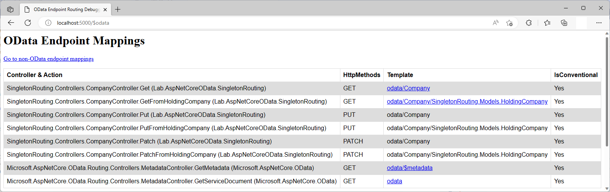

# Singleton Routing in ASP.NET Core OData 8
**Applies To**:[!INCLUDE[appliesto-webapi](../../includes/appliesto-webapi-v8.md)]

This tutorial shows how ASP.NET Core OData 8 supports singleton routing. An understanding of routing fundamentals in ASP.NET Core OData 8 is assumed. If you're unfamiliar with routing in ASP.NET Core OData 8, you may want to go through the [routing overview](/odata/webapi-8/fundamentals/routing-overview) tutorial.

## Introduction
You use a singleton to represent a special entity where there can be only one of it's kind. A singleton is not referenced by key. OData allows defining such a special entity that can be addressed directly by it's name from the service root.

OData singleton routing convention supports the following route templates:

| Request Method | Route Template |
|----------------|----------------|
| `GET` | `~/{singleton}` |
| `GET` | `~/{singleton}/{cast}` |
| `PUT` | `~/{singleton}` |
| `PUT` | `~/{singleton}/{cast}` |
| `PATCH` | `~/{singleton}` |
| `PATCH` | `~/{singleton}/{cast}` |

**Note**: `{cast}` is a placeholder for the fully-qualified name for a derived type

To illustrate singleton routing convention, let's build a sample OData service.

## Packages

[!INCLUDE[](../../includes/appliesto-webapi-v8-pkg-install.md)]

## Prerequisites

[!INCLUDE[](../../includes/appliesto-webapi-v8-net-prereqs-vs.md)]

## Models
The following are the models for the OData service:

**`Company` class**
```csharp
namespace SingletonRouting.Models
{
    public class Company
    {
        public int Id { get; set; }
        public string Name { get;set; }
    }
}
```

**`HoldingCompany` class**
```csharp
namespace SingletonRouting.Models
{
    public class HoldingCompany : Company
    {
        public int NumberOfSubsidiaries { get; set; }
    }
}
```

## Edm model and service configuration
The logic for building the Edm model and configuring the OData service is as follows:

# [.NET 6.0](#tab/net60)

```csharp
// Program.cs
using Microsoft.AspNetCore.Builder;
using Microsoft.AspNetCore.OData;
using Microsoft.Extensions.DependencyInjection;
using Microsoft.OData.ModelBuilder;
using SingletonRouting.Models;

var builder = WebApplication.CreateBuilder(args);

var modelBuilder = new ODataConventionModelBuilder();
modelBuilder.Singleton<Company>("Company");

builder.Services.AddControllers()
    .AddOData(options =>
    {
        options.Select().EnableQueryFeatures(null).AddRouteComponents(
            routePrefix: "odata",
            model: modelBuilder.GetEdmModel());
    });

var app = builder.Build();

app.UseODataRouteDebug();
app.UseRouting();
app.UseEndpoints(endpoints => endpoints.MapControllers());

app.Run();
```

# [.NET Core 3.1](#tab/netcoreapp31)

```csharp
// Startup.cs
using Microsoft.AspNetCore.Builder;
using Microsoft.AspNetCore.OData;
using Microsoft.Extensions.DependencyInjection;
using Microsoft.OData.ModelBuilder;
using SingletonRouting.Models;

public class Startup
{
    public void ConfigureServices(IServiceCollection services)
    {
        var modelBuilder = new ODataConventionModelBuilder();
        modelBuilder.Singleton<Company>("Company");

        services.AddControllers()
            .AddOData(options =>
            {
                options.Select().EnableQueryFeatures(null).AddRouteComponents(
                    routePrefix: "odata",
                    model: modelBuilder.GetEdmModel());
            });
    }

    public void Configure(IApplicationBuilder app)
    {
        app.UseODataRouteDebug();
        app.UseRouting();
        app.UseEndpoints(endpoints => endpoints.MapControllers());
    }
}
```

---

In the above block of code, we define a singleton named `Company`. Implicitly, `Company` and `HoldingCompany` get included in the Edm model as entity types.

## Controller
The partial structure of the controller for the OData service is as follows:
```csharp
using Microsoft.AspNetCore.Mvc;
using Microsoft.AspNetCore.OData.Deltas;
using Microsoft.AspNetCore.OData.Query;
using Microsoft.AspNetCore.OData.Routing.Controllers;
using SingletonRouting.Models;

public class CompanyController : ODataController
{
    private static Company company;

    static CompanyController()
    {
        company = new HoldingCompany
        {
            Id = 13,
            Name = "Company LLC",
            NumberOfSubsidiaries = 7
        };
    }
}
```

Notice how we're making use of a static constructor that is called only once in the lifetime of the service. We are initializing the `company` static class member to an instance of the derived type `HoldingCompany`.

## Routing conventions for singletons
In this section we cover the conventions for singleton routing and the controller actions (endpoints) required for the request to be routed successfully.

### Retrieving a singleton
The route template for this request is `GET ~/{singleton}`.

The following request returns the `Company` singleton:
```http
GET http://localhost:5000/odata/Company
```

For the above request to be conventionally-routed, a controller action named `Get` (or `GetCompany`) is expected:
```csharp
public ActionResult<Company> Get()
{
    return company;
}
```

The following JSON payload shows the expected response:
```json
{
    "@odata.context": "http://localhost:5000/odata/$metadata#Company/SingletonRouting.Models.HoldingCompany",
    "@odata.type": "#SingletonRouting.Models.HoldingCompany",
    "Id": 13,
    "Name": "Company LLC",
    "NumberOfSubsidiaries": 7
}
```

### Retrieving a derived singleton
The route template for this request is `GET ~/{singleton}/{cast}`.

The following request returns the `HoldingCompany` derived singleton:
```http
GET http://localhost:5000/odata/Company/SingletonRouting.Models.HoldingCompany
```

For the above request to be conventionally-routed, a controller action named `GetFromHoldingCompany` is expected:
```csharp
public ActionResult<HoldingCompany> GetFromHoldingCompany()
{
    if (!(company is HoldingCompany holdingCompany))
    {
        return NotFound();
    }

    return holdingCompany;
}
```

The following JSON payload shows the expected response:
```json
{
    "@odata.context": "http://localhost:5000/odata/$metadata#Company/SingletonRouting.Models.HoldingCompany",
    "Id": 13,
    "Name": "Company LLC",
    "NumberOfSubsidiaries": 7
}
```

### Updating a singleton
The route template for this request is `PUT ~/{singleton}`

The following `PUT` request updates the `Company` singleton:
```http
PUT http://localhost:5000/odata/Company
```

Here's the request body:
```json
{
    "Id": 13,
    "Name": "Company LLP",
}
```

For the above request to be conventionally-routed, a controller action named `Put` (or `PutCompany`) is expected. The controller action should accept a single parameter of type `Company` decorated with `FromBody` attribute:
```csharp
public ActionResult Put([FromBody] Company updated)
{
    company.Name = updated.Name;

    return Ok();
}
```

The response status code should be `200`. Querying the updated entity should return the following:
```json
{
    "@odata.context": "http://localhost:5000/odata/$metadata#Company/SingletonRouting.Models.HoldingCompany",
    "Id": 13,
    "Name": "Company LLP",
    "NumberOfSubsidiaries": 7
}
```

### Updating a derived singleton
The route template for this request is `PUT ~/{singleton}/{cast}`

The following `PUT` request updates the `HoldingCompany` derived singleton:
```http
PUT http://localhost:5000/odata/Company/SingletonRouting.Models.HoldingCompany
```

Here's the request body:
```json
{
    "Id": 13,
    "Name": "Company LTD",
    "NumberOfSubsidiaries": 5
}
```

For the above request to be conventionally-routed, a controller action named `PutFromHoldingCompany` is expected. The controller action should accept a single parameter of type `HoldingCompany` decorated with `FromBody` attribute:
```csharp
public ActionResult PutFromHoldingCompany([FromBody] HoldingCompany updated)
{
    if (!(company is HoldingCompany holdingCompany))
    {
        return NotFound();
    }

    holdingCompany.Name = updated.Name;
    holdingCompany.NumberOfSubsidiaries = updated.NumberOfSubsidiaries;

    return Ok();
}
```

The response status code should be `200`. Querying the updated derived singleton should return the following:
```json
{
    "@odata.context": "http://localhost:5000/odata/$metadata#Company/SingletonRouting.Models.HoldingCompany",
    "Id": 13,
    "Name": "Company LTD",
    "NumberOfSubsidiaries": 5
}
```

### Patching a singleton
The route template for this request is `PATCH ~/{singleton}`

The following `PATCH` request patches the `Company` singleton:
```http
PATCH http://localhost:5000/odata/Company
```

Here's the request body:
```json
{
    "Name": "Company (PTY) LTD"
}
```

For the above request to be conventionally-routed, a controller action named `Patch` (or `PatchCompany`) is expected. The controller action should accept a single parameter of type [`Delta<Company>`](/dotnet/api/microsoft.aspnetcore.odata.deltas.delta) decorated with `FromBody` attribute:
```csharp
public ActionResult Patch([FromBody] Delta<Company> delta)
{
    delta.Patch(company);

    return Ok();
}
```

The response status code should be `200`. Querying the patched singleton should return the following:
```json
{
    "@odata.context": "http://localhost:5000/odata/$metadata#Company/SingletonRouting.Models.HoldingCompany",
    "@odata.type": "#SingletonRouting.Models.HoldingCompany",
    "Id": 13,
    "Name": "Company (PTY) LTD",
    "NumberOfSubsidiaries": 3
}
```

### Patching a derived singleton
The route template for this request is `PATCH ~/{singleton}/{cast}`

The following `PATCH` request patches the `HoldingCompany` derived singleton:
```http
PATCH http://localhost:5000/odata/Company/SingletonRouting.Models.HoldingCompany
```

Here's the request body:
```json
{
    "Name": "Company A/S",
    "NumberOfSubsidiaries": 3
}
```

For the above request to be conventionally-routed, a controller action named `PatchFromHoldingCompany` is expected. The controller action should accept a single parameter of type [`Delta<HoldingCompany>`](/dotnet/api/microsoft.aspnetcore.odata.deltas.delta) decorated with `FromBody` attribute:
```csharp
public ActionResult PatchFromHoldingCompany([FromBody] Delta<HoldingCompany> delta)
{
    if (!(company is HoldingCompany holdingCompany))
    {
        return NotFound();
    }

    delta.Patch(holdingCompany);

    return Ok();
}
```

The response status code should be `200`. Querying the patched derived singleton should return the following:
```json
{
    "@odata.context": "http://localhost:5000/odata/$metadata#Company/SingletonRouting.Models.HoldingCompany",
    "Id": 13,
    "Name": "Company A/S",
    "NumberOfSubsidiaries": 3
}
```

## Singleton routing endpoint mappings
If you went through this tutorial and implemented the logic in an OData service, you can run the application and visit the `$odata` endpoint (http://localhost:5000/$odata) to view the endpoint mappings:


