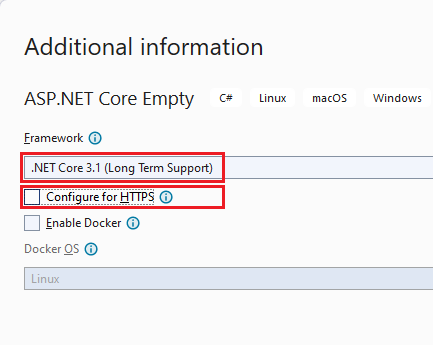
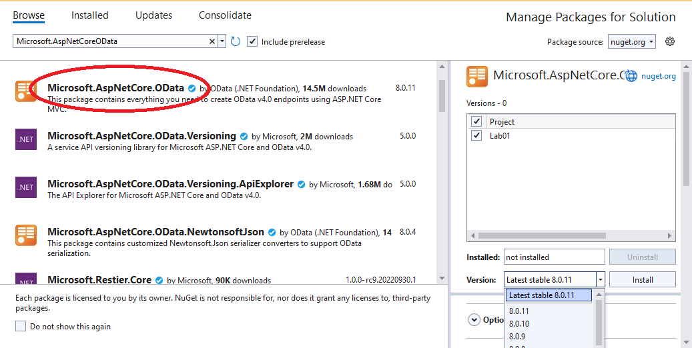
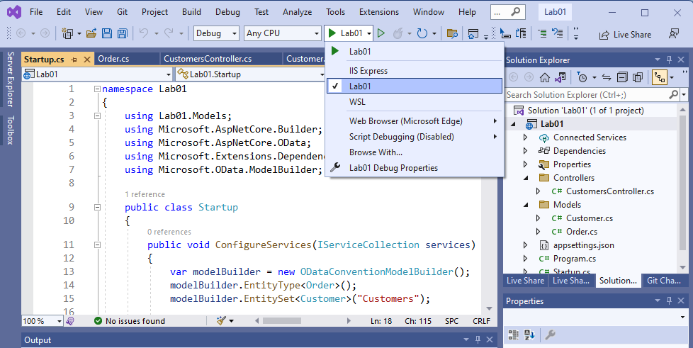
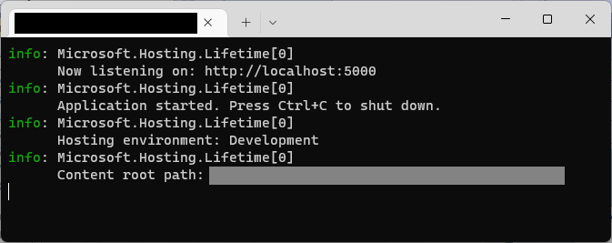

# Getting Started with ASP.NET Core OData 8
**Applies To**:[!INCLUDE[appliesto-webapi](../includes/appliesto-webapi-v8.md)]

This tutorial shows how to create and run an ASP.NET Core OData 8 application

You'll learn how to:  
:white_check_mark: Create an ASP.NET Core application  
:white_check_mark: Add Microsoft.AspNetCore.OData library package  
:white_check_mark: Define the CLR types  
:white_check_mark: Add an OData controller  
:white_check_mark: Build the Edm model and configure the service  
:white_check_mark: Run the OData service  
:white_check_mark: Interact with the OData service from an API client  

## Prerequisites
- [Visual Studio 2022](https://visualstudio.microsoft.com/vs/#download) with the ASP.NET and web development workload - when targeting [.NET Core 3.1](https://dotnet.microsoft.com/en-us/download/dotnet/3.1) or [.NET 6.0](https://dotnet.microsoft.com/en-us/download/dotnet/6.0) frameworks, or
- [Visual Studio 2019](https://visualstudio.microsoft.com/vs/older-downloads/) with the ASP.NET and web development workload - when targeting [.NET Core 3.1](https://dotnet.microsoft.com/en-us/download/dotnet/3.1) framework.

## Create an ASP.NET Core application
In Visual Studio, create a new C# project from the **ASP.NET Core Empty** template. Name the project "Lab01".

In the **Additional information** dialog, select either of **.NET Core 3.1 (Long Term Support)** or **.NET 6.0 (Long Term Support)** frameworks. Uncheck "Configure for HTTPS" checkbox. Click **Create**.

.NET Core 3.1 |  .NET 6.0
:------------:|:------------:
  |  

## Add Microsoft.AspNetCore.OData library package
Using the **Nuget Package Manager** (under **Tools** menu) install the `Microsoft.AspNetCore.OData` nuget package and all the dependencies.



## Define the CLR types
Add a folder named **Models** to the project and then add the following C# classes.

**`Order` class**
```csharp
namespace Lab01.Models
{
    public class Order
    {
        public int Id { get; set; }
        public decimal Amount { get; set; }
    }
}
```

**`Customer` class**
```csharp
namespace Lab01.Models
{
    using System.Collections.Generic;

    public class Customer
    {
        public int Id { get; set; }
        public string Name { get; set; }
        public List<Order> Orders { get; set; }
    }
}
```
The `Order` and `Customer` classes both contain an `Id` property that is conventionally treated as the key property of the entity. Note also that the `Customer` class has a collection property named `Orders` of type `List<Order>`.

## Add an OData controller
Add a folder named **Controllers** and then add the following C# class.
```csharp
namespace Lab01.Controllers
{
    using System;
    using System.Collections.Generic;
    using System.Linq;
    using Lab01.Models;
    using Microsoft.AspNetCore.Mvc;
    using Microsoft.AspNetCore.OData.Query;
    using Microsoft.AspNetCore.OData.Routing.Controllers;

    public class CustomersController : ODataController
    {
        private static Random random = new Random();
        private static List<Customer> customers = new List<Customer>(
            Enumerable.Range(1, 3).Select(idx => new Customer
            {
                Id = idx,
                Name = $"Customer {idx}",
                Orders = new List<Order>(
                    Enumerable.Range(1, 2).Select(dx => new Order
                    {
                        Id = (idx - 1) * 2 + dx,
                        Amount = random.Next(1, 9) * 10
                    }))
            }));

        [EnableQuery]
        public ActionResult Get()
        {
            return Ok(customers);
        }

        [EnableQuery]
        public ActionResult Get([FromRoute] int key)
        {
            var item = customers.SingleOrDefault(d => d.Id.Equals(key));

            if (item == null)
            {
                return NotFound();
            }

            return Ok(item);
        }
    }
}
```
In the controller, we define a `Customer` collection (`List<Customer>`) and initialize it with 3 `Customer` objects. This will serve as our in-memory data source for the OData service.

We also define two overloads of the `Get` method. The first overload does not accept any arguments while the second one accepts a single integer argument. In addition, the first overload returns a collection of `Customer` objects while the second one returns a single `Customer` object. These two methods will handle HTTP GET requests from the client. Both overloads are decorated with the `EnableQuery` attribute. This attribute is responsible for applying the query options that are passed in the query string.

## Build the Edm model and configure the service
If the target framework for your project is [.NET Core 3.1](https://dotnet.microsoft.com/en-us/download/dotnet/3.1), replace the code in the _Startup.cs_ file with the following:
```csharp
namespace Lab01
{
    using Lab01.Models;
    using Microsoft.AspNetCore.Builder;
    using Microsoft.AspNetCore.OData;
    using Microsoft.Extensions.DependencyInjection;
    using Microsoft.OData.ModelBuilder;

    public class Startup
    {
        public void ConfigureServices(IServiceCollection services)
        {
            var modelBuilder = new ODataConventionModelBuilder();
            modelBuilder.EntityType<Order>();
            modelBuilder.EntitySet<Customer>("Customers");

            services.AddControllers().AddOData(
                options => options.Select().Filter().OrderBy().Expand().Count().SetMaxTop(null).AddRouteComponents(
                    "odata",
                    modelBuilder.GetEdmModel()));
        }

        public void Configure(IApplicationBuilder app)
        {
            app.UseRouting();

            app.UseEndpoints(endpoints => endpoints.MapControllers());
        }
    }
}
```
If the target framework for your project is [.NET 6.0](https://dotnet.microsoft.com/en-us/download/dotnet/6.0), replace the code in the _Program.cs_ file with the following:
```csharp
using Lab01.Models;
using Microsoft.AspNetCore.OData;
using Microsoft.OData.ModelBuilder;

var builder = WebApplication.CreateBuilder(args);

var modelBuilder = new ODataConventionModelBuilder();
modelBuilder.EntityType<Order>();
modelBuilder.EntitySet<Customer>("Customers");

builder.Services.AddControllers().AddOData(
    options => options.Select().Filter().OrderBy().Expand().Count().SetMaxTop(null).AddRouteComponents(
        "odata",
        modelBuilder.GetEdmModel()));

var app = builder.Build();

app.UseRouting();

app.UseEndpoints(endpoints => endpoints.MapControllers());

app.Run();
```

In the code snippets above, we define the Edm model. As part of the model, we register `Order` as an entity type and `Customers` as an entity set - `Customer` entity type also gets registered as a result. In this case, the `ODataConventionalModelBuilder` is being used to build the Edm model.

We then proceed to add essential OData services by calling the `AddOData` method, in the process enabling different OData query capabilities - `$select`, `$filter`, `$orderby`, `$expand`, `count`, `$top` and `$skip`. The `AddRouteComponents` method is used to register a route, passing along the Edm model to associate it with.

The final step in configuring the service is adding the two middlewares responsible for matching incoming HTTP requests and dispatching those requests to the application's executable endpoints. We do this by calling [`UseRouting`](/dotnet/api/microsoft.aspnetcore.builder.endpointroutingapplicationbuilderextensions.userouting) and [`UseEndpoints`](/dotnet/api/microsoft.aspnetcore.builder.endpointroutingapplicationbuilderextensions.useendpoints) - the former adds [route matching](/aspnet/core/fundamentals/routing?#routing-basics) to the middleware pipeline while the latter adds [endpoint execution](/aspnet/core/fundamentals/routing?#endpoints).


## Run the OData service
Before running the service, select the debugging profile named after the project - **Lab01** - to use ASP.NET Core Kestrel web server.



Press F5 to build and run the application.

The following window will be displayed:



Take note of the endpoint that the application is listening on - `http://localhost:5000`

## Interact with the OData service from an API client
You can use any API client of your choice to interact with the OData service.

Below is a list of endpoints exposed by the OData service created in this tutorial:

| Method | Endpoint | Description | Response |
|--------|----------|-------------|----------|
| GET | `/odata` | Retrieve service document | JSON-based respresentation of the service document listing all the top-level feeds / entity sets |
| GET | `/odata/$metadata` | Retrieve service metadata | Service metadata document describing the Entity Data Model (EDM) for the service |
| GET | `/odata/Customers` | Retrieve all customers | Collection of customers |
| GET | `/odata/Customers/$count` | Retrieve number of customers | Number of customers |
| GET | `/odata/Customers({key})` | Retrieve customer by ID | Customer object |
| GET | `/odata/Customers/{key}` | Retrieve customer by ID | Customer object |

### Query service metadata
To query service metadata, send a GET request to the service metadata endpoint - `/odata/$metadata`
##### Request
```http
GET http://localhost:5000/odata/$metadata
```
##### Response
```xml
<?xml version="1.0" encoding="utf-8"?>
<edmx:Edmx Version="4.0" xmlns:edmx="http://docs.oasis-open.org/odata/ns/edmx">
    <edmx:DataServices>
        <Schema Namespace="Lab01.Models" xmlns="http://docs.oasis-open.org/odata/ns/edm">
            <EntityType Name="Order">
                <Key>
                    <PropertyRef Name="Id" />
                </Key>
                <Property Name="Id" Type="Edm.Int32" Nullable="false" />
                <Property Name="Amount" Type="Edm.Decimal" Nullable="false" Scale="Variable" />
            </EntityType>
            <EntityType Name="Customer">
                <Key>
                    <PropertyRef Name="Id" />
                </Key>
                <Property Name="Id" Type="Edm.Int32" Nullable="false" />
                <Property Name="Name" Type="Edm.String" />
                <NavigationProperty Name="Orders" Type="Collection(Lab01.Models.Order)" />
            </EntityType>
        </Schema>
        <Schema Namespace="Default" xmlns="http://docs.oasis-open.org/odata/ns/edm">
            <EntityContainer Name="Container">
                <EntitySet Name="Customers" EntityType="Lab01.Models.Customer" />
            </EntityContainer>
        </Schema>
    </edmx:DataServices>
</edmx:Edmx>
```
Notice the `Order` and `Customer` entity types as well as the `Customers` entity set - nested within the `EntityContainer` element. Notice also the `Property` and `NavigationProperty` elements used to define the structure of the schema types.

### Querying service data
The query capabilities offered by OData are immense. Covering all supported capabilities is beyond the scope of this tutorial. Let's take a look at a few:

#### Example 1: Retrieve all customers
To retrieve all customers, use the following query:
##### Request
```http
GET http://localhost:5000/odata/Customers
```
##### Response
```json
{
    "@odata.context": "http://localhost:5000/odata/$metadata#Customers",
    "value": [
        {
            "Id": 1,
            "Name": "Customer 1"
        },
        {
            "Id": 2,
            "Name": "Customer 2"
        },
        {
            "Id": 3,
            "Name": "Customer 3"
        }
    ]
}
```

> **NOTE:** When you query an entity or entity collection, the default response does not include any related entities or entity collections. The response above does not include the `Orders` collection, even though the `Customer` entity has an `Orders` navigation property.

#### Example 2: Retrieve customer entity by key
Entities are required to define a key property. In the case of the `Customer` entity, the `Id` property is conventionally designated as the key property - on account of the naming.

To retrieve a customer with a key value of 2, use the following query:
##### Request
```http
GET http://localhost:5000/odata/Customers(2)
```
##### Response
```json
{
    "@odata.context": "http://localhost:5000/odata/$metadata#Customers/$entity",
    "Id": 2,
    "Name": "Customer 2"
}
```

#### Example 3: Retrieve customers with `Id` equal to 1 or 3
By using the `$filter` query option, you can specify the expressions to be used to limit the results to be returned.

To retrieve customers with `Id` equal to 1 or 3, use the following query:
##### Request
```http
GET http://localhost:5000/odata/Customers?$filter=Id eq 1 or Id eq 3
```
##### Response
```json
{
    "@odata.context": "http://localhost:5000/odata/$metadata#Customers",
    "value": [
        {
            "Id": 1,
            "Name": "Customer 1"
        },
        {
            "Id": 3,
            "Name": "Customer 3"
        }
    ]
}
```

#### Example 4: Retrieve customers ordered by `Id` in descending order
By using the `$orderby` query option, you can specify a custom sort order for the returned results - either ascending order using `asc` or descending order using `desc`. The `$orderby` query option takes a comma-separated list of sort columns together with the corresponding sort order. A missing sort order implies ascending order.

To retrieve all the customers ordered by `Id` in descending order, use the following query:
##### Request
```http
GET http://localhost:5000/odata/Customers?$orderby=Id desc
```
##### Response
```json
{
    "@odata.context": "http://localhost:5000/odata/$metadata#Customers",
    "value": [
        {
            "Id": 3,
            "Name": "Customer 3"
        },
        {
            "Id": 2,
            "Name": "Customer 2"
        },
        {
            "Id": 1,
            "Name": "Customer 1"
        }
    ]
}
```

#### Example 5: Retrieve customer with `Id` equal to 2 and expand their list of orders
By using the `$expand` query option, you can include related entities or entity collections in the response. The `$expand` option takes a comma-separated list of navigation properties to expand.

To include all the orders for a particular customer, use the following query:
##### Request
```http
GET http://localhost:5000/odata/Customers(2)?$expand=Orders
```
##### Response
```json
{
    "@odata.context": "http://localhost:5000/odata/$metadata#Customers(Orders())/$entity",
    "Id": 2,
    "Name": "Customer 2",
    "Orders": [
        {
            "Id": 3,
            "Amount": 20
        },
        {
            "Id": 4,
            "Amount": 20
        }
    ]
}
```

#### Example 6: Retrieve customer names only
By using the `$select` query option, you can specify a subset of properties to be included in the response. The `$select` query option takes a comma-separated list of properties to be returned.

To retrieve only the name of each customer, use the following query:
##### Request
```http
GET http://localhost:5000/odata/Customers?$select=Name
```
##### Response
```json
{
    "@odata.context": "http://localhost:5000/odata/$metadata#Customers(Name)",
    "value": [
        {
            "Name": "Customer 1"
        },
        {
            "Name": "Customer 2"
        },
        {
            "Name": "Customer 3"
        }
    ]
}
```

#### Example 7: Combine multiple query options together
To retrieve names of top 2 customers ordered by `Id` in descending order and expand their list of orders, use the following query:
##### Request
```http
GET  http://localhost:5000/odata/Customers?$orderby=Id desc&$expand=Orders&$top=2&select=Name
```
##### Response
```json
{
    "@odata.context": "http://localhost:5000/odata/$metadata#Customers(Name,Orders())",
    "value": [
        {
            "Name": "Customer 3",
            "Orders": [
                {
                    "Id": 5,
                    "Amount": 10
                },
                {
                    "Id": 6,
                    "Amount": 80
                }
            ]
        },
        {
            "Name": "Customer 2",
            "Orders": [
                {
                    "Id": 3,
                    "Amount": 20
                },
                {
                    "Id": 4,
                    "Amount": 20
                }
            ]
        }
    ]
}
```
