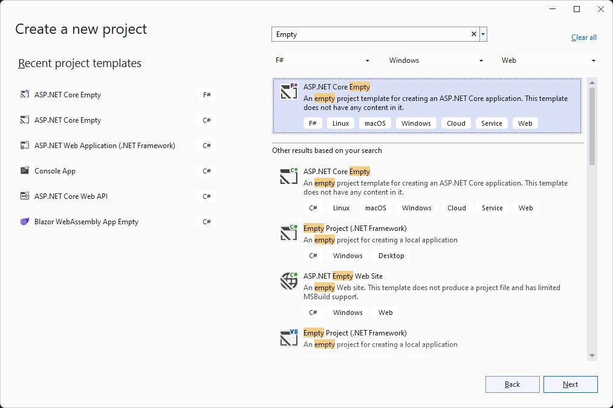
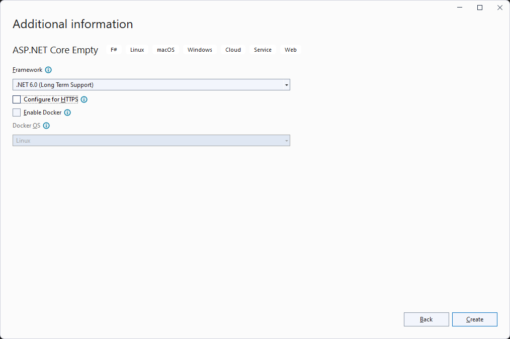
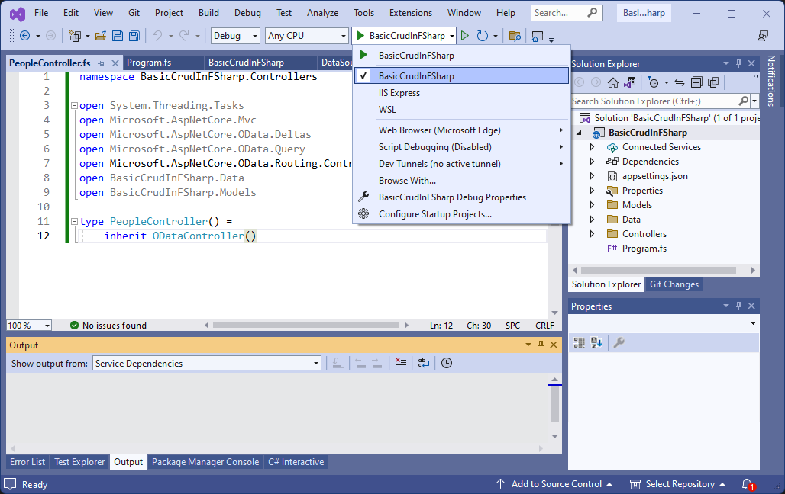

# Basic CRUD in ASP.NET Core OData 8 and F#
**Applies To**:[!INCLUDE[appliesto-webapi](../../includes/appliesto-webapi-v8.md)]

This tutorial shows how to implement basic CRUD (Create, Read, Update, and Delete) in an ASP.NET Core OData 8 service built in F#.

You'll learn how to:  
:white_check_mark: Create an F# ASP.NET Core application  
:white_check_mark: Install required packages  
:white_check_mark: Add data models  
:white_check_mark: Add an in-memory collection as data source  
:white_check_mark: Build the Edm model and configure the service  
:white_check_mark: Add an OData controller  
:white_check_mark: Run the OData service  
:white_check_mark: Request entity collection  
:white_check_mark: Request a single entity  
:white_check_mark: Create an entity  
:white_check_mark: Update an entity  
:white_check_mark: Delete an entity  

## Prerequisites

[!INCLUDE[](../../includes/appliesto-webapi-v8-net-prereqs-vs.md)]

## Create an ASP.NET Core application

- Start Visual Studio 2022 and select **Create a new project**.
- In the **Create a new project** dialog:
  - Enter `Empty` in the **Search for templates** search box.
  - Select **ASP.NET Core Empty** project template and select **Next**.

    
- Name the project _BasicCrudInFSharp_ and select **Next**.
- In the **Additional information** dialog: 
  - Select **.NET 6.0 (Long Term Support)**.
  - Uncheck **Configure for HTTPS** checkbox.
  - Select **Create**.

  

## Install required packages

Install the following Nuget package:
- [Microsoft.AspNetCore.OData](https://www.nuget.org/packages/Microsoft.AspNetCore.OData) 8.x

# [Visual Studio](#tab/visual-studio)

In the Visual Studio **Package Manager Console**:

```powershell
Install-Package Microsoft.AspNetCore.OData
```

# [.NET Core CLI](#tab/netcore-cli)

```dotnetcli
dotnet add package Microsoft.AspNetCore.OData
```

---

## Add data models
Add a folder named **Models** to the project and then add the following type:

**`Person` class**

```fsharp
namespace BasicCrudInFSharp.Models

type Person() = 
    member val Id = 0 with get, set
    member val Name = "" with get, set
    member val Age = 0 with get, set
```

## Add an in-memory collection as data source
Add an in-memory collection to serve as the data source for the OData service:

```fsharp
namespace BasicCrudInFSharp.Data

open BasicCrudInFSharp.Models

module DataSource =
    let private GetPeople() =
        let people = ResizeArray<Person>()

        people.Add(new Person(Id = 1, Name = "Sue", Age = 19))
        people.Add(new Person(Id = 2, Name = "Joe", Age = 17))
        people.Add(new Person(Id = 3, Name = "Luc", Age = 23))

        people

    let People = GetPeople()
```

**NOTE:** The F# compiler requires files (and code within a file) to be organized in dependency order. In our project for example, the compiler has to "see" the `Person` type first before the `DataSource` module since the latter is dependent on the former. For that reason, you'll need to manually edit the _.fsproj_ file to reorder the files as follows:

```xml
<Project Sdk="Microsoft.NET.Sdk.Web">
  <PropertyGroup>
    <TargetFramework>net6.0</TargetFramework>
  </PropertyGroup>
  <ItemGroup>
    <Compile Include="Models\Person.fs" />
    <Compile Include="Data\DataSource.fs" />
    <Compile Include="Program.fs" />
  </ItemGroup>
</Project>
```

## Build the Edm model and configure the service

```fsharp
open Microsoft.AspNetCore.Builder
open Microsoft.Extensions.Hosting
open Microsoft.Extensions.DependencyInjection
open Microsoft.AspNetCore.OData
open Microsoft.OData.ModelBuilder
open BasicCrudInFSharp.Models


[<EntryPoint>]
let main args =
    let builder = WebApplication.CreateBuilder(args)

    let modelBuilder = new ODataConventionModelBuilder()
    modelBuilder.EntitySet<Person>("People") |> ignore

    let model = modelBuilder.GetEdmModel()

    builder.Services.AddControllers().AddOData(fun options -> 
        options.EnableQueryFeatures().AddRouteComponents(model) |> ignore) |> ignore

    let app = builder.Build()

    app.UseODataRouteDebug() |> ignore
    app.UseRouting() |> ignore
    app.UseEndpoints(fun endpoints -> endpoints.MapControllers() |> ignore) |> ignore

    app.Run()

    0 // Exit code
```

We're using the `ODataConventionalModelBuilder` to build the Edm model. As part of the model, we register an entity set named `People` - a collection of `Person` entities.

Next, we add essential OData services by calling the `AddOData` method, in the process enabling different OData query features - `$select`, `$filter`, `$orderby`, etc.

Lastly, we register the default route by calling the `AddRouteComponents` method, passing along the Edm model to associate it with.

## Add an OData controller
Add a folder named **Controllers** and then add the following F# class:

```fsharp
namespace BasicCrudInFSharp.Controllers

open System.Threading.Tasks
open Microsoft.AspNetCore.Mvc
open Microsoft.AspNetCore.OData.Deltas
open Microsoft.AspNetCore.OData.Query
open Microsoft.AspNetCore.OData.Routing.Controllers
open BasicCrudInFSharp.Data
open BasicCrudInFSharp.Models

type PeopleController() =
    inherit ODataController()
```

The `PeopleController` above inherits from `ODataController`. The `ODataController` class implements shared logic required when writing and reading data using the OData formats.

For the reason outline in the [add an in-memory collection as data source](#add-an-in-memory-collection-as-data-source) section, edit the _.fsproj_ file such that _PeopleController.fs_ file appears after _DataSource.fs_ in the `ItemGroup`.

We will add controller actions to this controller progressively to support different CRUD operations.

## Run the OData service
Before running the service, select the debugging profile named after the project - **BasicCrudInFSharp** - to use ASP.NET Core Kestrel web server.



Press F5 to build and run the application.

You may get a security warning about installation of a certificate from a certification authority (CA). You can choose not to allow the certificate to be installed.

After the application has launched, take note of the endpoint that the application is listening on - `http://localhost:5108`. The port may differ depending on the version of Visual Studio and other environmental settings.

Stop the application.

In the sections that follow, we implement support for different CRUD operations. After implementing support for each particular operation, you can re-run the application to test the functionality.

## Request entity collection
To support the ability to return all `Person` entities, we implement a controller action to handle that request.

Add the following logic to the `PeopleController` class:

```fsharp
    [<HttpGet>]
    [<EnableQuery>]
    member this.Get() =
        this.Ok(DataSource.People)
```

In the above block of code, we're calling the ASP.NET Core built-in `Ok` method that prepares a `200 OK` HTTP response. We are also passing the `DataSource.People` collection into the method for the collection to be written into the response.

The following `GET` request returns all `Person` entities:

```http
GET http://localhost:5108/People
```

The following JSON payload shows the expected response:
```json
{
    "@odata.context": "http://localhost:5108/$metadata#People",
    "value": [
        {
            "Id": 1,
            "Name": "Sue",
            "Age": 19
        },
        {
            "Id": 2,
            "Name": "Joe",
            "Age": 17
        },
        {
            "Id": 3,
            "Name": "Luc",
            "Age": 23
        }
    ]
}
```

You can apply any of the supported query options to transform the data before returning the results. For example, to return people aged less than 20, you can apply the `$filter` query option as follows:

```http
GET http://localhost:5108/People?$filter=Age lt 20
```

The following JSON payload shows the expected response:

```json
{
    "@odata.context": "http://localhost:5108/$metadata#People",
    "value": [
        {
            "Id": 1,
            "Name": "Sue",
            "Age": 19
        },
        {
            "Id": 2,
            "Name": "Joe",
            "Age": 17
        }
    ]
}
```

## Request a single entity
To support this request, we add a controller action named `Get` to the `PeopleController` class. The action should accept a single parameter named `key` of type `int` - same type as the `Person` entity key property:

```fsharp
    [<HttpGet>]
    [<EnableQuery>]
    member this.Get(key : int) =
        match DataSource.People |> Seq.tryFind(fun d -> d.Id.Equals(key)) with
        | None -> this.NotFound() :> ActionResult
        | Some person -> this.Ok(person) :> ActionResult
```

In the above block of code, we're executing the `tryFind` method against the `People` collection to find a `Person` entity that matches the value of the `key` parameter. We return a `404 NotFound` HTTP status if we don't find any match; otherwise we call `Ok` method and pass the matched entity to be written into the `200 OK` HTTP response.

The following `GET` request returns the person with a key value of 2:

```http
GET http://localhost:5108/People(2)
```

The following JSON payload shows the expected response:

```json
{
    "@odata.context": "http://localhost:5108/$metadata#People/$entity",
    "Id": 2,
    "Name": "Joe",
    "Age": 17
}
```

## Create an entity
To support this request, we add a controller action named `Post` to the `PeopleController` class. The action should accept a single parameter of type `Person`, decorated with `FromBody` attribute:

```fsharp
    [<HttpPost>]
    member this.Post([<FromBody>] person : Person) =
        if not (this.ModelState.IsValid || person.Id = 0) then
            this.BadRequest() :> ActionResult
        else
            match DataSource.People |> Seq.tryFind(fun d -> d.Id.Equals(person.Id)) with
            | Some _ -> this.Conflict() :> ActionResult
            | None ->
                DataSource.People.Add(person)
                this.Created(person) :> ActionResult
```

In the above block of code, we're first checking that the model is valid and that the `Id` property of the `person` parameter is not 0. If the result is `false`, we respond with a `400 BadRequest` HTTP status.

Next, we're executing the `tryFind` method against the `People` collection to find a `Person` entity that matches the value of the `Id` property of the `person` parameter. If a match is found, we respond with a `409 Conflict` HTTP status. If no match is found, we add the `person` object to the `People` collection before calling `Created` method that returns a `201 Created` HTTP response containing the location of the created entity as a `Location` header.

The following `POST` request creates a `Person` entity:
```http
POST http://localhost:5108/People
```

Here's the request body:
```json
{
    "Id": 4,
    "Name": "Doe",
    "Age": 18
}
```

## Update an entity
We can update an entity using `PUT` or `PATCH` request. The `PUT` method updates the entire entity (i.e. replaces the entity) while the `PATCH` method applies a partial update to the entity (i.e. modifies the entity).

### Update an entity using `PUT`
To support this request, we add a controller action named `Put` to the `PeopleController` class. The action should accept two parameters - the first is the key of the target entity and the second is a parameter of type `Person` decorated with `FromBody` attribute:

```fsharp
    [<HttpPut>]
    member this.Put(key : int, [<FromBody>] person : Person) =
        if not (this.ModelState.IsValid) then
            this.BadRequest() :> ActionResult
        else
            match DataSource.People |> Seq.tryFind(fun d -> d.Id.Equals(key)) with
            | None -> this.NotFound() :> ActionResult
            | Some target ->
                target.Name <- person.Name
                target.Age <- person.Age
                this.Ok() :> ActionResult
```

In the above block of code, we're first checking that the model is valid. If the result is `false`, we respond with a `400 BadRequest` HTTP status.

Next, we're executing the `tryFind` method against the `People` collection to find a `Person` entity that matches the value of the `key` parameter. If a match is not found, we respond with a `404 NotFound` HTTP status. If a match is found, we update the properties of the matched `Person` entity with the respective property values from the `person` parameter and then respond with a `200 OK` HTTP status.

The following `PUT` request updates person 3:

```http
PUT http://localhost:5108/People(3)
```

Here's the request body:

```json
{
    "Id": 3,
    "Name": "Foo",
    "Age": 31
}
```

The above request will update the entire entity. You can query for the entity to confirm the result of the `PUT` operation.

### Update an entity using `PATCH`
To support this request, we add a controller action named `Patch` to the `PeopleController` class. The action should accept two parameters - the first is the key of the target entity and the second is a parameter of type `Delta<Person>` decorated with `FromBody` attribute:

```fsharp
    [<HttpPatch>]
    member this.Patch(key : int, [<FromBody>] delta : Delta<Person>) =
        if not (this.ModelState.IsValid) then
            this.BadRequest() :> ActionResult
        else
            match DataSource.People |> Seq.tryFind(fun d -> d.Id.Equals(key)) with
            | None -> this.NotFound() :> ActionResult
            | Some person ->
                delta.Patch(person) |> ignore
                this.Ok() :> ActionResult
```

In the above block of code, we're first checking that the model is valid. If the result is `false`, we respond with a `400 BadRequest` HTTP status.

Next, we're executing the `tryFind` method against the `People` collection to find a `Person` entity that matches the value of the `key` parameter. If a match is not found, we respond with a `404 NotFound` HTTP status. If a match is found, we execute the `Patch` method of the `Delta<Person>` object to update only the modified properties before responding with a `200 OK` HTTP status.

The following `PATCH` request patches person 3:

```http
PATCH http://localhost:5108/People(3)
```

Here's the request body:

```json
{
    "Name": "Bar"
}
```

The above request will only update the `Name` property. You can query for the entity to confirm the result of the `PATCH` operation.

## Delete an entity
To support this request, we add a controller action named `Delete` to the `PeopleController` class. The action should accept the key parameter:

```fsharp
    [<HttpDelete>]
    member this.Delete(key : int) =
        match DataSource.People |> Seq.tryFind(fun d -> d.Id.Equals(key)) with
        | None -> this.NoContent()
        | Some person ->
            DataSource.People.Remove(person) |> ignore
            this.NoContent()
```

In the above block of code, we're executing the `tryFind` method against the `People` collection to find a `Person` entity that matches the value of the `key` parameter. If a match is not found, we respond with a `204 NoContent` HTTP status. If a match is found, we remove the matched `Person` entity from the `People` collection before responding with a `204 NoContent` HTTP status.

The following `DELETE` request deletes person 3:

```http
DELETE http://localhost:5108/People(3)
```
