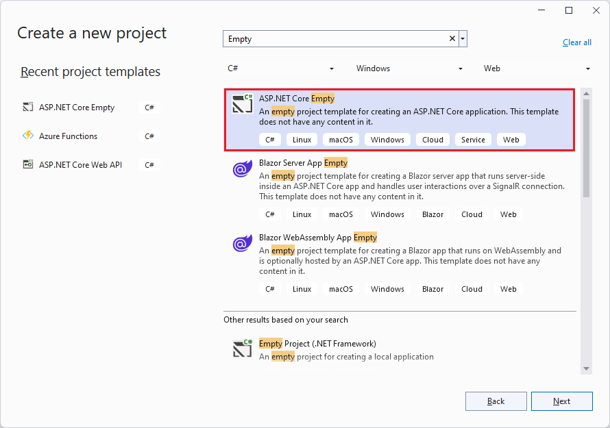
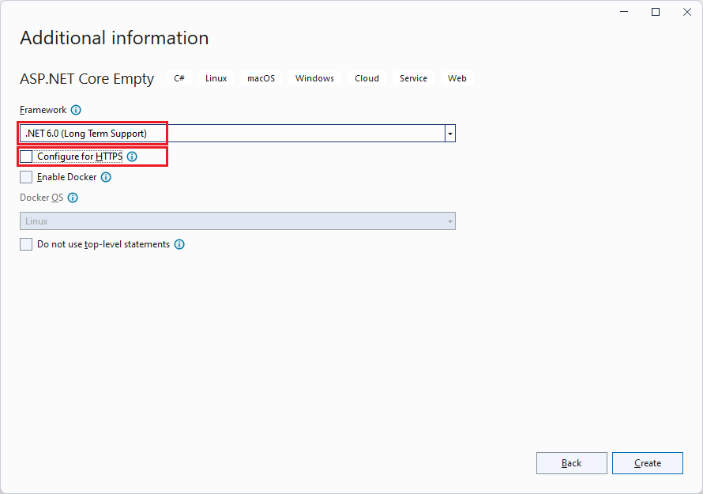
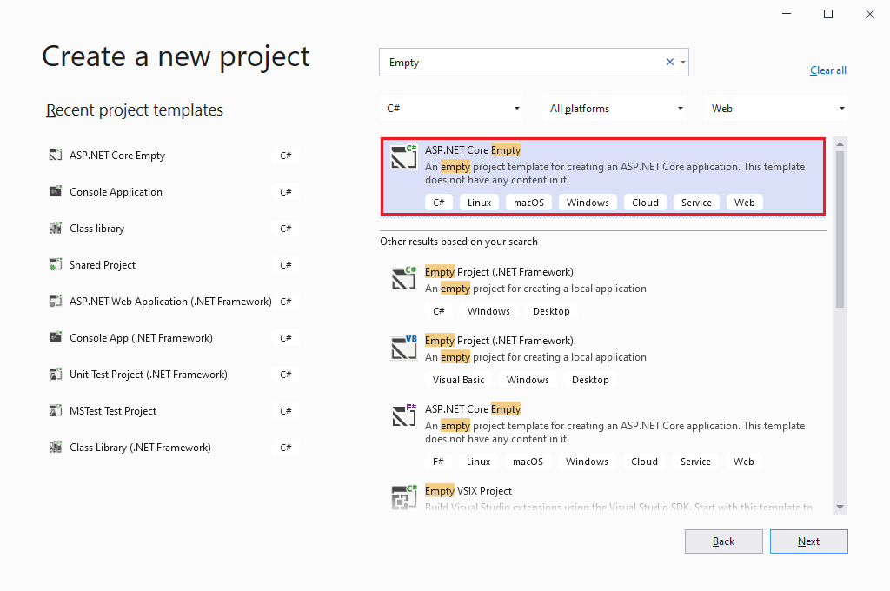
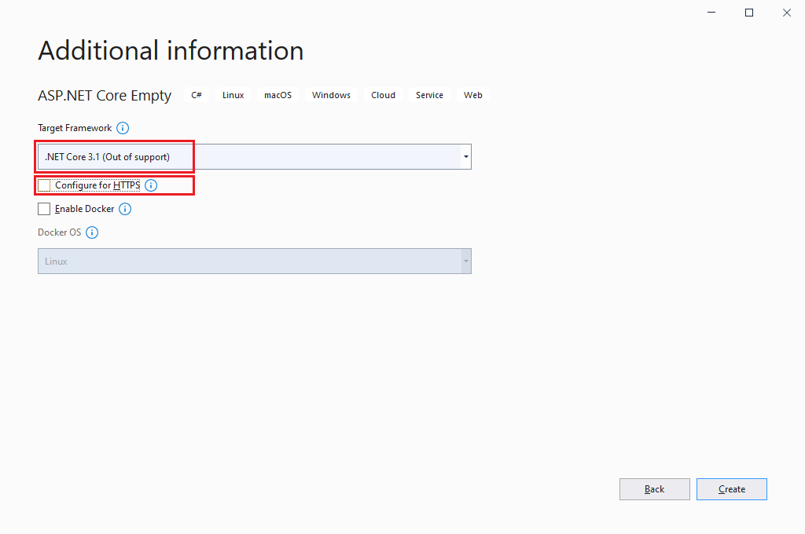
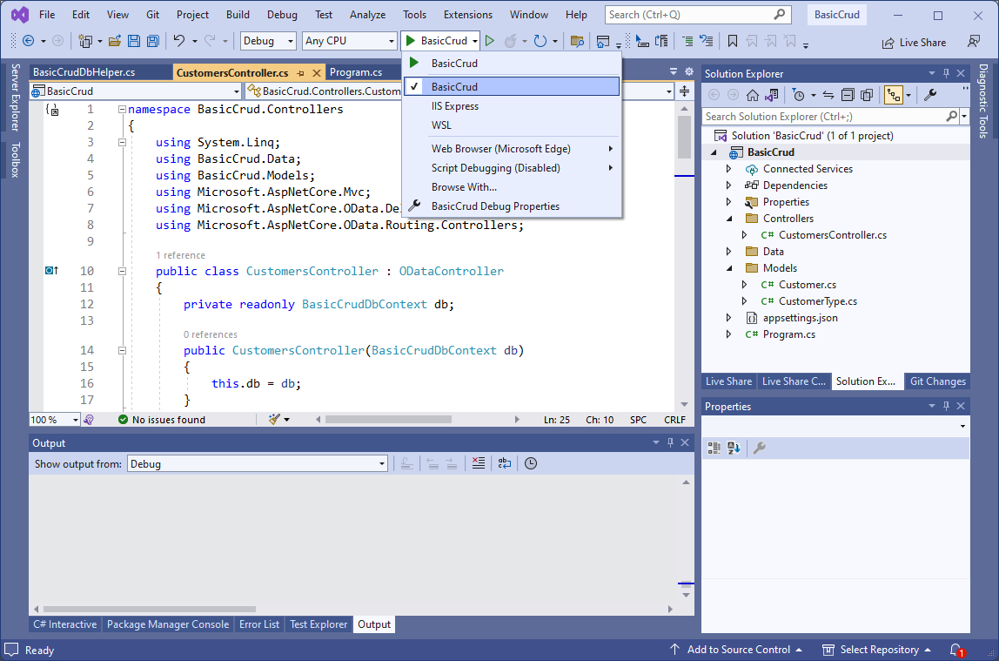
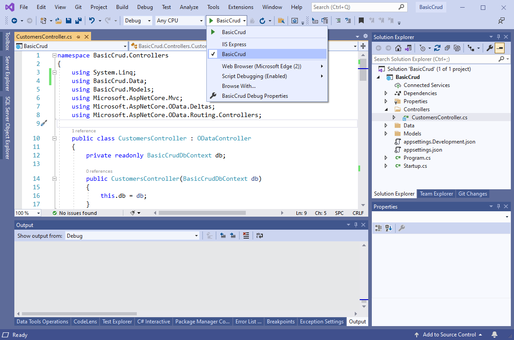

# Basic CRUD in ASP.NET Core OData 8
**Applies To**:[!INCLUDE[appliesto-webapi](../../includes/appliesto-webapi-v8.md)]

This tutorial shows how to implement basic CRUD (Create, Read, Update, and Delete) in an ASP.NET Core OData 8 service

You'll learn how to:  
:white_check_mark: Create an ASP.NET Core application  
:white_check_mark: Install required packages  
:white_check_mark: Add data models  
:white_check_mark: Add a database context  
:white_check_mark: Build the Edm model and configure the service  
:white_check_mark: Add an OData controller  
:white_check_mark: Run the OData service  
:white_check_mark: Request entity collection  
:white_check_mark: Request a single entity  
:white_check_mark: Create an entity  
:white_check_mark: Update an entity  
:white_check_mark: Delete an entity  

## Prerequisites

[!INCLUDE[](../../includes/appliesto-webapi-v8-net-prereqs-vs.md)]

## Create an ASP.NET Core application

# [Visual Studio 2022](#tab/visual-studio-2022)

- Start Visual Studio 2022 and select **Create a new project**.
- In the **Create a new project** dialog:
  - Enter `Empty` in the **Search for templates** search box.
  - Select **ASP.NET Core Empty** project template and select **Next**.

    
- Name the project _BasicCrud_ and select **Next**.
- In the **Additional information** dialog: 
  - Select **.NET 6.0 (Long Term Support)**.
  - Uncheck **Configure for HTTPS** checkbox.
  - Select **Create**.

  

# [Visual Studio 2019](#tab/visual-studio-2019)

- Start Visual Studio 2019 and select **Create a new project**.
- In the **Create a new project** dialog:
  - Enter `Empty` in the **Search for templates** search box.
  - Select **ASP.NET Core Empty** project template and select **Next**.

    
- Name the project _BasicCrud_ and select **Next**.
- In the **Additional information** dialog: 
  - Select **.NET Core 3.1 (Out of support)**.
  - Uncheck **Configure for HTTPS** checkbox.
  - Select **Create**.

  

---

## Install required packages

Install the following Nuget packages:
- [Microsoft.AspNetCore.OData](https://www.nuget.org/packages/Microsoft.AspNetCore.OData) 8.x
- [Microsoft.EntityFrameworkCore.InMemory](https://www.nuget.org/packages/Microsoft.EntityFrameworkCore.InMemory)

# [Visual Studio](#tab/visual-studio)

In the Visual Studio **Package Manager Console**:

```powershell
Install-Package Microsoft.AspNetCore.OData
Install-Package Microsoft.EntityFrameworkCore.InMemory
```

# [.NET Core CLI](#tab/netcore-cli)

```dotnetcli
dotnet add package Microsoft.AspNetCore.OData
dotnet add package Microsoft.EntityFrameworkCore.InMemory
```

---

In addition to the `Microsoft.AspNetCore.OData` library, we are installing the `Microsoft.EntityFrameworkCore.InMemory` library in order to use the Entity Framework Core in-memory database.

**Note:** .NET Core 3.1 does not support [Microsoft.EntityFrameworkCore.InMemory](https://www.nuget.org/packages/Microsoft.EntityFrameworkCore.InMemory) 6 or higher. You will need to specify a lower version.

## Add data models
Add a folder named **Models** to the project and then add the following types.

**`CustomerType` enum**
```csharp
namespace BasicCrud.Models
{
    public enum CustomerType
    {
        Retail,
        Wholesale
    }
}
```

**`Customer` class**
```csharp
namespace BasicCrud.Models
{
    using System;

    public class Customer
    {
        public int Id { get; set; }
        public string Name { get; set; }
        public CustomerType CustomerType { get; set; }
        public decimal CreditLimit { get; set; }
        public DateTime CustomerSince { get; set; }
    }
}

```

We define a `CustomerType` enum type and a `Customer` class. The `Id` property in the `Customer` class will serve as the unique key in our database.

## Add a database context
The _database context_ is the main class that coordinates Entity Framework functionality for a data model. This class is created by deriving from the `Microsoft.EntityFrameworkCore.DbContext` class.

Add a folder named **Data** to the project and then add the following class:
```csharp
namespace BasicCrud.Data
{
    using BasicCrud.Models;
    using Microsoft.EntityFrameworkCore;

    public class BasicCrudDbContext : DbContext
    {
        public BasicCrudDbContext(DbContextOptions<BasicCrudDbContext> options)
            : base(options)
        {
        }

        public DbSet<Customer> Customers { get; set; }
    }
}
```

In the same folder, add the following helper class named `BasicCrudDbHelper` containing logic to help us seed the database.
```csharp
namespace BasicCrud.Data
{
    using System;
    using System.Linq;
    using BasicCrud.Models;

    internal static class BasicCrudDbHelper
    {
        public static void SeedDb(BasicCrudDbContext db)
        {
            if (!db.Customers.Any())
            {
                db.Add(new Customer
                {
                    Id = 1,
                    Name = "Sue",
                    CustomerType = CustomerType.Retail,
                    CreditLimit = 3700,
                    CustomerSince = new DateTime(2022, 7, 4)
                });

                db.Add(new Customer
                {
                    Id = 2,
                    Name = "Joe",
                    CustomerType = CustomerType.Wholesale,
                    CreditLimit = 5100,
                    CustomerSince = new DateTime(2022, 12, 12)
                });

                db.SaveChanges();
            }
        }
    }
}
```

## Build the Edm model and configure the service

# [.NET 6.0](#tab/net60)

```csharp
using BasicCrud.Data;
using BasicCrud.Models;
using Microsoft.AspNetCore.OData;
using Microsoft.EntityFrameworkCore;
using Microsoft.OData.ModelBuilder;

var builder = WebApplication.CreateBuilder(args);

var modelBuilder = new ODataConventionModelBuilder();
modelBuilder.EnumType<CustomerType>();
modelBuilder.EntitySet<Customer>("Customers");

builder.Services.AddControllers().AddOData(
    options => options.EnableQueryFeatures(null).AddRouteComponents(
        routePrefix: "odata",
        model: modelBuilder.GetEdmModel()));

builder.Services.AddDbContext<BasicCrudDbContext>(options =>
    options.UseInMemoryDatabase("BasicCrudDb"));

var app = builder.Build();

app.UseRouting();
app.UseEndpoints(endpoints => endpoints.MapControllers());

// Seed database
using (var serviceScope = app.Services.GetRequiredService<IServiceScopeFactory>().CreateScope())
{
    var db = serviceScope.ServiceProvider.GetRequiredService<BasicCrudDbContext>();

    BasicCrudDbHelper.SeedDb(db);
}

app.Run();
```

# [.NET Core 3.1](#tab/netcoreapp31)

```csharp
using BasicCrud.Data;
using BasicCrud.Models;
using Microsoft.AspNetCore.Builder;
using Microsoft.AspNetCore.OData;
using Microsoft.EntityFrameworkCore;
using Microsoft.Extensions.DependencyInjection;
using Microsoft.OData.ModelBuilder;

public class Startup
{
    public void ConfigureServices(IServiceCollection services)
    {
        var modelBuilder = new ODataConventionModelBuilder();
        modelBuilder.EnumType<CustomerType>();
        modelBuilder.EntitySet<Customer>("Customers");

        services.AddControllers().AddOData(
            options => options.EnableQueryFeatures(null).AddRouteComponents(
                routePrefix: "odata",
                model: modelBuilder.GetEdmModel()));

        services.AddDbContext<BasicCrudDbContext>(
            options => options.UseInMemoryDatabase("BasicCrudDb"));
    }

    public void Configure(IApplicationBuilder app)
    {
        app.UseRouting();
        app.UseEndpoints(endpoints => endpoints.MapControllers());

        // Seed database
        using (var serviceScope = app.ApplicationServices.GetRequiredService<IServiceScopeFactory>().CreateScope())
        {
            var db = serviceScope.ServiceProvider.GetRequiredService<BasicCrudDbContext>();

            BasicCrudDbHelper.SeedDb(db);
        }
    }
}
```

---

We're using the `ODataConventionalModelBuilder` to build the Edm model. As part of the model, we register `CustomerType` as an enum type and `Customers` as an entity set - `Customer` entity type also gets registered as a result. We then proceed to add essential OData services by calling the `AddOData` method, in the process enabling different OData query features - `$filter`, `$orderby`, `$top`, etc. The `AddRouteComponents` method is also called to register a route - `odata`, passing along the Edm model to associate it with.

In addition, we're also registering the database context as a service with the [dependency injection (DI)](/aspnet/core/fundamentals/dependency-injection) container. The DI container will provide the service to the controllers.

The other thing that we are doing is to seed our database with some data by calling `SeedDb` method from our `BasicCrudDbHelper` class. We resolve the `BasicCrudDbContext` service from the DI container and pass it to the `SeedDb` method. There will be only one instance of `BasicCrudDbContext` in the [lifetime of the application](/aspnet/core/fundamentals/dependency-injection#entity-framework-contexts).

## Add an OData controller
Add a folder named **Controllers** and then add the following C# class.
```csharp
namespace BasicCrud.Controllers
{
    using System.Linq;
    using BasicCrud.Data;
    using BasicCrud.Models;
    using Microsoft.AspNetCore.Mvc;
    using Microsoft.AspNetCore.OData.Deltas;
    using Microsoft.AspNetCore.OData.Routing.Controllers;

    public class CustomersController : ODataController
    {
        private readonly BasicCrudDbContext db;

        public CustomersController(BasicCrudDbContext db)
        {
            this.db = db;
        }
    }
}
```

In the controller, we add a contructor that accepts a `BasicCrudDbContext` parameter. Since we registered `BasicCrudDbContext` as a service in the DI container, ASP.NET Core will take care of resolving the database context as a dependency and injecting into our controller - [constructor injection](/dotnet/core/extensions/dependency-injection#constructor-injection-behavior).

We will add controller actions to this controller progressively to support different CRUD operations.

## Run the OData service
Before running the service, select the debugging profile named after the project - **BasicCrud** - to use ASP.NET Core Kestrel web server.

# [VS 2022](#tab/vs2022)



# [VS 2019](#tab/vs2019)



---

Press F5 to build and run the application.

You may get a security warning about installation of a certificate from a certification authority (CA). You can choose not to allow the certificate to be installed.

After the application has launched, take note of the endpoint that the application is listening on - `http://localhost:5173` though **the port might differ** depending on the version of Visual Studio and other environmental settings.

Stop the application.

In the sections that follow, we implement support for different CRUD operations. After implementing support for each particular operation, you can re-run the application to test the functionality.

## Request entity collection
To support the ability to return all `Customer` entities from an OData service, we implement a controller action to handle that request. Add the following logic to the `CustomersController` class:
```csharp
public ActionResult<IQueryable<Customer>> Get()
{
    return Ok(db.Customers);
}
```

In the above block of code, we're calling the an ASP.NET Core built-in method - `Ok()` that internally prepares a status 200 `OK` response. We pass the `Customers` [DbSet](/dotnet/api/microsoft.entityframeworkcore.dbset-1) into the method to return all customers in our database. A `DbSet` represents a collection of entities of a specific type.

The following `GET` request returns all customer entities:
```http
GET http://localhost:5173/odata/Customers
```

The following JSON payload shows the expected response:
```json
{
    "@odata.context": "http://localhost:5173/odata/$metadata#Customers",
    "value": [
        {
            "Id": 1,
            "Name": "Sue",
            "CustomerType": "Retail",
            "CreditLimit": 3700,
            "CustomerSince": "2022-07-04T00:00:00+03:00"
        },
        {
            "Id": 2,
            "Name": "Joe",
            "CustomerType": "Wholesale",
            "CreditLimit": 5100,
            "CustomerSince": "2022-12-12T00:00:00+03:00"
        }
    ]
}
```

## Request a single entity
To support this request, we add a controller action named `Get` (or `GetCustomer`) to the `CustomersController` class. The action should accept a single parameter named `key` of type `int` - same type as the entity's key property:
```csharp
public ActionResult<Customer> Get([FromRoute] int key)
{
    var customer = db.Customers.SingleOrDefault(d => d.Id == key);

    if (customer == null)
    {
        return NotFound();
    }

    return Ok(customer);
}
```

In the above block of code, we're using `LINQ` to write an expression to retrieve a entity with the specified key from the `Customers` table. We return a status 404 `NotFound` if we don't find any match; otherwise we return the matched entity.

The `FromRoute` attribute is only added for documentation purposes to show that the parameter should be bound using route-data from the current request - it is neither necessary nor mandatory.

Note that for the built-in routing conventions to route the request successfully, the key parameter should be named `key`. This is a pitfall that people who are unfamiliar with OData routing find themselves in. If you choose to rename the parameter, specify the route template on the controller action - attribute routing basically. The following block of code shows how to do it:
```csharp
[HttpGet("odata/Customers({id})")]
public ActionResult Get([FromRoute] int id)
{
    var customer = db.Customers.SingleOrDefault(d => d.Id == id);

    if (customer == null)
    {
        return NotFound();
    }

    return Ok(customer);
}
```

The following `GET` request returns the customer with a key value of 1:
```http
GET http://localhost:5173/odata/Customers(1)
```

The above request makes use of the parentheses-style key. An alternative way is to use the key-as-segment convention as follows:
```http
GET http://localhost:5173/odata/Customers/1
```

The following JSON payload shows the expected response:
```json
{
    "@odata.context": "http://localhost:5173/odata/$metadata#Customers/$entity",
    "Id": 1,
    "Name": "Sue",
    "CustomerType": "Retail",
    "CreditLimit": 3700,
    "CustomerSince": "2022-07-04T00:00:00+03:00"
}
```

## Create an entity
To support this request, we add a controller action named `Post` (or `PostCustomer`) to the `CustomersController` class. The action should accept a single parameter of type `Customer`, decorated with `FromBody` attribute:
```csharp
public ActionResult Post([FromBody] Customer customer)
{
    db.Customers.Add(customer);

    return Created(customer);
}
```

Unlike `FromRoute` attribute from the previous section, the `FromBody` attribute applied to the `customer` parameter is necessary. It specifies that the parameter should be bound using the request body.

The following `POST` request creates a `Customer` entity:
```http
POST http://localhost:5173/odata/Customers
```

Here's the request body:
```json
{
    "Id": 3,
    "Name": "Luc",
    "CustomerType": "Retail",
    "CreditLimit": 2300,
    "CustomerSince": "2022-10-01"
}
```

The `Created` method used in the controller action returns a status 201 `Created` response. It also generates and returns the location of the created entity. If you look through the response headers, you should find the following `Location` header:
```
http://localhost:5173/odata/Customers(3)
```

## Update an entity
We can update an entity using `PUT` or `PATCH` request. The `PUT` method updates the entire entity (i.e. replaces the entity) while the `PATCH` method applies a partial update to the entity (i.e. modifies the entity).

### Update an entity using `PUT`
To support this request, we add a controller action named `Put` (or `PutCustomer`) to the `CustomersController` class. The action should accept two parameters - the first is the key of the target entity and the second is a parameter of type `Customer` decorated with `FromBody` attribute:
```csharp
public ActionResult Put([FromRoute] int key, [FromBody] Customer updatedCustomer)
{
    var customer = db.Customers.SingleOrDefault(d => d.Id == key);

    if (customer == null)
    {
        return NotFound();
    }

    customer.Name = updatedCustomer.Name;
    customer.CustomerType = updatedCustomer.CustomerType;
    customer.CreditLimit = updatedCustomer.CreditLimit;
    customer.CustomerSince = updatedCustomer.CustomerSince;

    db.SaveChanges();

    return Updated(customer);
}
```

The following `PUT` request updates customer 2:
```http
PUT http://localhost:5173/odata/Customers(2)
```

Here's the request body:
```json
{
    "Id": 2,
    "Name": "Joe",
    "CustomerType": "Retail",
    "CreditLimit": 0,
    "CustomerSince": "2022-04-27"
}
```

The above request will update the entire entity. You can query for the entity to confirm the result of the `PUT` operation.

### Update an entity using `PATCH`
To support this request, we add a controller action named `Patch` (or `PatchCustomer`) to the `CustomersController` class. The action should accept two parameters - the first is the key of the target entity and the second is a parameter of type `Delta<Customer>` decorated with `FromBody` attribute:
```csharp
public ActionResult Patch([FromRoute] int key, [FromBody] Delta<Customer> delta)
{
    var customer = db.Customers.SingleOrDefault(d => d.Id == key);

    if (customer == null)
    {
        return NotFound();
    }

    delta.Patch(customer);

    db.SaveChanges();

    return Updated(customer);
}
```

The following `PATCH` request patches customer 2:
```http
PATCH http://localhost:5173/odata/Customers(2)
```

Here's the request body:
```json
{
    "CreditLimit": 1300,
    "CustomerSince": "2022-01-26"
}
```

The above request will only update the `CreditLimit` and `CustomerSince` fields. You can query for the entity to confirm the result of the `PATCH` operation.

## Delete an entity
To support this request, we add a controller action named `Delete` (or `DeleteCustomer`) to the `CustomersController` class. The action should accept the key parameter:
```csharp
public ActionResult Delete([FromRoute] int key)
{
    var customer = db.Customers.SingleOrDefault(d => d.Id == key);

    if (customer != null)
    {
        db.Customers.Remove(customer);
    }

    db.SaveChanges();

    return NoContent();
}
```

The following `DELETE` request deletes customer 2:
```http
DELETE http://localhost:5173/odata/Customers(2)
```
