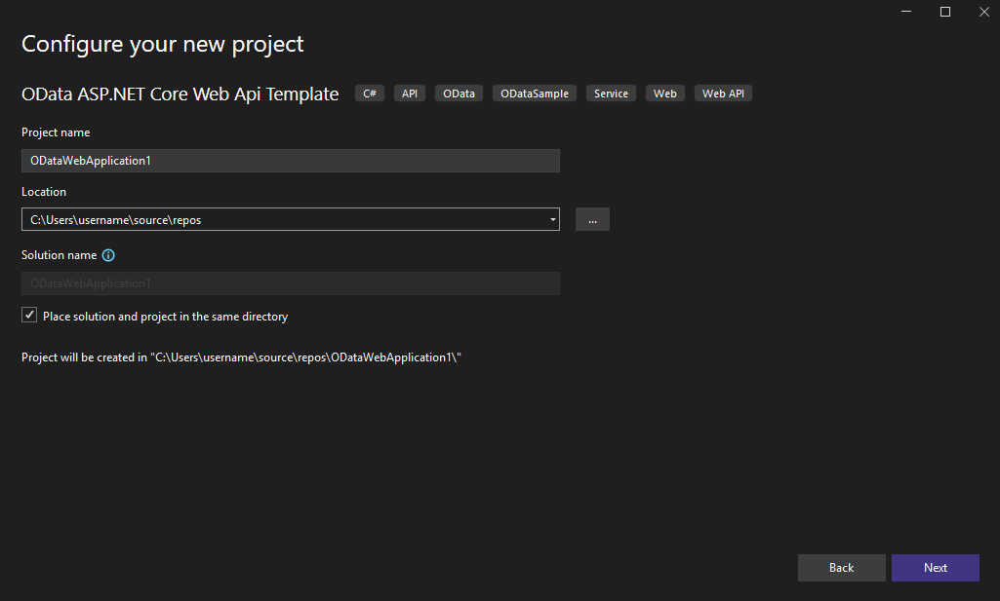

# OData ASP.NET Core WebAPI Template Pack Release
**Applies To**:[!INCLUDE[appliesto-webapi](../includes/appliesto-webapi-v8.md)]

We are excited to announce the first public preview release of the OData ASP.NET Core WebAPI Template Pack. This template helps you create an ASP.NET Core WebAPI project with OData support, providing a streamlined setup for .NET 6.0 and above. The following preview release is now available on NuGet:
- [`Microsoft.OData.WebApiTemplate/1.0.0-preview.1`](https://www.nuget.org/packages/Microsoft.OData.WebApiTemplate/1.0.0-preview.1)

## Key Features

- **Support for .NET 8.0 and above**: Easily create projects targeting the latest .NET versions.
- **OData System Query Options**: Enable query options like `$filter`, `$select`, `$expand`, `$orderby`, and `$count`.
- **OpenAPI (Swagger) Support**: Enable OpenAPI support for better API documentation.
- **Batching Support**: Allow OData batching in your project.
- **Case Insensitive Routing**: Enable case insensitive routing for controller/action property names.

## Installation

To install the template, use the following command:

```bash
dotnet new install Microsoft.OData.WebApiTemplate
```

## Usage

### Using dotnet CLI
Create a new project using the template:

- Create Template with Default Settings
    ```bash
    dotnet new odata-webapi -n MyODataService1 --framework net9.0
    ```

- Enable OData Batching 
    ```bash
    dotnet new odata-webapi -n MyODataService2 -f net8.0 --enable-batching true
    ```

- Enable a few Query-Options
    ```bash
    dotnet new odata-webapi -n MyODataService3 -f net8.0 --query-option filter select expand
    ```

- Enable OpenAPI/Swagger
    ```bash
    dotnet new odata-webapi -n MyODataService4 --enable-openapi true
    ```

- To view template options:
    ```bash
    dotnet new odata-webapi --help
    ```

### Using Visual Studio IDE

1. **Open the "Create a new project" dialog**
    When you first open Visual Studio, the start window appears, and from there, you can select **Create a new project**.
    

2. **Select a template type**
    - On the `Create a new project` dialog, search for `OData` or `OData WebAPI`.
    - Select `OData ASP.NET Core Web API Template` and then select **Next**.

    

3. **Configure your new project**
    The **Configure your new project** dialog has options to name your project (and solution), select a disk location, and more.
    

4. **Additional information dialog**
    This includes options to select when creating an `AspNetCore OData Web API project`. It includes:
    - **Framework**: The target framework to use for the project.
    - **ODataQueryOptions**: OData System Query Options. You can multi-select all of them or specific options like `filter`, `select`, `expand`, `orderby`, and `count`. Default is all of them selected.
    - **EnableNoDollarQueryOptions**: Whether or not to prefix OData system query options with '$'. Default is true.
    - **EnableDefaultODataBatch**: Allowing OData batching. Default is false.
    - **EnableOpenAPI**: Enables OpenAPI (Swagger) support. Default is true.

    Select **Create** to create the new project.
    
    

5. **Build and run the project**
    Build and run the application. Navigate to the `{Your-project-name}.http` to test some endpoints provided there.
    

## Feedback

We value your feedback! Please report any issues or suggestions on our [GitHub repository](https://github.com/OData/ODataDotNetTemplate).

Thank you for trying out the OData ASP.NET Core WebAPI Template Pack!
